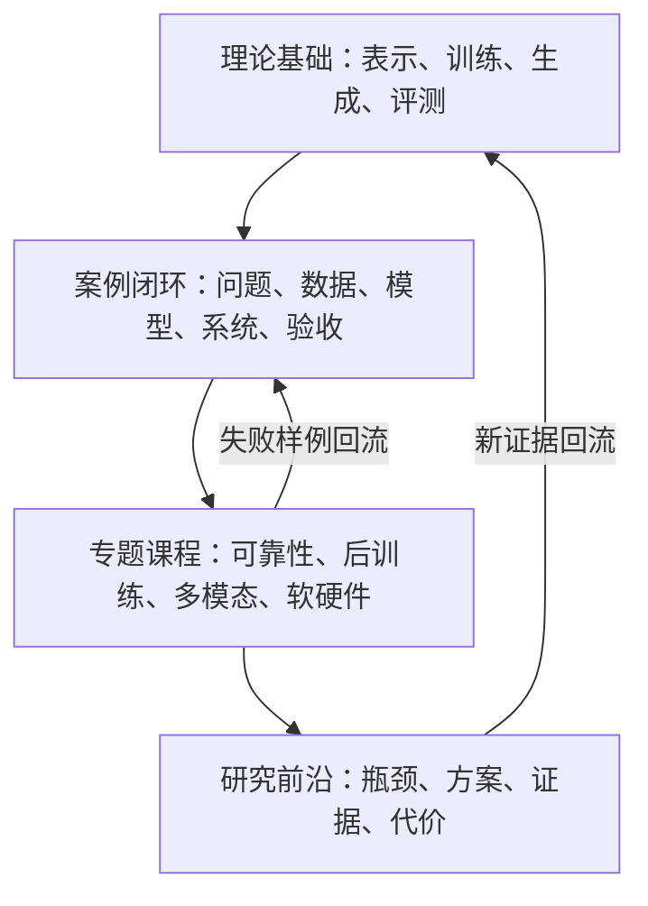
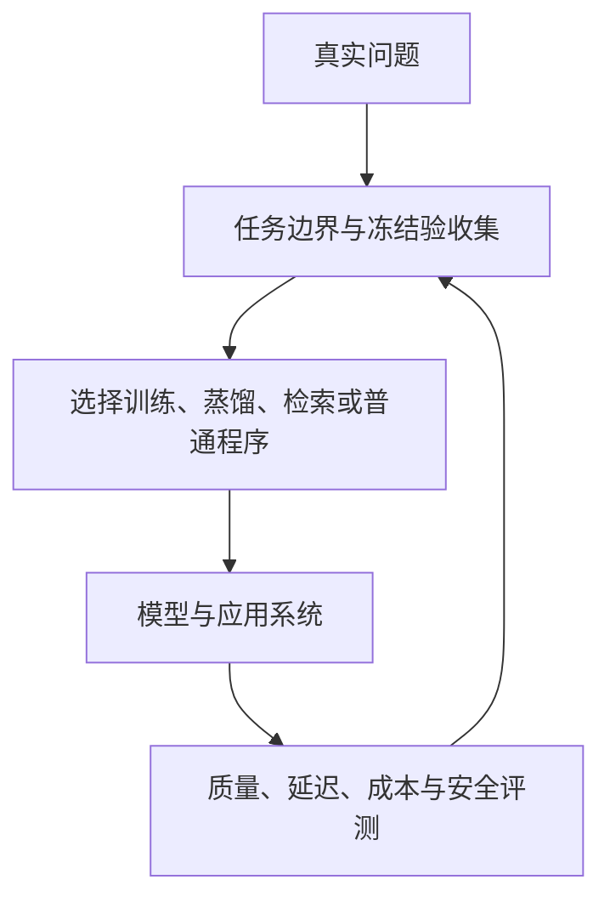
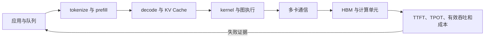

# 全局知识图谱

这张图先回答“我正在学整套系统的哪一层”。第一次只沿粗箭头阅读，不要求记住所有分支；遇到新术语时，先回到本页定位它的上游、下游和责任边界。

如果你还不知道该从哪个问题进入，请先看[学科地图](学科地图.md)。学科地图负责选择观察角度，本页负责解释依赖与责任边界。

## 从学科到项目的四层结构

这四层不是难度排行榜。理论解释稳定机制，案例展示项目证据怎样形成，专题把共性问题展开，研究则追踪尚未稳定解决的瓶颈。

## 一次模型项目的完整生命周期

图中有两条容易混淆的链：训练链把数据变成参数，推理链用静态参数计算结果。RAG 把资料放进本次上下文，不等于重新训练；采样由解码代码执行，不等于模型参数随机变化。

## 放大一：参数怎样训练出来

| 输入 | 发生的动作 | 输出交给下一层 |
|---|---|---|
| 合法且切分好的数据 | tokenizer 或模态编码 | token ID 或模态表示 |
| ID 与位置 | Embedding 和模型前向 | 隐藏表示与 logits |
| 预测和目标 | loss、反向传播、优化器更新 | 新参数与检查点 |
| 检查点 | 验证、失败分析、模型卡 | 可比较的模型资产 |

## 放大二：一次请求怎样得到输出

| 输入 | 负责组件 | 产生什么 |
|---|---|---|
| 文本、图像、语音或工具结果 | tokenizer、模态编码器和模型前向 | logits 或任务特征 |
| logits | greedy、temperature、top-k、top-p | 当前选中的 token |
| 请求与缓存 | 推理引擎、KV Cache、批处理和并行 | 回答或结构化结果 |
| 实际输出 | 应用评测与监控 | 失败分类和下一轮改进证据 |

## 放大三：强模型怎样变成低成本系统

| 阶段 | 必须保留的对照 | 决策条件 |
|---|---|---|
| 选择学生 | 教师、原始学生、最简单规则基线 | 预设记录证明学生适合目标硬件 |
| 蒸馏 | 回答、logit、特征或策略信号分别记录 | 关键任务超过原始学生 |
| 压缩 | 未量化学生与量化/剪枝/QAT 版本 | 质量仍高于冻结底线 |
| 部署 | 相同输入长度、输出长度、batch 和并发 | 延迟、吞吐、显存和成本达标 |

离策略蒸馏在固定教师轨迹上学习，在策略蒸馏在学生自己访问的状态上请求教师信号。后者更贴近学生推理分布，却还要检查教师是否提供新增能力、双方高概率 token 区域能否对齐，以及长轨迹尾部的监督是否退化。机制案例见 [在策略蒸馏论文深读](../06-拓展知识库/在策略蒸馏深读/)。

## 放大四：一次请求怎样穿过 AI Infra

这张图要求把模型语义和系统执行分开：权重与上下文产生 logits，解码策略选 token，推理引擎调度请求与缓存，算子和硬件负责把张量计算实际跑完。任一层都不能单独解释完整用户体验。

## 知识图谱中的七种关系

| 关系 | 例子 | 学习时要问 |
|---|---|---|
| 前置于 | softmax 前置于注意力权重 | 不会前置知识，后面会卡在哪里？ |
| 组成 | 注意力与 MLP 组成一个 Block 的主要计算 | 当前对象是谁的一部分？ |
| 产生 | LM Head 产生词表 logits | 输入、动作和输出分别是什么？ |
| 实现于 | top-p 通常在模型外的解码代码中执行 | 这一步由权重、框架还是应用负责？ |
| 解决 | GQA 主要缓解 KV Cache 成本 | 它针对哪一个瓶颈？ |
| 局限 | 固定状态可能压缩丢失历史细节 | 得到效率时牺牲了什么？ |
| 替代或互补 | RAG 与 SFT 处理不同类型的问题 | 两个方法能否直接互相替代？ |

术语之间只有“链接到定义”还不算知识图谱。正文首次引入重要概念时，必须至少标明上面一种关系。

## 五张必须能闭卷重画的图

1. `文本 -> token -> ID -> Embedding -> Transformer -> logits`。
2. `训练数据 -> loss -> 梯度 -> 参数更新 -> 检查点`。
3. `上下文 -> 模型 logits -> 解码策略 -> 推理引擎 -> 输出`。
4. `真实问题 -> 验收集 -> Prompt/RAG/微调/预训练/蒸馏选型 -> 独立评测`。
5. `应用队列 -> prefill/decode -> 推理引擎 -> kernel/通信 -> 硬件 -> SLO`。

如果仍不清楚某层为什么要学，先看[课程为什么这样安排](课程为什么这样安排.md)。第一次进入课程，请继续选择[能力路线](能力路线.md)。已经明确问题时，可以直接进入[实际模型案例](../06-拓展知识库/实际模型项目/)、[幻觉与可靠性](../06-拓展知识库/幻觉与可靠性/)、[模型后训练](../06-拓展知识库/模型后训练/)、[多模态基础](../06-拓展知识库/多模态基础/)或[软硬件瓶颈](../06-拓展知识库/软硬件瓶颈/)；阅读新架构前先看[前沿瓶颈地图](../06-拓展知识库/前沿瓶颈地图.md)。
