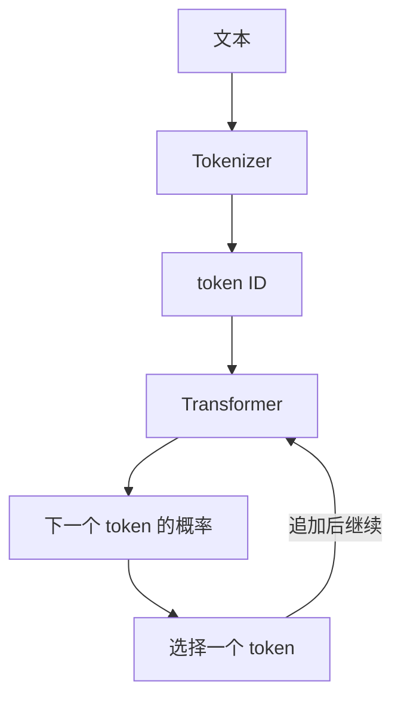

# D01：大模型到底是什么

## 今日目标

能把大语言模型描述为“根据已有 token 预测下一个 token 概率的参数化模型”，并区分训练和推理。

## 先看全流程

### 三个角色

- **Tokenizer**：把文本切成 token，再映射为整数 ID。
- **模型参数**：训练中调整的大量数字。它们共同决定输入经过模型后得到什么 logits。
- **生成策略**：把 logits 转成概率后，决定选概率最高的 token，还是按某种规则采样。

“大”通常指参数量、训练数据和训练计算的规模大，不代表模型必然正确，也不代表所有参数都保存了一条可直接查询的事实。

## 训练与推理不是一回事

**训练**时有参考答案。模型预测下一个 token，计算预测与答案的差距，再用梯度更新参数。

**推理**时通常不更新参数。模型根据当前上下文反复预测和追加 token。把一段资料放入上下文能临时影响回答，但不等于模型已经把资料训练进参数。

| 阶段 | 有参考答案 | 更新参数 | 常见输出 |
|---|:---:|:---:|---|
| 训练 | 是 | 是 | loss、检查点 |
| 验证 | 是 | 否 | 验证 loss、指标 |
| 推理 | 通常没有 | 否 | 生成文本 |

## 它不是什么

- 不是实时更新的百科数据库，知识可能过时或混杂。
- 不是每次都按固定规则查到唯一答案的普通程序。
- 不能仅凭流畅语气证明事实正确。
- 是否具有意识属于哲学和科学争议，不能从“会对话”直接推出结论。

## 动手任务

以提示“天空通常是”为例，写出你认为可能的 5 个后续 token，并让总概率加起来等于 1。概率是模型的候选分布，不等于事实投票。

## 今日验收

1. 参数与 token 有什么区别？
2. 为什么多轮对话不等于模型在持续训练？
3. 一次生成为什么可能每次不同？
4. “语言流畅”和“事实可靠”为什么不是同一指标？

参考答案：参数是模型内部被训练的数字，token 是输入输出单位；普通推理不更新参数；采样会引入随机性；训练目标主要约束序列预测，不自动提供事实核验。

下一课：[D02：文字如何变成数字](D02-文字如何变成数字.md)
