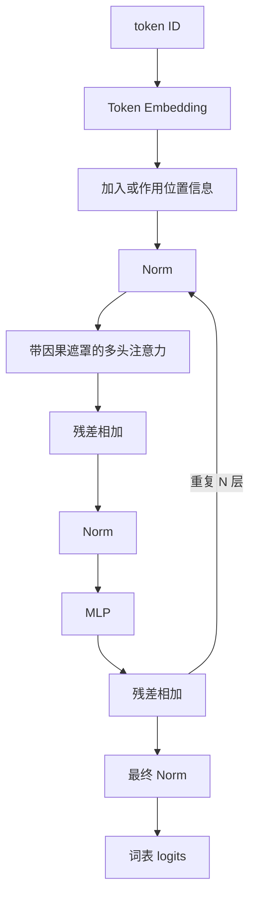

# D06：拼出完整 Transformer

## 今日目标

能画出 Decoder-only Transformer 的主要数据流，并解释残差连接、归一化和 MLP 的作用。

## 一个现代 Decoder 的教学骨架

具体模型会改变 Norm 的类型和位置、位置编码、激活函数、是否使用 MoE、是否共享输入输出权重等。上图是理解主干，不是所有模型的逐层施工图。

## 每个零件在做什么

- **Embedding**：把 token ID 查成向量。
- **注意力**：让当前位置按计算权重汇入此前位置的信息。
- **MLP/FFN**：对每个位置分别做非线性变换，扩展表示能力。
- **残差连接**：把子层输入直接加回输出，为信息和梯度提供短路径。
- **归一化**：控制表示尺度，改善训练稳定性。LayerNorm 与 RMSNorm 计算不同，不能简单说后者只是“更快版”而忽略架构上下文。
- **LM Head**：把隐藏向量映射成词表中每个 token 的 logits。

## Encoder、Decoder 与 Encoder-Decoder

| 类型 | 典型注意力 | 常见用途 |
|---|---|---|
| Encoder-only | 双向自注意力 | 表示、分类、抽取 |
| Decoder-only | 因果自注意力 | 自回归生成，现代 LLM 主流 |
| Encoder-Decoder | 编码器双向，解码器因果并含交叉注意力 | 翻译、条件生成 |

“主流”不等于其他架构无用。还存在 RNN、状态空间模型和混合架构，它们在不同约束下有价值。

## 参数量在哪里

Embedding、注意力投影、MLP 和输出层都可能包含参数。序列长度主要影响本次计算和激活内存，不直接增加已训练模型的参数个数。

## 今日验收

闭卷画出：`token -> embedding -> N 个 Block -> logits`，并在 Block 中标出注意力、MLP、Norm、残差和因果遮罩。

再回答：为什么没有 MLP 的纯注意力堆叠表达会受限？为什么残差连接不是“把错误也加回来”这么简单？

下一课：[D07：模型如何生成文字](D07-模型如何生成文字.md)
