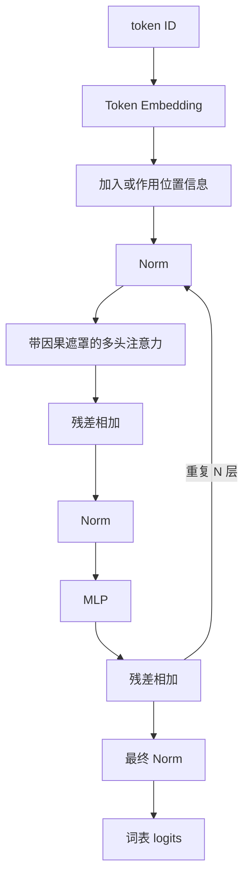

# D06：拼出完整 Transformer

> **学习导航**：承接 D02 的表示、D05 的注意力；本课把零件装成 Decoder-only 主干；完成后应能从 token ID 一路标到 logits，并解释每次形状变化是查表、投影、重排还是汇总。

## 今日目标

能画出 Decoder-only Transformer 的主要数据流，追踪其中的序列轴与特征轴，并解释残差连接、归一化和 MLP 的作用。

## 为什么要学这一课

只理解注意力还不等于理解大模型。真实模型还要组合 Embedding、位置、归一化、残差、MLP 和输出头；架构论文也常只修改其中一部分。本课把零件装回数据流，帮助你以后判断一个新方法解决的是表示、信息汇总、训练稳定性还是输出计算。

## 一个现代 Decoder 的教学骨架

具体模型会改变 Norm 的类型和位置、位置编码、激活函数、是否使用 MoE、是否共享输入输出权重等。上图是理解主干，不是所有模型的逐层施工图。

## 每个零件在做什么

- **Embedding**：把 token ID 查成向量。
- **注意力**：让当前位置按计算权重汇入此前位置的信息。
- **MLP/FFN**：对每个位置分别做非线性变换，扩展表示能力。
- **残差连接**：把子层输入直接加回输出，为信息和梯度提供短路径。
- **归一化**：控制表示尺度，改善训练稳定性。LayerNorm 与 RMSNorm 计算不同，不能简单说后者只是“更快版”而忽略架构上下文。
- **LM Head**：把隐藏向量映射成词表中每个 token 的 logits。

## 用形状读完整模型

先约定：`B` 是 batch，`T` 是序列长度，`D` 是隐藏维度，`H` 是头数，`D_h=D/H` 是每头维度，`M` 是 MLP 中间维度，`V` 是词表大小。

| 阶段 | 典型形状 | 关键理解 |
|---|---|---|
| token ID | `(B, T)` | 两条轴是样本与序列位置，没有语义特征轴 |
| Embedding + 位置 | `(B, T, D)` | 每个位置获得 D 维初始表示 |
| QKV 线性层 | `(B, T, 3D)` | 一次产生三套投影，随后各自为 `(B, T, D)` |
| 多头内部 | `(B, H, T, D_h)` | `D = H × D_h`，拆头通常只是 reshape |
| 注意力输出 | `(B, T, D)` | 拼头并投影回残差宽度 |
| MLP 中间层 | `(B, T, M)` | 常见教学配置取 `M = 4D`，只变特征宽度 |
| MLP 输出 | `(B, T, D)` | 回到 D 才能与残差支路相加 |
| LM Head | `(B, T, V)` | 每个位置为整个词表产生 logits |
| 平均交叉熵 | 标量 | 汇总多个 batch 与位置的预测误差 |

先用一个具体配置检查这张表：若 `B=1、T=3、D=4、H=2、V=6`，token ID 形状是 `(1,3)`，Embedding 后是 `(1,3,4)`，拆头后每个头宽度 `D_h=2`，注意力分数是 `(1,2,3,3)`，最终 logits 是 `(1,3,6)`。最后一个 `6` 不是隐藏维度，而是每个位置都要给词表中的 6 个候选打分。

不要把所有形状变化都叫升维或降维。Embedding 是按 ID 查表；多头拆分是重排；QKV、MLP 和 LM Head 才使用矩阵学习新的坐标组合。多数 Block 的入口和出口保持相同 `D`，因为残差相加要求两边形状兼容。

这张表也是阅读陌生架构的起点：先写每个轴代表什么，再判断哪一步改变了序列长度、网络深度或特征宽度。数学补充见[高维表示、投影与降维](../03-数学急救包/08-高维表示、投影与降维.md)。

## Encoder、Decoder 与 Encoder-Decoder

| 类型 | 典型注意力 | 常见用途 |
|---|---|---|
| Encoder-only | 双向自注意力 | 表示、分类、抽取 |
| Decoder-only | 因果自注意力 | 自回归生成，现代 LLM 主流 |
| Encoder-Decoder | 编码器双向，解码器因果并含交叉注意力 | 翻译、条件生成 |

“主流”不等于其他架构无用。还存在 RNN、状态空间模型和混合架构，它们在不同约束下有价值。

## 现代模型会改写哪些边界

教学骨架里的“注意力层”和“残差连接”不是只能有一种实现。长上下文模型可能把标准注意力与固定状态更新混合使用；超深模型也可能让当前层从多条历史表示中学习读取，而不只接收上一层输出。Kimi K3 就同时沿**序列、深度、宽度**三条轴改造信息流。

这并不推翻 Transformer 骨架。判断一个新模块时，先问：它替换了哪条信息通道？状态形状是什么？计算、显存与通信分别怎样变化？不要只凭新名称宣布“Transformer 已被取代”。具体拆解见 [Kimi K3 三维信息流](../06-拓展知识库/Kimi-K3深读/02-三维信息流全景.md)。

## 参数量在哪里

Embedding、注意力投影、MLP 和输出层都可能包含参数。序列长度主要影响本次计算和激活内存，不直接增加已训练模型的参数个数。

## 今日验收

<ExerciseBlock
  id="d06-transformer-flow"
  type="qa"
  question="闭卷说出 Decoder-only Transformer 从 token ID 到 logits 的主干流程。"
  :concepts="[{ id: 'transformer-flow', label: 'Decoder-only Transformer 主干', prerequisites: ['embedding-table', 'positional-information', 'attention-weighted-sum'] }]"
  :misconceptions="[{ id: 'transformer-parts-without-flow', label: '只记零件名但串不起信息流', explanation: '关键不是背模块清单，而是知道表示怎样从 ID 经 Embedding、Block 和 LM Head 逐步变成 logits。' }]"
  :remediation="{ href: '#一个现代-decoder-的教学骨架', title: '一个现代 Decoder 的教学骨架', reason: '沿输入、重复 Block、输出三段主干重新口述，并在每段说清张量含义。' }"
  answer="token ID 先变成 Embedding 并加入位置信息，再反复经过含 Norm、因果注意力、MLP 和残差的 Block，最后经 Norm 与 LM Head 得到词表 logits。"
  :steps="['输入侧先用 token ID 查 Embedding，并让模型获得位置信息。', '每个 Block 用注意力汇总序列信息，再用 MLP 做逐位置非线性变换，两个子层都有 Norm 与残差配合。', '重复 N 层后，最终隐藏表示映射成词表中每个 token 的 logits。']"
  :transfer="{
    question: '隐藏状态已经经过最后一层 Norm，下一步怎样得到每个词表项的分数？',
    options: ['经过 LM Head 映射到词表 logits', '重新训练 Tokenizer', '删除位置信息'],
    correct: 'A',
    explanation: 'LM Head 把最后隐藏维度投影到词表维度。'
  }"
  mistake="logits 还不是概率，通常还要经过 softmax 或生成策略。"
/>

<ExerciseBlock
  id="d06-attention-vs-mlp"
  type="choice"
  question="为什么现代 Transformer Block 通常还需要 MLP？"
  :concepts="[{ id: 'attention-vs-mlp', label: '注意力与 MLP 分工', prerequisites: ['transformer-flow'] }]"
  :misconceptions="[
    { id: 'attention-replaces-mlp', label: '认为注意力能替代所有变换', explanation: '注意力主要在位置间取信息，MLP 主要在每个位置内部做非线性特征变换。', options: ['A', 'C', 'D'] }
  ]"
  :remediation="{ href: '#每个零件在做什么', title: '每个零件在做什么', reason: '分别回答“从哪里取信息”和“取回后怎样变换”两个问题。' }"
  :options="['MLP 专门负责读取未来 token', 'MLP 对每个位置做非线性变换，补充注意力的信息混合', 'MLP 只是把 token ID 排序', '没有 MLP 就无法使用 tokenizer']"
  correct="B"
  answer="B。注意力主要在位置之间汇总信息，MLP 负责每个位置内部的非线性表示变换。"
  :steps="['注意力回答当前位置从哪些位置取信息。', '取回的信息仍需在特征维度上组合和变换。', '带激活或门控的 MLP 提供非线性表达能力，与注意力形成分工。']"
  :transfer="{
    question: '某层已从前文取回相关信息，接着要在当前 token 的特征维度做非线性组合，主要靠什么？',
    options: ['MLP', '因果遮罩', 'Tokenizer 文件名'],
    correct: 'A',
    explanation: '逐位置非线性特征变换是 MLP 的主要职责。'
  }"
  mistake="注意力和 MLP 不是谁完全替代谁，而是处理不同方向的变换。"
/>

<ExerciseBlock
  id="d06-mlp-shape"
  type="calculation"
  question="隐藏状态是 (4, 32, 64)，MLP 使用 4D 中间宽度。第一层和第二层线性变换后的形状分别是什么？"
  :concepts="[{ id: 'mlp-shape', label: 'Transformer MLP 形状', prerequisites: ['attention-vs-mlp'] }]"
  :misconceptions="[{ id: 'mlp-expands-sequence', label: '把 MLP 扩维误解成增加 Token', explanation: 'MLP 只改变最后的特征维度，batch 和序列长度保持不变。' }]"
  :remediation="{ href: '#用形状读完整模型', title: '用形状读完整模型', reason: '固定前两维，只追踪最后一维从 D 扩到 4D 再回到 D。' }"
  answer="第一层后是 (4, 32, 256)，第二层后回到 (4, 32, 64)。"
  :steps="['隐藏维度 D=64，因此中间宽度 4D=256。', 'MLP 对每个 batch、每个位置独立变换最后一维，所以前两维 4 和 32 不变。', '第二个线性层把 256 维映射回 64 维，才能与原残差支路相加。']"
  :transfer="{
    question: '输入形状 (2, 10, 128)，MLP 中间宽度 4D，第一层输出形状是什么？',
    options: ['(2, 10, 512)', '(2, 40, 128)', '(8, 10, 128)'],
    correct: 'A',
    explanation: '只把最后一维 128 扩为 512。'
  }"
  mistake="MLP 扩张的是每个位置的特征维度，不是把 32 个 token 扩成 256 个 token。"
/>

<ExerciseBlock
  id="d06-residual-connection"
  type="qa"
  question="为什么残差连接不只是把错误原样加回来？"
  :concepts="[{ id: 'residual-connection', label: '残差连接', prerequisites: ['transformer-flow'] }]"
  :misconceptions="[{ id: 'residual-copies-errors', label: '把残差理解成无条件复制错误', explanation: '残差提供原表示和梯度的短路径，子层学习修正；两条路径会在训练中共同适配。' }]"
  :remediation="{ href: '#每个零件在做什么', title: '每个零件在做什么', reason: '用输出 = 输入 + 子层修正观察信息路径与优化路径。' }"
  answer="残差连接为原表示和梯度提供短路径，子层学习的是在原表示基础上的修正；训练会共同调整这条组合路径。"
  :steps="['残差形式可以写成输出 = 输入 + 子层变换。', '若子层暂时没有学好，原信息仍有较直接的通路。', '反向传播也能沿较短路径传递梯度，改善深层网络优化。']"
  :transfer="{
    question: '子层暂时输出接近 0 时，残差块输出最接近什么？',
    options: ['原输入', '全零向量', '词表大小'],
    correct: 'A',
    explanation: '输入 + 接近 0 的修正仍接近原输入。'
  }"
  mistake="残差不能保证网络永不出错，它解决的是信息与优化路径问题。"
/>

<ExerciseBlock
  id="d06-depth-information-flow"
  type="choice"
  question="某层可以学习读取前一层以及更早多个层的表示，这主要改动了哪条信息流？"
  :concepts="[{ id: 'depth-information-flow', label: '深度方向信息流', prerequisites: ['residual-connection'] }]"
  :misconceptions="[
    { id: 'depth-confused-with-sequence', label: '把层间读取误认成序列注意力', explanation: '序列方向连接 token 位置，深度方向连接不同网络层的表示。', options: ['A', 'C', 'D'] }
  ]"
  :remediation="{ href: '#现代模型会改写哪些边界', title: '现代模型会改写哪些边界', reason: '分别画出横向 token 位置和纵向网络层，定位读取发生在哪条轴。' }"
  :options="['序列方向', '深度方向', '词表方向', '数据集切分方向']"
  correct="B"
  answer="B。它改变了不同网络深度之间如何传递和汇总表示。"
  :steps="['序列方向讨论不同 token 位置之间的信息。', '宽度方向通常讨论隐藏维度或专家计算。', '读取多个历史层表示发生在层与层之间，因此属于深度方向。']"
  :transfer="{
    question: '让第 20 层直接融合第 8、12、19 层表示，主要连接的是哪个方向？',
    options: ['深度方向', '词表方向', '样本顺序'],
    correct: 'A',
    explanation: '被连接的是不同层级的表示。'
  }"
  mistake="不要因为它也叫注意力读取，就自动判断为序列注意力。"
/>

<ExerciseBlock
  id="d06-lm-head-parameters"
  type="calculation"
  question="隐藏维度是 768，词表大小是 50,000。忽略 bias，一个独立 LM Head 矩阵有多少个参数？"
  :concepts="[{ id: 'lm-head', label: 'LM Head', prerequisites: ['transformer-flow', 'contextual-representation'] }]"
  :misconceptions="[{ id: 'lm-head-count-ignores-weight-tying', label: '忽略输出矩阵形状或权重共享', explanation: '独立 LM Head 的参数是隐藏维度乘词表大小；若与输入 Embedding 权重共享，不能重复计数。' }]"
  :remediation="{ href: '#参数量在哪里', title: '参数量在哪里', reason: '先写清输入维度和输出词表维度，再判断是否权重共享。' }"
  answer="有 38,400,000 个参数，约 3840 万。"
  :steps="['LM Head 要把 768 维隐藏向量映射到 50,000 个词表 logits。', '矩阵形状可看作 768 × 50,000。', '相乘得到 38,400,000。']"
  :transfer="{
    question: '隐藏维度 256、词表大小 10,000，独立 LM Head 忽略 bias 有多少参数？',
    options: ['2,560,000', '10,256', '256,000'],
    correct: 'A',
    explanation: '256 × 10,000 = 2,560,000。'
  }"
  mistake="若模型让输入 Embedding 与输出权重共享，这部分不能再简单重复计数。"
/>

下一课：[D07：模型如何生成文字](D07-模型如何生成文字.md)
