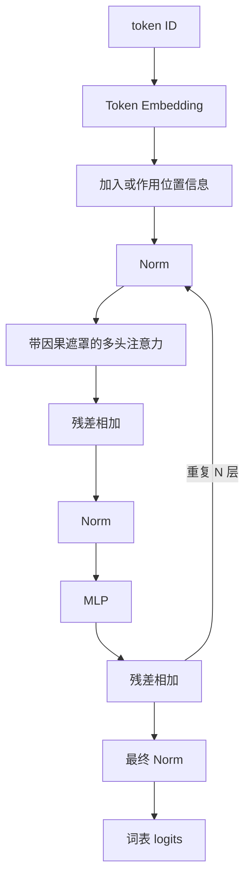

# D06：拼出完整 Transformer

## 今日目标

能画出 Decoder-only Transformer 的主要数据流，并解释残差连接、归一化和 MLP 的作用。

## 一个现代 Decoder 的教学骨架

具体模型会改变 Norm 的类型和位置、位置编码、激活函数、是否使用 MoE、是否共享输入输出权重等。上图是理解主干，不是所有模型的逐层施工图。

## 每个零件在做什么

- **Embedding**：把 token ID 查成向量。
- **注意力**：让当前位置按计算权重汇入此前位置的信息。
- **MLP/FFN**：对每个位置分别做非线性变换，扩展表示能力。
- **残差连接**：把子层输入直接加回输出，为信息和梯度提供短路径。
- **归一化**：控制表示尺度，改善训练稳定性。LayerNorm 与 RMSNorm 计算不同，不能简单说后者只是“更快版”而忽略架构上下文。
- **LM Head**：把隐藏向量映射成词表中每个 token 的 logits。

## Encoder、Decoder 与 Encoder-Decoder

| 类型 | 典型注意力 | 常见用途 |
|---|---|---|
| Encoder-only | 双向自注意力 | 表示、分类、抽取 |
| Decoder-only | 因果自注意力 | 自回归生成，现代 LLM 主流 |
| Encoder-Decoder | 编码器双向，解码器因果并含交叉注意力 | 翻译、条件生成 |

“主流”不等于其他架构无用。还存在 RNN、状态空间模型和混合架构，它们在不同约束下有价值。

## 现代模型会改写哪些边界

教学骨架里的“注意力层”和“残差连接”不是只能有一种实现。长上下文模型可能把标准注意力与固定状态更新混合使用；超深模型也可能让当前层从多条历史表示中学习读取，而不只接收上一层输出。Kimi K3 就同时沿**序列、深度、宽度**三条轴改造信息流。

这并不推翻 Transformer 骨架。判断一个新模块时，先问：它替换了哪条信息通道？状态形状是什么？计算、显存与通信分别怎样变化？不要只凭新名称宣布“Transformer 已被取代”。具体拆解见 [Kimi K3 三维信息流](../06-拓展知识库/Kimi-K3深读/02-三维信息流全景.md)。

## 参数量在哪里

Embedding、注意力投影、MLP 和输出层都可能包含参数。序列长度主要影响本次计算和激活内存，不直接增加已训练模型的参数个数。

## 今日验收

<ExerciseBlock
  type="qa"
  question="闭卷说出 Decoder-only Transformer 从 token ID 到 logits 的主干流程。"
  answer="token ID 先变成 Embedding 并加入位置信息，再反复经过含 Norm、因果注意力、MLP 和残差的 Block，最后经 Norm 与 LM Head 得到词表 logits。"
  :steps="['输入侧先用 token ID 查 Embedding，并让模型获得位置信息。', '每个 Block 用注意力汇总序列信息，再用 MLP 做逐位置非线性变换，两个子层都有 Norm 与残差配合。', '重复 N 层后，最终隐藏表示映射成词表中每个 token 的 logits。']"
  mistake="logits 还不是概率，通常还要经过 softmax 或生成策略。"
/>

<ExerciseBlock
  type="choice"
  question="为什么现代 Transformer Block 通常还需要 MLP？"
  :options="['MLP 专门负责读取未来 token', 'MLP 对每个位置做非线性变换，补充注意力的信息混合', 'MLP 只是把 token ID 排序', '没有 MLP 就无法使用 tokenizer']"
  correct="B"
  answer="B。注意力主要在位置之间汇总信息，MLP 负责每个位置内部的非线性表示变换。"
  :steps="['注意力回答当前位置从哪些位置取信息。', '取回的信息仍需在特征维度上组合和变换。', '带激活或门控的 MLP 提供非线性表达能力，与注意力形成分工。']"
  mistake="注意力和 MLP 不是谁完全替代谁，而是处理不同方向的变换。"
/>

<ExerciseBlock
  type="calculation"
  question="一个模型有 12 个相同 Block，每个 Block 各含 1 个注意力子层和 1 个 MLP 子层。主干共有多少个这类子层？"
  answer="共有 24 个子层。"
  :steps="['每个 Block 有 2 个目标子层。', '模型重复 12 个 Block。', '所以总数为 12 × 2 = 24。']"
  mistake="这里没有把 Norm、Embedding 和 LM Head 计入这两个类别。"
/>

<ExerciseBlock
  type="qa"
  question="为什么残差连接不只是把错误原样加回来？"
  answer="残差连接为原表示和梯度提供短路径，子层学习的是在原表示基础上的修正；训练会共同调整这条组合路径。"
  :steps="['残差形式可以写成输出 = 输入 + 子层变换。', '若子层暂时没有学好，原信息仍有较直接的通路。', '反向传播也能沿较短路径传递梯度，改善深层网络优化。']"
  mistake="残差不能保证网络永不出错，它解决的是信息与优化路径问题。"
/>

<ExerciseBlock
  type="choice"
  question="某层可以学习读取前一层以及更早多个层的表示，这主要改动了哪条信息流？"
  :options="['序列方向', '深度方向', '词表方向', '数据集切分方向']"
  correct="B"
  answer="B。它改变了不同网络深度之间如何传递和汇总表示。"
  :steps="['序列方向讨论不同 token 位置之间的信息。', '宽度方向通常讨论隐藏维度或专家计算。', '读取多个历史层表示发生在层与层之间，因此属于深度方向。']"
  mistake="不要因为它也叫注意力读取，就自动判断为序列注意力。"
/>

<ExerciseBlock
  type="calculation"
  question="隐藏维度是 768，词表大小是 50,000。忽略 bias，一个独立 LM Head 矩阵有多少个参数？"
  answer="有 38,400,000 个参数，约 3840 万。"
  :steps="['LM Head 要把 768 维隐藏向量映射到 50,000 个词表 logits。', '矩阵形状可看作 768 × 50,000。', '相乘得到 38,400,000。']"
  mistake="若模型让输入 Embedding 与输出权重共享，这部分不能再简单重复计数。"
/>

下一课：[D07：模型如何生成文字](D07-模型如何生成文字.md)
