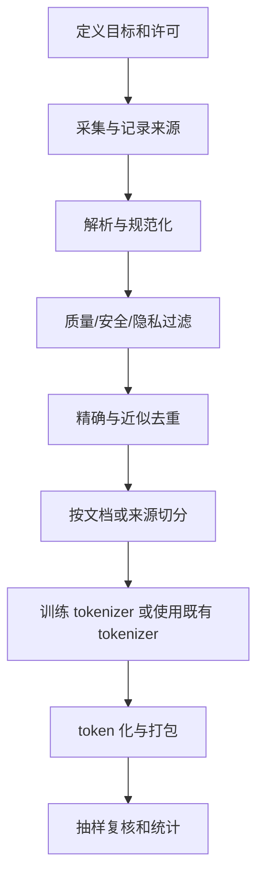

# D08：训练数据与分词器

## 今日目标

建立“许可与目标 -> 清洗 -> 去重 -> 切分 -> token 化 -> 打包”的数据流水线意识。

## 数据不是越多越好

训练数据决定模型会反复练习什么。数量、质量、多样性、领域配比、时效、许可和隐私需要一起考虑。高比例重复、错误答案、模板垃圾或隐私信息会直接进入训练信号。

## 推荐流水线



相近文档不能一份进训练集、一份进验证集，否则验证结果会虚高。切分应尊重文档、会话或用户边界，避免把同一对象拆散后泄漏。

## 因果语言模型的标签

序列是：

```text
输入：今 天 天
目标：天 天 气
```

每个位置预测它后面的 token。实现中常用同一序列错开一位；padding 或不应计分的位置会被 mask 掉。

## 分词器取舍

- **字符级**：概念简单，词表小，但序列通常较长。本课程项目使用它。
- **BPE 类方法**：反复合并常见相邻单元，常用于子词或字节级方案。
- **Unigram**：从候选子词集合中选择概率模型支持的切分。
- **SentencePiece**：一个 tokenizer 工具包，支持 BPE 和 Unigram；它不是单独一种与二者并列的切分原理。

不同 tokenizer 下的 token 数和困惑度不可直接混为同一尺度。

## 数据质检清单

- [ ] 有权使用和再分发数据。
- [ ] 抽样查看原文，不只看统计。
- [ ] 记录语种、长度、重复率和异常字符。
- [ ] 检查个人信息、密钥和危险内容。
- [ ] 训练与验证没有文档级或近重复泄漏。
- [ ] 验证集未参与规则和超参数的反复调优。

## 今日验收

解释为什么“随机按行切分”可能泄漏；再为聊天数据列出三个应按会话而不是按消息切分的理由。

来源：[SentencePiece](https://arxiv.org/abs/1808.06226)

下一课：[D09：一次完整训练循环](D09-一次完整训练循环.md)
