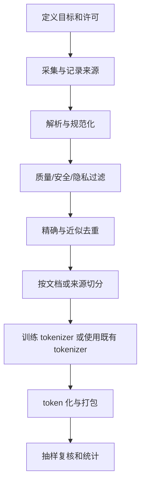

# D08：训练数据与分词器

> **学习导航**：D02 讲的是“已有 tokenizer 怎样使用”，本课改问“训练前怎样选择 tokenizer、治理数据并隔离验证集”；完成后应能画出数据流水线，并指出至少三种泄漏或质量风险。

> **主线位置**：[模型全生命周期总纲](模型训练总纲.md) -> **主线三：D08 数据和 Tokenizer** -> D09 训练任务 -> D10 规模化 -> D11-D12 评估与优化。数据工程处在训练之前，不是训练循环里的一个小清洗按钮。

## 今日目标

能设计并检查“许可与目标 -> 清洗 -> 去重 -> 切分 -> token 化 -> 打包”的数据流水线。

## 为什么要学这一课

模型只能从训练信号中学习。数据的重复、错误、配比、许可和切分都会影响参数或评测；许多“模型问题”来自数据泄漏、低质样本或覆盖不足。本课先判断数据是否值得训练、结论是否可信。

## “监督”不等于必须人工写答案

**监督信号**是告诉训练过程“什么输出更符合目标”的信息。它可以来自人工标签，也可以由数据自身构造：

| 学习方式 | 样本怎样得到目标 | 例子 |
|---|---|---|
| 人工监督 | 标注者给输入补充类别、答案或结构化目标 | 工单 -> `退款问题` |
| 自监督学习 | 从原始数据隐藏、错开或变换一部分，让另一部分成为目标 | 文本前缀 -> 下一个 token |
| 偏好或奖励监督 | 比较多个输出，或由规则、环境和验证器产生分数 | 回答 A 优于 B；代码测试通过 |

因此，“没有人工标签的文本”不等于“训练没有监督目标”。因果语言模型会把文本错开一位，用后一个 token 作为当前训练标签；这是由数据自身构造目标的自监督学习。人工整理类别或理想回答的过程叫**数据标注**。

再分清三个数据词：**训练样本**是一个可处理单元，**数据集**是按用途组织的一组样本，**训练语料**通常指用于语言建模的大量文本或多模态材料。它们都必须记录来源和许可。

**数据泄漏**是开发或测试信息进入了本不该参与的训练、规则拟合或方案选择；**数据污染**常特指评测题、答案或近重复内容混入训练数据。污染是泄漏的一种常见来源，但泄漏还包括先看测试结果再调阈值等流程问题。

## 数据不是越多越好

训练数据决定模型会反复练习什么。数量、质量、多样性、领域配比、时效、许可和隐私需要一起考虑。高比例重复、错误答案、模板垃圾或隐私信息会直接进入训练信号。

## 推荐流水线



相近文档不能一份进训练集、一份进验证集，否则验证结果会虚高。切分应尊重文档、会话或用户边界，避免把同一对象拆散后泄漏。

切分完成后，只有训练分区可用于拟合新 tokenizer 的词表内容、合并规则，以及估计归一化阈值、长度分桶等数据统计。验证集不更新参数，但可用于比较预先定义的 tokenizer 方案、模型配置、checkpoint、阈值和停止时机；每次根据验证结果修改方案，都属于开发过程，反复适配会逐渐过拟合这把尺子。测试集应等方案与选择规则冻结后再用于最终评估。若先看验证或测试内容再拟合数据规则，评测信息就泄漏进了开发流程。使用已经固定的外部分词器不等于在当前数据上重新训练它，但仍要记录版本和配置。

## 因果语言模型的标签

序列是：

```text
输入：今 天 天
目标：天 天 气
```

每个位置预测它后面的 token。实现中常用同一序列错开一位；padding 或不应计分的位置会被 mask 掉。

## 分词器取舍

- **字符级**：概念简单，词表小，但序列通常较长。本课程的预生成微型模型案例使用它。
- **BPE 类方法**：反复合并常见相邻单元，常用于子词或字节级方案。
- **Unigram**：从候选子词集合中选择概率模型支持的切分。
- **SentencePiece**：一个 tokenizer 工具包，支持 BPE 和 Unigram；它不是单独一种与二者并列的切分原理。

不同 tokenizer 下的 token 数和困惑度不可直接混为同一尺度。

## 数据质检清单

- 有权使用和再分发数据。
- 抽样查看原文，不只看统计。
- 记录语种、长度、重复率和异常字符。
- 检查个人信息、密钥和危险内容。
- 训练与验证没有文档级或近重复泄漏。
- tokenizer 词表、合并规则和数据统计只用训练分区拟合。
- 验证集用于有限的方案与超参数选择；最终测试集未参与调优。

## 今日验收

<ExerciseBlock
  id="d08-split-leakage"
  type="qa"
  question="为什么随机按行切分训练集和验证集可能造成泄漏？"
  answer="同一文档、会话或近重复内容可能被拆到两边，使验证集包含模型训练时已经见过的上下文或答案。"
  :steps="['一行通常不等于一个独立信息单元。', '同一文档的相邻行或同一会话的多条消息高度相关。', '若相关内容跨集合，验证指标会把记忆或近重复误当成泛化。']"
  mistake="随机化本身不是充分条件，切分单位必须尊重文档、会话或用户边界。"
/>

<ExerciseBlock
  id="d08-causal-label-shift"
  type="choice"
  question="因果语言模型中，输入序列是 今、天、天，正确的目标序列是哪一项？"
  :options="['今、天、天', '天、天、气', '气、天、今', '只预测第一个 今']"
  correct="B"
  answer="B。目标相对输入向后错开一位，每个位置预测下一个 token。"
  :steps="['第一个输入 今 的下一个 token 是 天。', '第二个输入 天 的下一个 token 还是 天。', '第三个输入 天 的下一个 token 是 气，因此目标是 天、天、气。']"
  mistake="padding 或不需要计分的位置还会被 mask，不能一律计入 loss。"
/>

<ExerciseBlock
  id="d08-dataset-split-counts"
  type="calculation"
  question="有 100 份互不重复的文档，按 80%/10%/10% 做训练、验证、测试切分，各有多少份？"
  answer="训练集 80 份，验证集 10 份，测试集 10 份。"
  :steps="['训练集：100 × 80% = 80。', '验证集：100 × 10% = 10。', '测试集也是 100 × 10% = 10，三者相加回到 100。']"
  mistake="实际切分还要先处理来源、近重复和用户边界，不能只追求比例。"
/>

<ExerciseBlock
  id="d08-tokenizer-tradeoffs"
  type="qa"
  question="字符级 tokenizer 与子词 tokenizer 各有什么典型取舍？"
  answer="字符级词表较小、概念简单但序列常更长；子词可缩短常见文本，但词表、训练和跨语言行为更复杂。"
  :steps="['字符级把较小书写单元直接编号，因此词表容易控制。', '常见词需要多个字符 token，导致序列和计算变长。', '子词把常见组合合并，可缩短序列，但效果取决于语料和规则。']"
  mistake="不存在对所有语言、领域和任务都唯一最优的 tokenizer。"
/>

<ExerciseBlock
  id="d08-sentencepiece-role"
  type="choice"
  question="关于 SentencePiece，哪一项最准确？"
  :options="['它只能做字符级切分', '它是支持 BPE 和 Unigram 等方案的 tokenizer 工具包', '它等于模型的 Embedding 层', '它会自动保证数据无版权问题']"
  correct="B"
  answer="B。SentencePiece 是工具包，不是与 BPE、Unigram 完全并列的单一切分原理。"
  :steps="['BPE 和 Unigram 描述不同的子词建模思路。', 'SentencePiece 提供训练和使用这些模型的工具。', '工具选择与数据许可、质量治理是不同问题。']"
  mistake="不要把软件工具名、算法名和模型层混成同一层级。"
/>

<ExerciseBlock
  id="d08-deduplication-count"
  type="calculation"
  question="数据集有 1,000 条样本，精确去重发现其中 5% 是应删除的重复项。删除后还剩多少条？"
  answer="删除 50 条，剩 950 条。"
  :steps="['重复项数量是 1,000 × 5% = 50。', '从原数据中减去重复项：1,000 - 50。', '结果是 950 条。']"
  mistake="近似重复检测还涉及阈值和误删风险，不能只靠精确字符串比较。"
/>

来源：[SentencePiece](https://arxiv.org/abs/1808.06226)

下一课：[D09：训练任务内部的一次完整循环](D09-训练任务内部的一次完整循环.md)
