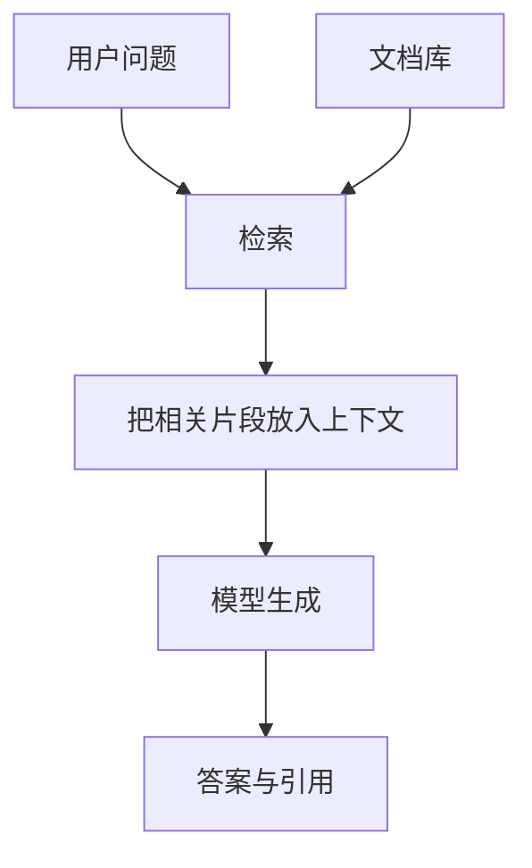

# D13：推理、部署、RAG 与 Agent

## 今日目标

把模型放进真实系统，区分模型层、检索层、工具层和服务层。

## 推理服务关心什么

- **首 token 延迟**：用户多久看到第一个输出。
- **逐 token 延迟**：后续生成速度。
- **吞吐**：单位时间服务多少 token 或请求。
- **并发与队列**：高峰时如何批处理和限流。
- **显存与成本**：权重、KV Cache 和工作区。
- **可靠性**：超时、重试、回滚、监控和版本管理。

量化、连续批处理、KV Cache、推测解码和并行可以优化不同瓶颈，但收益取决于模型、硬件、负载和实现，不能引用一个固定倍数代表所有场景。

## RAG：先查再答



RAG 适合知识频繁变化、私有资料或需要引用的场景。失败可能来自检索没找到、切块不当、排序错误、上下文冲突或模型没有忠实使用证据。检索到文档不代表文档真实，也不保证回答忠实。

## Agent：模型参与循环决策

一个简化循环：

```text
观察状态 -> 选择工具及参数 -> 执行工具 -> 读取结果 -> 决定继续或结束
```

工具调用需要结构校验、权限最小化、超时、预算、幂等性和人工确认。外部网页或文档可能包含提示注入，不能把检索文本当成可信系统指令。

Agent 适合步骤依赖运行结果、需要工具交互的任务。固定流程、强合规审批或简单 CRUD 往往应由普通程序主导，只在需要语言理解的节点使用模型。

## 方法选择顺序

1. 普通代码能否可靠解决？
2. 提示和结构化输出能否解决？
3. 是否需要外部知识，考虑 RAG。
4. 是否需要按结果动态调用工具，考虑 Agent。
5. 是否有稳定行为差距和高质量数据，考虑微调。
6. 只有在基础模型能力不足且资源充分时，才考虑更重的训练。

## 今日验收

为“查询公司报销政策并提交报销”画系统图，标出检索、模型、审批、财务 API 和人工确认。指出哪些步骤绝不能仅凭模型自然语言结果直接执行。

来源：[RAG](https://arxiv.org/abs/2005.11401)、[ReAct](https://arxiv.org/abs/2210.03629)

下一课：[D14：多模态、应用全景与总复习](D14-多模态、应用全景与总复习.md)
