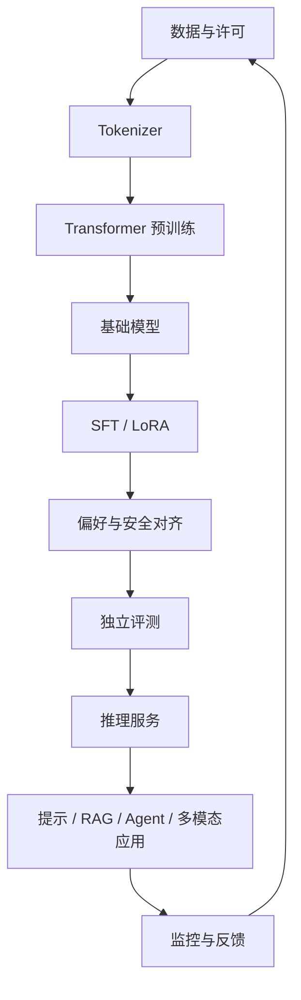

# D14：多模态、应用全景与总复习

## 今日目标

把 14 天知识连成一张图，了解多模态和应用边界，并为第三周训练项目做设计。

## 多模态怎样接入

视觉语言模型常把图像经过视觉编码器或视觉 tokenizer 变成一串表示，再通过投影或连接模块交给语言模型处理。语音也可由专门编码器产生表示，或先转写为文本。

图像生成常使用扩散模型、自回归图像 token 模型或混合方法，不应把所有生成式 AI 都说成“逐字预测”。“世界模型”也没有唯一统一定义，使用该词时应说明它预测的状态、观测或行动是什么。

## 应用不要按行业死记

把应用拆成五种模式更实用：

| 模式 | 例子 | 核心风险 |
|---|---|---|
| 生成 | 写作、代码、摘要 | 幻觉、版权、泄密 |
| 抽取与分类 | 合同字段、工单分类 | 漏检、偏差 |
| 检索问答 | 企业知识库 | 错检索、伪引用 |
| 工具代理 | 查询、下单、改配置 | 越权、不可逆操作 |
| 多模态理解/生成 | 看图问答、语音、图像生成 | 感知错误、深度伪造 |

医疗、法律、金融等高风险领域还需要专业审查、权限、审计和当地法规合规，模型输出不能替代具备资质的判断。

## 总知识地图

反馈不能自动倒回训练集。必须经过许可、脱敏、质量筛选、去重和评测隔离，否则数据飞轮会变成错误放大器。

## 结业闭卷题

1. 从文本到下一个 token 写出至少六步。
2. 为什么因果遮罩允许并行训练，却不能让生成一次完成？
3. train loss 下降而 val loss 上升意味着什么？
4. RAG 和 LoRA 分别更适合改变什么？
5. QLoRA 的 4-bit 针对什么，为什么总显存不是简单除以四？
6. 为什么 Benchmark 高分不能单独证明生产可用？
7. Agent 执行支付前需要哪些保护？
8. 参数量、数据量和能力为什么不是简单线性关系？

## 第三周项目设计

项目目标不是生成优美长文，而是亲手验证：

`数据 -> 字符 ID -> 因果 Transformer -> 交叉熵 -> 梯度更新 -> 验证 -> 生成`

先阅读 [第 3 周实战入口](../02-第3周实战/)，完成环境检查，再运行未训练基线。不要跳过第 18 天的单 batch 过拟合。
