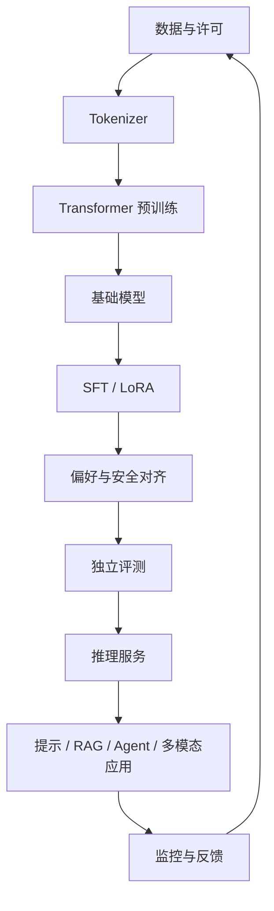

# D14：多模态、应用全景与总复习

> **学习导航**：承接前序模块的表示、训练、评测和应用系统；本课把知识压成可重画的总图，并把理论交给训练过程案例；完成后应能从原始数据追踪到线上输出，也能沿失败现象反向定位可能环节。

## 今日目标

能把理论基础连成一张图，解释多模态接口与应用边界，并能审查一份训练案例是否具有完整证据链。

## 为什么要学这一课

文本只是大模型的一种输入输出形态，图像、语音和视频会增加编码器、连接器、时间轴和新的评测问题。本课同时把前面各层重新接起来，避免学完很多局部机制却无法判断一个真实问题从哪里进入、应在哪一层验收。

## 多模态怎样接入

视觉语言模型常把图像经过视觉编码器或视觉 tokenizer 变成一串表示，再通过投影或连接模块交给语言模型处理。语音也可由专门编码器产生表示，或先转写为文本。

视觉编码器输出可能是 `(B, N_image, D_vision)`，语言模型残差流需要 `(B, N, D_language)`。连接器可以学习 `D_vision -> D_language` 的线性投影，使接口宽度兼容；它也可能通过 pixel-shuffle、池化或重采样改变视觉 token 数 `N_image`。特征宽度和 token 数是两条不同轴，不能混成一次笼统“降维”。

宽度对齐只解决张量能否接入，不等于视觉与语言已经语义对齐。后者还依赖配对数据、训练目标、冻结策略和评测。二维投影中看见图文点靠近，也不能单独证明模型可靠理解了图像内容。

“能看图”也有不同训练路径。外挂式方案可保持语言模型基本不变，只训练连接模块；原生多模态方案则把图文 token 更早混合进预训练，让语言主干共同学习跨模态表示。后者并不自动更强，仍要核对视觉编码器、数据配比、分辨率处理、冻结策略和独立评测。Kimi K3 采用原生视觉语言预训练，可作为阅读这类设计的一份案例。

图像生成常使用扩散模型、自回归图像 token 模型或混合方法，不应把所有生成式 AI 都说成“逐字预测”。“世界模型”也没有唯一统一定义，使用该词时应说明它预测的状态、观测或行动是什么。

## 应用不要按行业死记

把应用拆成五种模式更实用：

| 模式 | 例子 | 核心风险 |
|---|---|---|
| 生成 | 写作、代码、摘要 | 幻觉、版权、泄密 |
| 抽取与分类 | 合同字段、工单分类 | 漏检、偏差 |
| 检索问答 | 企业知识库 | 错检索、伪引用 |
| 工具代理 | 查询、下单、改配置 | 越权、不可逆操作 |
| 多模态理解/生成 | 看图问答、语音、图像生成 | 感知错误、深度伪造 |

医疗、法律、金融等高风险领域还需要专业审查、权限、审计和当地法规合规，模型输出不能替代具备资质的判断。

## 总知识地图

反馈不能自动倒回训练集。必须经过许可、脱敏、质量筛选、去重和评测隔离，否则数据飞轮会变成错误放大器。

忘记某一段时不要从头重读，按故障位置回查：

| 卡住的现象 | 优先回看 |
|---|---|
| 分不清 token、ID、向量或形状 | D02、D03、D06 |
| 不懂 loss 怎样改变参数 | D04、D09 |
| 不懂模型怎样找信息和生成 | D05、D07 |
| 不会判断数据、训练或评测是否可信 | D08、D10、D12 |
| 不会选择 RAG、Agent 或微调 | D11、D13 |

## 结业验收

<ExerciseBlock
  type="qa"
  question="从原始文本到生成下一个 token，按顺序说出至少六个关键步骤。"
  answer="文本经 tokenizer 变成 token ID，查 Embedding 并加入位置信息，经过多层因果 Transformer 得到 logits，转换成候选分布，按生成策略选择 token，再追加到上下文。"
  :steps="['输入阶段：文本切成 token，再映射为 ID 和向量。', '模型阶段：带位置信息的表示经过注意力、MLP、残差和 Norm 的多层计算。', '输出阶段：LM Head 产生 logits，生成策略选择一个 token 并追加，随后进入下一轮。']"
  mistake="训练时还会用目标计算 loss 并更新参数；普通生成没有这两步。"
/>

<ExerciseBlock
  type="choice"
  question="关于原生多模态预训练，哪项最准确？"
  :options="['只要接入视觉编码器就一定属于原生多模态预训练', '图文表示在预训练阶段共同参与主干学习，但仍需核对数据配比和冻结策略', '它保证所有视觉任务都超过专用模型', '它不需要独立视觉评测']"
  correct="B"
  answer="B。原生多模态描述训练路径，不是无条件的能力保证。"
  :steps="['先看图像如何变成视觉 token，并分别记录 token 数 N_image 与特征宽度 D_vision。', '再看连接器怎样把宽度投影到语言模型需要的 D_language，以及这些表示何时共同进入训练。', '最后核对冻结策略、数据配比和独立视觉评测；形状兼容不等于语义已经对齐。']"
  mistake="能接收图片、原生共同预训练和视觉效果强是三个不同判断。"
/>

<ExerciseBlock
  type="calculation"
  question="某 Benchmark 从 72 分提升到 78 分。绝对提升是多少个百分点？相对提升约是多少？"
  answer="绝对提升 6 个百分点，相对提升约 8.3%。"
  :steps="['绝对提升直接相减：78 - 72 = 6 个百分点。', '相对提升以原分数 72 为分母：6 ÷ 72。', '结果约为 0.0833，也就是约 8.3%。']"
  mistake="百分点和百分比不是同一单位，而且单个 Benchmark 提升不能证明生产可用。"
/>

<ExerciseBlock
  type="qa"
  question="把 RAG、LoRA 和 Agent 放进同一张方法选择图时，它们分别主要解决什么？"
  answer="RAG 提供可更新、可引用的外部知识；LoRA 低成本调整稳定行为；Agent 让模型根据中间结果循环选择和调用工具。"
  :steps="['问题若是知识变化和引用，先看检索与证据链。', '问题若是稳定格式或行为差距，且有高质量数据，再比较 LoRA。', '问题若需要多步工具交互且下一步取决于结果，才考虑 Agent。']"
  mistake="三者可以组合，但组合越多，权限、评测和故障面也越大。"
/>

<ExerciseBlock
  type="choice"
  question="线上反馈准备回流训练集前，哪组步骤最完整？"
  :options="['直接把所有对话加入训练', '检查许可、脱敏、质量、去重并隔离评测数据', '只删除短对话', '只保留模型自信回答']"
  correct="B"
  answer="B。反馈必须经过治理，不能自动形成未经审计的数据飞轮。"
  :steps="['先确认反馈是否有权用于训练，并处理个人信息和密钥。', '再做质量筛选、错误标注和去重，避免放大垃圾与偏差。', '最后保护验证和测试样本，防止回流造成评测污染。']"
  mistake="模型自信不是质量标签，用户点击也可能受界面和任务难度影响。"
/>

<ExerciseBlock
  type="calculation"
  question="1,000 次真实请求中有 2% 被规则送去人工复核，需要复核多少次？若其中 5 次确认是严重问题，占全部请求多少？"
  answer="需要复核 20 次；5 次严重问题占全部请求的 0.5%。"
  :steps="['复核数：1,000 × 2% = 20。', '严重问题数是 5，占全部 1,000 次请求。', '5 ÷ 1,000 = 0.005，也就是 0.5%。']"
  mistake="低发生率不等于低风险，还要结合单次损害、可逆性和暴露规模。"
/>

## 进入训练过程案例

案例目标不是生成优美长文，而是沿预生成材料验证：

`数据 -> 字符 ID -> 因果 Transformer -> 交叉熵 -> 梯度更新 -> 验证 -> 生成`

先阅读[训练过程案例入口](../02-第3周实战/)，从未训练基线开始，依次观察数据、张量形状、单 batch 过拟合、完整日志、评测和模型卡。所有记录都已准备好，不需要安装、运行或训练。

完成主线后，可沿 [Kimi K3 深读路线](../06-拓展知识库/Kimi-K3深读/) 把注意力、MoE、长上下文、后训练、系统与评测串成一次完整论文阅读练习。

下一课：[D15：先看未训练基线](../02-第3周实战/D15-确定目标与跑通基线.md)
