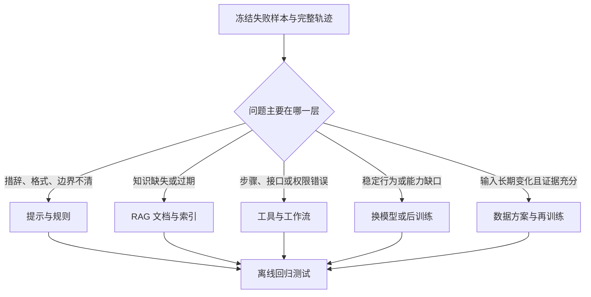
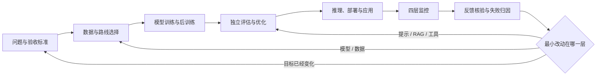

# D14：监控、反馈与持续迭代

> **学习导航**：承接 D12 的离线评测和 D13 的推理、部署与应用；本课追踪模型上线后怎样发现问题、定位责任、控制发布并把可靠证据送回下一轮。完成后应能画出从监控到再训练的闭环，也能判断一个失败应先改提示、检索、工具、模型还是数据。

> **主线位置**：[模型全生命周期总纲](模型训练总纲.md) -> D12 离线评估与优化 -> D13 推理、部署与应用 -> **D14 线上监控、反馈与持续迭代** -> 回到问题定义、数据或方法选择。上线不是课程主线的终点。

## 今日目标

1. 区分服务健康、输出质量、任务效果和安全治理四层监控。
2. 区分数据漂移、概念漂移、系统变化与滥用变化。
3. 根据失败证据选择最小改动层，并说明怎样灰度、回滚和治理反馈数据。

## 为什么要学这一课

离线测试只能回答“冻结样本上的这个版本怎样”。上线后，真实输入、知识库、工具、流量和用户目标都可能变化；服务也可能超时、检索错文档或越权调用工具。只看模型分数，会把系统问题误判成模型问题；只收点赞，又会把含糊行为误当真值。

把一个企业知识助手想成持续运行的产品：昨天答错可能是模型不会，今天答错也可能是文档刚更新、索引未刷新或引用服务故障。监控的任务不是堆更多仪表盘，而是留下足以定位和改进的证据。

## 上线后要看四层

| 层 | 先问什么 | 常见证据 | 只看这一层会漏掉什么 |
|---|---|---|---|
| 服务健康 | 请求能否稳定、及时完成 | 可用率、超时率、首 token 延迟、单次成本 | 快速返回也可能答错或越权 |
| 输出质量 | 回答本身是否可靠 | 事实核验、引用一致性、格式通过率、拒答质量 | 一条漂亮回答未必解决用户任务 |
| 任务效果 | 用户最终是否完成目标 | 一次解决率、人工转接率、用户纠正、后续操作结果 | 点击和停留时长不一定代表正确 |
| 安全与治理 | 系统是否守住权限和责任边界 | 隐私泄露、提示注入、工具越权、审计记录 | 平均质量无法暴露低频高损害事件 |

四层不能压成一个“总分”。例如服务可用率 99.9%，不代表引用正确；满意度高，也不能抵消一次不可逆的越权操作。

## 反馈不是答案标签

点赞、点踩、重试、复制、人工接管和客服备注都只是**观察信号**，不是自动正确的训练标签。

- 用户可能因为回答短而点赞，但内容有事实错误。
- 用户没有点踩，可能只是离开了页面。
- 同一句重试，可能说明答案差，也可能只是用户改变了目标。
- 人工改写更接近任务结果，但仍需核对权限、专业性和一致标注标准。

因此，反馈要先连接原请求、模型版本、提示版本、检索结果、工具轨迹和最终结果，再由规则或人工确认“发生了什么”。没有上下文的一个点击，无法告诉团队该改哪一层。

## 先判断发生了哪种变化

| 变化 | 含义 | 例子 | 优先检查 |
|---|---|---|---|
| 数据漂移（data drift） | 输入分布变了 | 用户开始大量询问新产品，语言和长度也变化 | 输入分布、知识覆盖、切片样本 |
| 概念漂移（concept drift） | 相同输入对应的正确规则变了 | 退款政策更新，旧答案曾经正确、现在错误 | 任务定义、标签标准、有效日期 |
| 系统变化 | 模型外的链路变了 | 提示、索引、工具接口或推理参数被更新 | 版本记录、调用轨迹、组件对照 |
| 对抗与滥用变化 | 用户在主动寻找新攻击面 | 新型提示注入诱导读取私有工具结果 | 攻击样本、权限日志、安全规则 |

数据漂移不等于模型一定失效；概念漂移也不一定需要再训练。若政策能从权威文档检索，先更新知识库通常比把新政策写进参数更及时、更可追溯。

## 从现象定位责任层

以“回答引用了过期退款政策”为例，按证据逐层缩小范围：

| 看到的证据 | 更可能的责任层 | 第一项改动 |
|---|---|---|
| 检索结果就是旧文档 | 数据、索引或检索 | 更新文档版本和索引规则 |
| 检索到新文档，回答却违背原文 | 提示、上下文组织或模型 | 固定失败集，比较提示与模型方案 |
| 回答正确，工具执行了旧流程 | 工具或工作流 | 修复接口、参数映射和权限 |
| 只在高并发时缺少引用 | 推理或服务系统 | 检查超时、截断、缓存和降级策略 |
| 新旧版本都无法完成稳定推理 | 模型能力或后训练 | 比较基座、SFT、偏好优化或换模型 |

一个故障可以跨层，但改动仍应从证据最明确、范围最小的一层开始。不要把每个线上错误都变成“再训一个更大的模型”。

## 决定改哪一层

Tokenizer、架构或从零预训练属于代价更高的上游改动。只有当词表覆盖、上下文机制、模态接口或基础能力确实成为瓶颈，并且更小改动无法达到门槛时，才应进入这些方案。

## 发布不是一次开关

新版本先通过固定离线回归集，再逐步接触真实流量。回归集可反复用于发布门禁；冻结测试集只在方案、阈值和选择规则确定后用于本轮最终估计，不能根据其结果继续选择版本：

1. **离线回归**：在质量、安全、成本和旧能力测试上比较新旧版本。
2. **影子验证**：复制真实请求给新版本，但结果不展示给用户，用于比较分布和系统指标；工具与外部写操作必须禁用、模拟或放进隔离环境，避免影子请求产生真实副作用。
3. **灰度发布（canary release）**：只让少量真实流量使用新版本，并设置停止条件。
4. **逐步放量**：指标稳定后扩大比例，同时分人群、任务和风险等级观察。
5. **回滚**：触发质量、安全或服务红线时，恢复已验证版本并保留故障证据。

回滚不是失败后的临时动作。版本、配置、提示、索引和工具接口都要可追踪，停止条件也要在发布前写明。否则发现问题时，团队甚至不知道要回到哪个状态。

## 反馈怎样回到下一轮

准备把反馈用于评测或训练前，还要经过：

- **许可**：确认数据可以被收集、审查和再次使用。
- **隐私与脱敏**：删除个人信息、密钥和不必要的敏感上下文。
- **裁决**：由明确标准确认失败类型和期望结果，而非直接采用点击信号。
- **去重与分层**：避免大量重复问题淹没罕见但高风险的问题。
- **测试隔离**：冻结测试集既不能混回训练，也不能反复据其结果选择方案或版本；否则它会变成开发证据，分数上升也不再代表对未见数据的真实泛化。

这才是持续迭代：线上现象变成可复查证据，证据决定改动层，改动再经过独立验证和受控发布。它不是让所有对话自动进入下一轮训练。

## 今日验收

<ExerciseBlock
  id="d14-old-policy-diagnosis"
  type="qa"
  question="一个知识助手回答了旧政策。为什么不能立刻断言‘模型需要重新训练’？请给出排查顺序。"
  answer="旧答案可能来自过期文档、未更新索引、提示未携带有效日期、工具调用旧接口，也可能才是模型能力问题。应冻结请求与完整轨迹，依次核对知识源和检索、提示上下文、工具执行、服务截断，最后再比较模型或后训练方案。"
  :steps="['先保存请求、版本、检索结果、工具轨迹和最终输出。', '若检索结果已过期，先修数据或索引；若证据正确而回答错误，再查提示与模型。', '若回答正确而动作错误，修工具或工作流；所有改动都进入同一失败集回归。']"
  mistake="最终文字由整条系统链产生，不应把所有错误都归给模型权重。"
/>

<ExerciseBlock
  id="d14-concept-drift"
  type="choice"
  question="下面哪项最能说明发生了概念漂移？"
  :options="['请求平均长度从 80 字变成 120 字', '服务器升级后首 token 延迟下降', '同一退款问题因新政策生效而有了不同正确答案', '用户开始更多使用英文提问']"
  correct="C"
  answer="C。概念漂移指输入与正确目标之间的关系改变；A 和 D 更像输入分布变化，B 是系统变化。"
  :steps="['先固定同一个输入。', '再问正确目标或判断规则是否随时间改变。', '政策生效使旧标签失效，因此属于概念漂移。']"
  mistake="输入样式变化和正确规则变化是两件事，处理方式也可能不同。"
/>

<ExerciseBlock
  id="d14-timeout-rate"
  type="calculation"
  question="30 分钟内收到 2,400 个请求，其中 72 个超时。超时率是多少？若告警阈值是 2%，是否触发？"
  answer="超时率是 3%，高于 2%，应触发告警。"
  :steps="['超时率 = 72 ÷ 2,400。', '结果是 0.03，也就是 3%。', '3% > 2%，因此触发；随后还要按版本、任务和节点分组定位。']"
  mistake="告警只说明越过门槛，不能单独证明故障来自模型、网络还是推理服务。"
/>

<ExerciseBlock
  id="d14-feedback-as-evidence"
  type="qa"
  question="为什么用户点赞不能直接作为训练标签？怎样把它变成更可靠的证据？"
  answer="点赞受长度、语气、界面和用户目标影响，不等于事实正确。应连接原请求、版本、检索与工具轨迹及最终任务结果，再按统一标准抽样核验和标注。"
  :steps="['先把点赞视为待调查信号。', '补齐产生答案的上下文和系统轨迹。', '用任务标准与人工裁决确认正确性、失败类型和可用范围。']"
  mistake="模型自信、用户点击和事实正确是三个不同变量。"
/>

<ExerciseBlock
  id="d14-canary-release"
  type="choice"
  question="关于灰度发布，哪项最准确？"
  :options="['新版本通过一个总分后立即替换全部流量', '先让少量真实流量使用新版本，并预先设置停止与回滚条件', '只比较服务延迟，不检查输出质量', '灰度期间发现问题后继续放量以收集更多样本']"
  correct="B"
  answer="B。灰度发布限制风险暴露；它仍要同时监控服务、质量、任务和安全指标。"
  :steps="['先完成离线回归和必要的影子验证。', '再限定流量、人群与任务，并写明红线。', '触发红线就停止或回滚，保存证据后再修复。']"
  mistake="流量比例小不会自动消除高风险操作，权限和不可逆动作仍需单独限制。"
/>

<ExerciseBlock
  id="d14-review-rate"
  type="calculation"
  question="1,000 次真实请求中有 2% 被送去人工复核，需要复核多少次？若其中 5 次确认是严重问题，占全部请求多少？"
  answer="需要复核 20 次；5 次严重问题占全部请求的 0.5%。"
  :steps="['复核数：1,000 × 2% = 20。', '严重问题率：5 ÷ 1,000 = 0.005。', '换成百分比是 0.5%，还要结合单次损害和暴露规模判断风险。']"
  mistake="不能用 5 ÷ 20 得到的 25% 代替全部请求中的发生率；两个分母回答不同问题。"
/>

## 主线完成后的去向

多模态不是生命周期最后一步，而是会重新经历表示、架构、训练、评估、部署和监控的专题。需要继续学习图像、语音和视频时，进入[多模态基础](../06-拓展知识库/多模态基础/)；需要理解算子、推理引擎、通信与硬件瓶颈时，进入[系统与软硬件瓶颈](../06-拓展知识库/软硬件瓶颈/)。

训练过程案例用预生成材料把主线压回一个可审查的小项目，不要求安装、运行或训练。下一课：[D15：先看未训练基线](../02-第3周实战/D15-确定目标与跑通基线.md)
