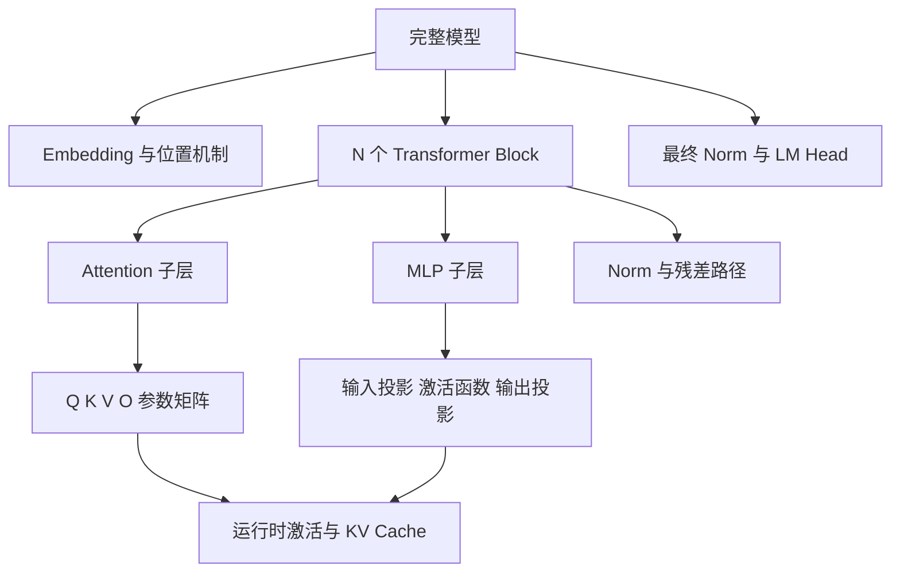

# 主线二：模型架构总纲

这条主线回答：**一个 Decoder-only 大语言模型内部到底有哪些层级，一次输入怎样穿过它们，哪些数字属于模型，哪些只是本次运行的临时状态？**

## 先看层级，不先背零件



“完整模型、Block、子层、参数矩阵”是包含关系；“激活、注意力分数、KV Cache”是模型运行时产生的状态，不是又一组永久模型参数。

## 用同一个 L0 装出完整模型

继续使用 `V=8、D=4、N=2、H=2、D_h=2、M=8、T=4` 的教学模型 L0。它采用简化的 Decoder-only 骨架：

```text
Token ID
  -> Embedding + 位置信息
  -> Block 1: Norm -> 因果 Attention -> 残差 -> Norm -> MLP -> 残差
  -> Block 2: Norm -> 因果 Attention -> 残差 -> Norm -> MLP -> 残差
  -> 最终 Norm
  -> LM Head
  -> 8 个词表 logits
```

教学模型采用预归一化、无 bias、简化 MLP，并让 LM Head 与 Embedding 共享权重。这是可手算的结构图，不代表真实模型都使用相同的 Norm、位置机制、门控或权重共享。

## 一条序列经过架构时，形状怎样变化

输入 `<bos> / 我 / 爱 / 学习` 时，batch 大小为 1：

| 位置 | 形状 | 这个形状里的每条轴 |
|---|---|---|
| Token ID | `(1, 4)` | 1 个样本，4 个序列位置 |
| Embedding 后 | `(1, 4, 4)` | 每个位置获得 4 个隐藏坐标 |
| Q、K、V 分头后 | `(1, 2, 4, 2)` | 1 个样本，2 个头，4 个位置，每头 2 维 |
| 注意力分数 | `(1, 2, 4, 4)` | 每个头中，4 个查询位置分别对 4 个键位置打分 |
| MLP 中间状态 | `(1, 4, 8)` | token 数不变，只把每个位置的特征宽度扩到 8 |
| Block 输出 | `(1, 4, 4)` | 回到残差宽度 4，交给下一 Block |
| LM Head 输出 | `(1, 4, 8)` | 每个位置对 8 个词表候选产生一个 logit |

不要把这些变化统称为“升维、降维”。ID 到 Embedding 是查表，拆成多个头主要是重排，注意力是跨位置加权汇总，MLP 与 LM Head 才是明确的可学习矩阵映射。

## 参数矩阵不是空间，矩阵执行空间之间的映射

令某个位置的隐藏向量为 $x$，Q 投影矩阵为 $W_Q$：

$$
q=xW_Q
$$

| 符号 | 对象 | L0 中的形状 |
|---|---|---:|
| $x$ | 隐藏空间中的一个具体向量 | `(4,)` |
| $W_Q$ | 把输入坐标映射成查询坐标的参数矩阵 | `(4, 4)` |
| $q$ | 映射后得到的新向量 | `(4,)` |

`W` 常用大写、`x` 常用小写是一种书写习惯，字母本身可以换。真正不能随意改变的是：对象类型、局部定义和形状兼容关系。矩阵不是“一个空间盒子”；它保存一条映射规则，输入向量经过它后得到另一个向量。

## L0 的参数到底在哪里

为了看见“每个点都是一个参数”与“模型有层级”怎样同时成立，按上面的简化配置计数：

| 所属位置 | 参数形状 | 数量 |
|---|---:|---:|
| Token Embedding | `8 × 4` | 32 |
| 每个 Block 的 `W_Q、W_K、W_V、W_O` | 4 个 `4 × 4` | 64 |
| 每个 Block 的两层 MLP | `4 × 8` 和 `8 × 4` | 64 |
| 每个 Block 的两个 Norm 缩放向量 | 2 个 `4` | 8 |
| 两个 Block | `2 × (64 + 64 + 8)` | 272 |
| 最终 Norm | `4` | 4 |
| LM Head | 与 Embedding 共享 | 0 个新增参数 |
| **总计** | 省略 bias 与可训练位置参数 | **308** |

所以，3D 参数点阵中的一个点可以代表一个标量参数，但点阵只能回答“数字很多、分布在不同矩阵中”。它不能替代模型层级、矩阵形状和信息流。真实大模型的参数数以十亿计，更需要先按“模型 -> Block -> 子层 -> 参数张量 -> 单个标量”逐级定位。

## 参数、激活与缓存不要混为一谈

| 对象 | 何时产生 | 跨请求保留吗 | 会被训练更新吗 |
|---|---|:---:|:---:|
| 模型参数 | 训练后保存在检查点 | 是 | 训练时会 |
| 激活 | 每次前向按输入计算 | 否 | 它本身不是被优化器直接保存的参数 |
| KV Cache | 自回归推理中保存历史层的 K、V | 通常只服务当前请求 | 否 |
| 梯度 | 反向传播时计算 | 通常只服务当前更新 | 它指导参数更新 |
| 优化器状态 | 训练过程中维护 | 训练恢复时需要 | 随训练变化，但不是部署推理的模型知识 |

训练与推理都做前向计算；训练还要保存反向需要的激活并计算梯度，推理则常保留 KV Cache 来避免重复计算历史 token。它们对内存的压力不同。

## 架构主线怎样展开

| 放大课 | 放大哪一层 | 学完要留下什么脑内图 |
|---|---|---|
| [D05：注意力机制](D05-注意力机制.md) | 一个位置怎样读取可见位置 | `Q/K 打分 -> softmax -> 按 V 汇总` |
| [D06：拼出完整 Transformer](D06-拼出完整Transformer.md) | 子层怎样组成 Block，Block 怎样组成模型 | 从 ID 沿形状走到词表 logits |
| [D07：模型一次运行到底发生什么](D07-模型一次运行到底发生什么.md) | 模型架构怎样被推理引擎反复执行 | `prefill -> decode -> KV Cache -> 输出` |

学完 D07 后闭卷回答：

1. 在“模型、Block、Attention、参数矩阵、单个参数”中画出包含关系。
2. 给出 L0 的 `(1,4)` 输入，沿架构写出每一步形状。
3. 解释为什么模型参数不变时，激活、KV Cache 和最终 token 仍会随输入变化。

能完成后，再进入[模型全生命周期总纲](模型训练总纲.md)，沿数据、训练、评估、部署和反馈继续追踪这个模型。
