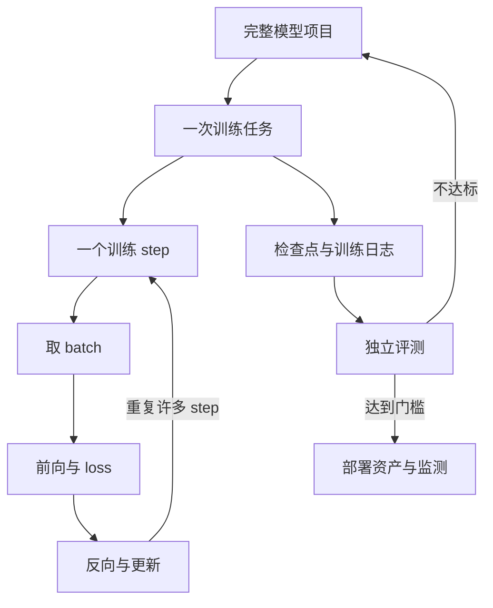

# 主线三：模型训练总纲

这条主线回答：**为了得到一个解决明确问题的模型，从立项到检查点、后训练、评测和部署，完整过程怎样组织？**

先纠正一个常见尺度错误：D09 的“训练循环”不是整个模型项目，它只是一次训练任务内部反复执行的核心循环。

## 三个尺度分别负责什么

| 尺度 | 典型持续范围 | 开始前必须确定 | 结束时得到 |
|---|---|---|---|
| 完整模型项目 | 多次方案与训练任务 | 问题、边界、冻结验收集、预算 | 可否使用的结论、模型卡与部署方案 |
| 一次训练任务 | 一套配置下的许多 step | 数据版本、模型配置、目标、超参数 | 检查点、日志、失败记录 |
| 一个训练 step | 一个或若干 batch | 当前参数与一批数据 | 一次梯度更新及局部指标 |

只看到 loss 下降，只能说明某次训练任务的某个指标变化；它不能自动证明完整项目解决了真实问题。

## 完整生命周期：每一阶段都要交付证据

| 阶段 | 先回答的问题 | 输入 | 输出与检查点 |
|---|---|---|---|
| 1. 问题定义 | 模型要改善谁的什么任务，不负责什么 | 真实失败与约束 | 任务合同、最小基线、冻结验收集 |
| 2. 路线选择 | 普通程序、Prompt、RAG、微调、蒸馏还是从零训练 | 基线差距、时效、预算 | 可反驳的方法选择理由 |
| 3. 数据工程 | 哪些数据可以进入，怎样切分且不泄漏 | 原始数据与许可 | 版本化训练/验证/测试集、数据报告 |
| 4. 模型设计 | 词表、架构、规模和上下文是否匹配任务 | 任务与资源约束 | 固定模型配置与参数量账本 |
| 5. 预训练或继续预训练 | 要让参数学习什么分布 | 大规模 token 与目标 | 基础或领域检查点、训练日志 |
| 6. 后训练 | 要塑造什么行为、格式、偏好或安全边界 | 示范、偏好、奖励与回归集 | SFT/偏好优化检查点与回归结果 |
| 7. 独立评测 | 质量、成本、安全和失败边界是否达标 | 冻结检查点与未参与训练的样本 | 对照表、失败分类、是否继续的决策 |
| 8. 部署与监测 | 模型怎样进入完整系统并持续受约束 | 权重、Tokenizer、配置与应用系统 | 部署资产、运行指标、回滚与监测规则 |

箭头不是永远向前。评测可能让团队回到数据、目标、架构，甚至回到“根本不该训练模型”的路线选择。

## 三条真实训练路线不能混写

### 路线 A：从零训练教学或小模型

L0 就属于这条路线。预设语料只包含 8 个 token 组成的短序列，目标是让学习者看见 token、形状、loss、梯度和检查点怎样连起来。

- **解决什么**：验证教学机制或非常窄的小任务。
- **需要什么**：自有 tokenizer、随机初始化参数、预训练数据和完整训练循环。
- **不能推出什么**：训练成功不等于拥有通用语言、事实知识和复杂推理能力。

### 路线 B：在基座上得到领域模型

大多数组织更常遇到这条路线。例如做一个受控的维修工单分类与答复助手，先用冻结验收集确定分类、引用、格式和安全门槛，再比较 Prompt、RAG、继续预训练、SFT 或 LoRA。

- **解决什么**：领域语言适应、稳定格式、特定任务行为或成本约束。
- **从哪里开始**：已有基座检查点，而不是随机参数。
- **必须保留什么**：未修改基座、最简单系统基线和旧能力回归集。
- **常见错误**：把频繁变化的事实硬写进参数，或只看新任务变好而忽略灾难性遗忘。

### 路线 C：训练通用基础模型

这条路线要覆盖广泛语言、知识、代码、推理与安全需求，通常需要海量数据、分布式训练、系统工程和长期评测。

- **解决什么**：建立可供多个下游任务继续使用的通用基座。
- **成本从哪里来**：数据治理、训练 FLOPs、参数与优化器状态、激活、通信、故障恢复和大量评测。
- **为什么先做文本**：文本数据、离散 token 目标和评测生态通常更成熟；先建立文本主干可以降低第一阶段的系统变量，但这只是路线选择，不是“多模态不重要”的结论。
- **加入多模态还要补什么**：模态编码器或离散表示、连接器、对齐数据、跨模态训练目标、输出头和分层评测。

三个项目都叫“训练模型”，但目标、起点、数据、预算、风险和可接受结论完全不同。

## 把 L0 放进完整流程

下面是一份**预生成教学记录**，用于追踪证据，不要求学习者运行训练：

| 项目阶段 | L0 的预设内容 | 学习者要检查什么 |
|---|---|---|
| 问题 | 预测 8 词表短序列的下一个 token | 任务是否窄到可以手工验收 |
| 数据 | 训练 800 条、验证 100 条、测试 100 条短序列 | 三套数据是否职责分离 |
| 架构 | `V=8,D=4,N=2,H=2,M=8,T=4` | 每个符号能否对应具体形状 |
| 训练任务 | 交叉熵、batch 16、最多 600 step | 配置是否固定且可比较 |
| 单个 step | batch -> 前向 -> loss -> 反向 -> 更新 | 哪一步真正改变参数 |
| 检查点 | step 0、200、400、600 | 能否从同一输入比较候选分布变化 |
| 评测 | 测试 loss 与固定续写题 | 是否使用了训练外样本 |
| 结论 | 仅用于教学短序列 | 是否明确没有宣称通用能力 |

## 训练前、中、后分别看什么

| 时间 | 关键证据 | 不能被它单独证明的事 |
|---|---|---|
| 训练前 | 基线、数据报告、参数量、显存和计算估算 | 模型最终一定能达到目标 |
| 训练中 | train/val loss、梯度范数、吞吐、异常与检查点 | 线上任务、安全和事实可靠性已经合格 |
| 训练后 | 冻结测试、人工审查、回归、安全、延迟与成本 | 未来分布变化后仍永远有效 |

检查点也不是自动可部署产品。部署还需要 tokenizer、架构配置、精度与量化信息、推理引擎兼容性、应用权限、监测和回滚方案。

## 训练主线怎样展开

| 放大课 | 放大哪一段 | 它不等于什么 |
|---|---|---|
| [D08：训练数据与分词器](D08-训练数据与分词器.md) | 数据进入训练前的治理、切分和编码 | 不是把网页抓来就算训练集 |
| [D09：训练任务内部的一次循环](D09-一次完整训练循环.md) | 单个 step 与一次训练任务 | 不是完整模型生命周期 |
| [D10：预训练与规模化训练](D10-预训练与规模化训练.md) | 放大训练后的计算、显存、通信与故障 | 不是参数越多就必然越好 |
| [D11：SFT、LoRA 与 QLoRA](D11-SFT、LoRA与QLoRA.md) | 在已有基座上继续改变参数 | 不是所有知识更新的默认方案 |
| [D12：对齐、强化学习与评测](D12-对齐、强化学习与评测.md) | 用示范、偏好、奖励塑造行为并防止自欺 | 不是把一个奖励分数刷高就完成对齐 |

学完 D12 后闭卷重建：

1. 从真实问题开始，画到数据、架构、预训练、检查点、后训练、独立评测和部署。
2. 在图中圈出“一个训练 step”，解释为什么 D09 只放大了这一局部。
3. 对比从零小模型、领域模型和通用基础模型的起点、目标、数据与结论边界。

完成这三项后，D13-D14 会把模型接入应用系统和多模态世界；案例课程则用预设日志、配置和模型卡继续训练你的证据判断能力。
