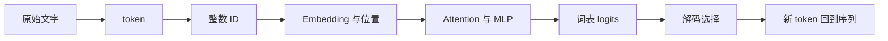

# 动画模型实验室：让一条数据走完整个模型

> **学习导航**：课程页内嵌的程序动效才是主入口，读到概念后直接在原地操作，不需要跳转到这里或打开外站。本页只做动画素材地图、来源核对和适用边界记录；需要查来源时再回来。

很多动画只让画面动起来，学习者看完仍然说不出模型做了什么。真正有效的交互可视化会固定一条可追踪的数据，让它在不同层级之间保持身份：文字变成 token，token 变成 ID，ID 查到向量，隐藏表示经过网络，最后得到候选分数和输出。

本站把这套方法概括成四个动作：

1. **先定位**：现在看的是输入、参数、运行时状态，还是输出。
2. **跟一次变化**：一次只追一条因果链，不同时播放所有效果。
3. **立即回答**：暂停后说出“什么变了、为什么变、形状怎样变”。
4. **回到全局**：把局部重新放回模型原理、模型架构或训练流程。

## 素材地图：只用于来源与审计

- **小网络怎样形成弯曲的分类边界**：[TensorFlow Playground](https://playground.tensorflow.org/)。先看 [D04 神经网络如何学习](../01-14天理论课/D04-神经网络如何学习.md)，再观察数据点、网络结构、loss 与决策边界怎样一起变化。
- **图像怎样逐层变成分类证据**：[CNN Explainer](https://poloclub.github.io/cnn-explainer/)。先看 D04 与[多模态基础](../06-拓展知识库/多模态基础/README.md)，再追踪卷积核、特征图、池化和类别分数的局部对应。
- **两个网络为什么会互相拉扯、训练不稳定**：[GAN Lab](https://poloclub.github.io/ganlab/)。先看 D04 与[训练流程总纲](../01-14天理论课/模型训练总纲.md)，同时观察真实分布、生成分布、判别边界和两方目标。
- **一段文字怎样穿过 GPT 风格模型**：[Transformer Explainer](https://poloclub.github.io/transformer-explainer/)。先看 [D02](../01-14天理论课/D02-文字如何变成数字.md)、[D05](../01-14天理论课/D05-注意力机制.md)、[D06](../01-14天理论课/D06-拼出完整Transformer.md)与[D07](../01-14天理论课/D07-模型如何生成文字.md)，再追踪同一批 token 怎样进入 Embedding、Attention、MLP、logits 与解码。
- **参数矩阵、激活和算子怎样在空间中连接**：[LLM Visualization](https://bbycroft.net/llm)。先看 [D03](../01-14天理论课/D03-够用就好的数学基础.md) 与 D06，重点区分参数、激活、矩阵乘法和层级结构。
- **高维向量为何只能被投影后观察**：[Embedding Projector](https://projector.tensorflow.org/)。先看 D02 与[高维表示、投影与降维](../03-数学急救包/08-高维表示、投影与降维.md)，再比较投影方法变化后邻域和簇怎样移动。
- **某一层、某个头在关注哪些位置**：[BertViz](https://github.com/jessevig/bertviz)。先看 [D05 注意力机制](../01-14天理论课/D05-注意力机制.md)，再观察层、头、Query/Key 位置和注意力连线；不要把权重直接当成完整解释。

这些项目提供了“状态变化应该怎样被看见”的设计证据，不是课程运行依赖，也不是进入下一课的门槛。课程页使用本站自己的 SVG/3D 程序动效；外站加载失败不会打断课程闭环。

## 重点路线：沿同一句文字走完一次生成

第一次不要自由探索，固定一句短文本，只观察下面七个检查点：

每到一个检查点，暂停并回答：

- 当前对象是离散符号、整数索引、浮点张量、模型参数，还是概率分布？
- 这一段改变了序列轴、特征轴、网络深度，还是只改变了数值？
- 模型权重是否被更新？若没有，变化来自输入、运行时状态还是解码选择？

站内的[统一运行地图](../01-14天理论课/D07-模型如何生成文字.md#第一段动效-一条请求怎样走完整条链)使用同一套对象命名。外部项目用于增加观察角度，本站负责把观察重新连回概念、公式、边界和验收题。

## 每个项目只做一个观察任务

### TensorFlow Playground：只改一个条件

固定数据集和网络，先只增加一层或改变激活函数。观察决策边界能否表达原来无法表达的形状，同时留意训练更慢、结果更不稳定或过拟合的可能。不要用一个玩具二维数据集推断真实大模型一定会怎样。

### CNN Explainer：从一个像素块追到类别分数

选择一个局部区域，追踪卷积后哪些特征图发生响应，再看池化和后续层如何改变空间分辨率与特征数量。目标不是记住界面，而是能说出“局部模式怎样逐层组合成分类证据”。

### GAN Lab：同时盯住两方

不要只看生成样本变好。同步观察生成分布、真实分布、判别边界和两方 loss；如果一方过强，另一方可能得到不足或不稳定的学习信号。二维玩具分布能展示训练动力学，不能代表现代图像生成系统的全部结构。

### Transformer Explainer：固定同一批 token

输入一句短文本，依次看 token、Embedding、Attention、MLP、logits 和候选概率。调节 temperature、top-k 或 top-p 时，只把它解释为本次解码分布改变；模型权重与已学知识没有因此更新。该项目运行的是可检查的小型 GPT-2 风格模型，不代表所有现代模型都采用完全相同的组件和配置。

### LLM Visualization：区分参数和激活

先定位某个参数矩阵，再跟踪一次输入经过矩阵乘法产生的激活。参数是训练后保存的数；激活是当前输入在运行过程中临时算出的数。项目中的首个带权重示例是执行字母排序任务的微型 GPT 风格网络，适合检查结构和计算，不应被当作通用聊天模型的缩小复刻。

### Embedding Projector：主动破坏一次投影

先观察一个二维或三维投影，再切换投影方法或参数，比较邻域和簇是否移动。学习目标是亲眼确认：低维图是分析视图，不是高维表示空间的原样照片。任何关于“两个点很近”的结论都要附带模型、层、样本、度量与投影设置。

### BertViz：注意力可见，不等于原因已解释

在层视图、头视图和神经元视图之间切换，确认同一 token 在不同层和不同头上的连线会变化。注意力图能回答“这里计算了怎样的权重”，但不能单独证明模型为何作出最终判断，更不能替代因果实验。

## 本站怎样吸收，而不是照搬

- 同一课尽量让同一个教学输入贯穿图、正文、公式和验收题。
- 全局图与局部放大共用对象名称、颜色和形状，返回全局后能找到原位置。
- 动画展示数据或状态变化；固定结构使用静态图，不为“更炫”而旋转。
- 控件每改变一个参数，图中必须立即出现可解释的反馈，并显示当前数值。
- 三维只用于轴、层级、参数点阵或空间遮挡确实承载知识的场景；同时保留二维说明和形状文字。
- 所有站内图、文案和交互独立实现。外部页面、论文和仓库只作为证据、比较对象与可选观察材料。
