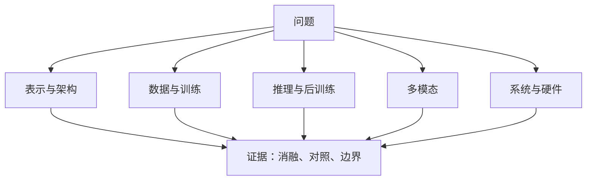

# 跨系列问题地图

学习导航：本页把 GLM、Kimi、DeepSeek、Qwen 放到同一组研究问题里；读完你应能从“我要解决什么瓶颈”反查论文，而不是从版本号猜架构。

## 为什么按问题比较

四个系列的发布时间和命名方式不同，但它们反复面对相同的系统问题：训练计算太贵、长上下文太慢、推理能力难以验证、多模态接口不自然、Agent 轨迹太长、模型变强后仍不可靠。按问题比较，才能看到方法的互补与代价。

表格中的模型名是代表性材料入口，不表示该系列只有这一种方案，也不表示同一行的材料可以直接横向排名；它们需要回到各自报告的版本和实验条件中核对。

## 研究问题对照

| 问题 | GLM | Kimi | DeepSeek | Qwen | 不能直接推出的结论 |
|---|---|---|---|---|---|
| 怎样扩大容量又控制每 token 成本？ | GLM-5 报告中的 DSA 与异步 RL | K2/K3 报告中的 MoE、KDA、Stable LatentMoE | DeepSeekMoE、V2/V3 与 DSA 实验材料 | Qwen3 的 MoE、Qwen3-Coder-Next 的混合架构 | 总参数更大不等于每 token 更贵或能力必然更强 |
| 长上下文为什么会慢？ | DSA、IndexCache | MoBA、Kimi Linear、KDA | MLA、DSA | YaRN 背景、Qwen3-Coder-Next | 窗口长度、可利用性和服务吞吐是三件事 |
| 推理能力如何被训练出来？ | ARC、异步 Agent RL | k1.5 长 CoT、K2 Agent 后训练 | DeepSeekMath、R1、Prover、Math-V2 | Qwen3 thinking/non-thinking、Math | 最终答案正确不等于过程可靠 |
| 多模态为什么不只是增加图像词表？ | GLM-V、Voice、OCR | Kimi-VL、Audio、K2.5/K3 | VL、Janus、OCR | Qwen-VL、Omni、Image | 具体模型可能使用连续特征或离散 token；模态编码器、连接器、主干和输出头必须分别审查 |
| 怎样让系统可上线？ | GLM-5 的异步训练和稀疏索引 | KDA/FlashKDA、长上下文吞吐 | FP8、DeepSeek 系列内核与 DSA | 多模态实时性、Embedding/Reranker | 论文的 benchmark 分数不能替代同负载 SLO |
| 如何守住可靠性？ | Agent 轨迹、工具调用与安全评测 | 长程 Agent 与视觉工具链 | 形式化证明、验证器、过程约束 | Qwen3Guard、安全后训练 | 拒答率、准确率和用户风险需要分层报告 |

## 推荐的跨系列路线

### 路线 A：先懂架构效率

[DeepSeekMoE](https://arxiv.org/abs/2401.06066) → [DeepSeek-V2](https://arxiv.org/abs/2405.04434) → [MoBA](https://arxiv.org/abs/2502.13189) → [Kimi Linear](https://arxiv.org/abs/2510.26692) → [GLM-5](https://arxiv.org/abs/2602.15763) → [Kimi K3](https://arxiv.org/abs/2607.24653)。

每一站都问同一组问题：状态存在哪里？每个 token 访问多少历史？省下的是 FLOPs、KV Cache、显存带宽还是通信？质量在哪些长度或任务上开始下降？

### 路线 B：先懂推理后训练

[Kimi k1.5](https://arxiv.org/abs/2501.12599) → [DeepSeekMath](https://arxiv.org/abs/2402.03300) → [DeepSeek-R1](https://arxiv.org/abs/2501.12948) → [Qwen3](https://arxiv.org/abs/2505.09388) → [GLM-4.5](https://arxiv.org/abs/2508.06471)。

这条路线要分清：奖励来自最终答案、过程验证器、环境成功，还是人工偏好？推理 token 变长是否真的带来可靠性？训练出的策略在没有验证器的开放任务上会发生什么？

### 路线 C：先懂统一/原生多模态

[Qwen-VL](https://arxiv.org/abs/2308.12966) → [DeepSeek-VL](https://arxiv.org/abs/2403.05525) → [Janus](https://arxiv.org/abs/2410.13848) → [Qwen2.5-Omni](https://arxiv.org/abs/2503.20215) → [Kimi K2.5 技术报告](https://github.com/moonshotai/Kimi-K2.5/blob/master/tech_report.pdf) → [Kimi K3](https://arxiv.org/abs/2607.24653)。

每篇都画四个框：原始输入、模态编码器或离散表示、连接器/主干、输出头。这里的“原生/统一”沿用各报告的架构标签，不代表存在一个所有模型都共用的实现。再单独列感知、对齐、推理和生成四类失败。

## 共性审查问题

读四个系列时，下面的问题比“谁的分数最高”更有迁移价值：

1. **基线是否同层**：裸基座、后训练模型、带工具 Agent 和完整应用不能放在一张排行榜里直接比较。
2. **改动是否被隔离**：数据、架构、优化器、RL、推理预算同时改变时，只能说组合结果。
3. **数字是否可复算**：总参数、激活参数、层数、专家数、上下文和吞吐的口径是否一致？
4. **失败是否被报告**：只给平均分会隐藏长上下文尾部、视觉小字、拒答和工具调用失败。
5. **发布层级是什么**：论文、技术报告、模型卡、博客和仓库代码分别能证明什么？

## 迁移题

假设一个 1T 总参数、32B 激活参数的 MoE 模型在长上下文任务中比一个 70B dense 模型快。这里是一个虚构的验收场景，不对应某一篇论文或产品；你不能仅凭这句话选型，至少还要索取输入/输出长度、精度、并发、TTFT、TPOT、尾延迟、硬件、路由负载和失败率。若模型还带 Agent 工具，必须把工具耗时和模型 decode 时间拆开。

结论回扣标题：**系列名称只是索引，研究问题和证据层级才是可迁移的知识图谱边。**
