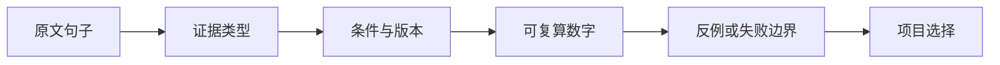

# 论文证据卡

学习导航：本页把“读论文”变成一张可审查的结构化卡片；读完任何一篇论文，都应能从摘要走到数字、边界和项目决策，而不是只留下几句漂亮总结。

## 为什么要填证据卡

初学者看不懂论文，常常不是公式太难，而是把五种不同句子混在一起：作者观察到的事实、作者做出的实验、作者解释实验的主张、读者自己算出的关系、尚未确认的猜测。证据卡强迫每个结论回到来源和适用条件。

## 一页卡片模板

| 卡片区 | 必须回答 | 常见漏项 |
|---|---|---|
| 问题 | 论文要改善的真实失败是什么？ | 只写“提升性能” |
| 基线 | 和谁比较？是同模型、同数据、同预算吗？ | 把模型和完整 Agent 系统混比 |
| 输入 | 数据、token、图像 patch、音频帧如何进入？ | 只画一个“输入”箭头 |
| 改动 | 哪些参数、状态、算子或训练阶段改变？ | 把推理引擎优化算成模型能力 |
| 证据 | 哪个表、图、公式或代码支持？能复算什么？ | 只记录排行榜第一名 |
| 代价 | 显存、吞吐、数据、训练不稳定或可解释性付出什么？ | 只写收益 |
| 边界 | 长度、语言、模态、任务、版本或硬件何时失效？ | “适用于所有场景” |
| 迁移 | 这条结论会改变哪一个项目决策？ | 读完没有行动判断 |

## 逐句标注示例

> 作者报告某稀疏注意力版本在 128K 输入下达到更高吞吐。

- **作者实验**：必须附输入长度、输出长度、硬件、精度、batch、吞吐定义。
- **教学推导**：如果根据层数和访问块数估算每 token 访问量，要明确是估算。
- **作者主张**：如果作者说“几乎不损失质量”，要回到具体任务和误差条，而不是扩大成普遍无损。
- **待核查**：若仓库代码与论文版本不一致，先保留两个版本，不要强行合并。

## 证据链写法

推荐把“项目选择”写成条件句：

> 如果输入长度长期超过 128K、硬件支持相应内核且质量回归集不下降，才考虑这项稀疏注意力方案；短上下文或小 batch 不能直接沿用长上下文结论。

## 四个最小复核动作

1. 从表格中挑一个数字，用最小算式复算，例如 `69 + 24 = 93`。对 MoE 先写清统计口径：`每 token 激活参数 ≈ 共享参数 + 当前 token 选中的专家参数`，而`总参数 = 共享参数 + 全部专家参数 + 其他层参数`；二者不是简单的乘法关系。
2. 把基线、方法、结果和硬件写成四列，检查是否把完整系统与裸模型混在一起。
3. 构造一个让作者结论不成立的场景，例如上下文长度缩短、并发下降、视觉文字变小或工具耗时占主导。
4. 写一句“不负责什么”：架构效率不负责事实正确，验证器高分不负责开放世界真实性，模型卡不负责第三方部署 SLO。

## 完成标准

一张证据卡至少有：1 个问题、1 个基线、1 张信息流、1 个可复算数字、1 个代价、1 个反例和 1 个待核查项。没有这七项时，状态只能保持“研读中”。
