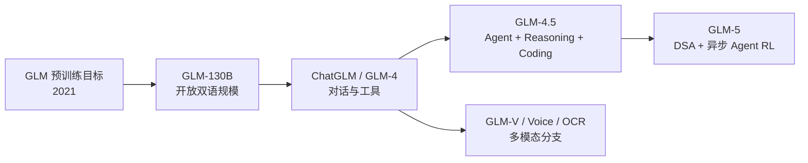

# GLM 系列选读地图

学习导航：本页是[GLM 论文深读](GLM深读/)的导航地图，不再把整个系列压成一篇文章。先按下方问题链定位，再进入逐篇深读；完成后应能解释版本变化背后的研究问题。

> **怎么读**：路线页负责“为什么按这个顺序”，深读页负责“这一篇到底做了什么”。推荐从 [GLM：生成式预训练的空白填充](GLM深读/01-GLM预训练目标.md) 开始；GLM-V、Voice、OCR 等分支先留在[论文库](01-论文库.md)查阅。

## 为什么先读 GLM

GLM 系列适合初学者观察“模型名字变了，但问题链没有断”：早期材料讨论预训练目标，随后出现双语基座、对话、工具、推理和多模态分支。下面是一条便于学习的阅读叙事，不表示每一代都由前一代单独继承，也不表示能力变化只有一个原因。它能提醒我们：GLM-5 的 Agent 能力不是只靠一个采样参数产生的，而是模型、后训练、环境和服务共同作用。

## 推荐路线

| 顺序 | 论文 | 观察点 |
|---:|---|---|
| 1 | [GLM](https://arxiv.org/abs/2103.10360) | 自回归空白填充怎样同时利用双向上下文？ |
| 2 | [GLM-130B](https://arxiv.org/abs/2210.02414) | 开放双语规模化训练的稳定性和并行账本是什么？ |
| 3 | [ChatGLM 家族](https://arxiv.org/abs/2406.12793) | 对话后训练、工具调用和版本家族如何连接？ |
| 4 | [GLM-4.5](https://arxiv.org/abs/2508.06471) | Agent、推理和代码能力的训练与评测是否被分开？ |
| 5 | [GLM-5](https://arxiv.org/abs/2602.15763) | 稀疏注意力、异步 RL 和软件工程长任务如何共同工作？ |
| 6 | [GLM-4.5V](https://arxiv.org/abs/2507.01006) 或 [GLM-4-Voice](https://arxiv.org/abs/2412.02612) | 多模态分支怎样改变输入、输出和评测？ |

## 三个核心连接

### 1. 从“空白填充”到“下一 token”不是简单换公式

原始 GLM 论文提出的关键训练设计，是把生成式目标和双向上下文结合；不要把它理解成所有 GLM/ChatGLM 版本都使用完全相同的目标。读原始论文时，把训练样本、可见位置、预测位置和损失范围画出来；再回到 D08，检查模型实际输入的 token、位置编码和标签是否仍然满足“只预测被遮蔽的位置”。

### 2. Agent 能力不是模型分数的同义词

GLM-4.5/5 把 Agent、推理和代码放在一起报告。证据卡必须分开：裸模型回答、带思考预算的模型、带工具的 harness、完整软件工程任务。一个模型在 SWE 任务上更强，可能来自更好的轨迹数据、工具循环、上下文压缩或更高预算，不能只归因给参数量。

### 3. 稀疏注意力解决的是计算路径，不是事实性

GLM-5 报告中的 DSA，以及作为机制伴读收录的 IndexCache 论文，都关注长上下文的访问和索引效率；IndexCache 不等于 GLM-5 报告中的独立消融，也不自动表示它已经随产品部署。相关方法可能降低某些计算与缓存成本，却不自动解决：知识是否在训练数据中、证据是否进入上下文、答案是否忠实、工具调用是否安全。把这四层分开，才能回应课程里“模型为什么会幻觉”的问题。

## 研读时要记录的数字

- 训练 token、上下文长度、激活参数和总参数分别是多少？
- DSA 的稀疏访问、索引复用和全注意力基线在什么长度上比较？
- 异步 RL 改变的是采样/训练的等待关系、训练稳定性，还是最终能力？
- Agent 评测是否包含真实工具、失败重试、长轨迹和成本？

## 反例

如果一个 GLM-5 部署在 4K 短请求、小 batch、强工具缓存的场景中，DSA 的长上下文优势可能不构成端到端收益；如果工具 API 本身占据 90% 延迟，优化 decode 内核也不会让用户体验按同样比例变快。

## 继续阅读

- 需要架构效率：进入[跨系列问题地图](02-跨系列问题地图.md)的路线 A。
- 需要 Agent 训练：先读[模型后训练](../模型后训练/)和[幻觉与可靠性](../幻觉与可靠性/)。
- 需要视觉或语音：进入[多模态基础](../多模态基础/)，再读 GLM-V、GLM-4-Voice 和 GLM-OCR。
