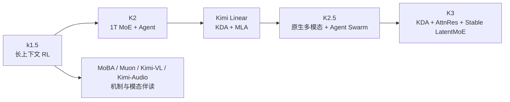

# Kimi 系列选读地图

学习导航：本页是[Kimi 论文深读](Kimi深读/)的路线地图；逐篇机制分析不再堆在这里。完成路线后应能区分 Kimi K3 报告中的组合结果与单项机制论文的证据。

> **怎么读**：先进入 [Kimi k1.5：长思维链强化学习](Kimi深读/01-k1.5长思维链强化学习.md)，再读 MoBA、K2、Kimi Linear 与 K2.5；最后进入[Kimi K3 技术报告深读](../Kimi-K3深读/)完成组合案例。

## 为什么先读 Kimi

Kimi 系列很适合学习“架构和训练互相塑造”：相关材料分别讨论长上下文 RL、MoE、Muon、Agent、混合注意力和多模态。下面按模型系列组织成阅读路线，不表示每个版本的能力变化都由前一项机制单独造成。路线中会遇到正式论文、技术报告和仓库随附报告，正好练习证据分层。

## 推荐路线

| 顺序 | 资料 | 观察点 |
|---:|---|---|
| 1 | [Kimi k1.5](https://arxiv.org/abs/2501.12599) | 长 CoT、部分轨迹、策略优化和多模态 RL 怎样协同？ |
| 2 | [MoBA](https://arxiv.org/abs/2502.13189) | block 级稀疏注意力减少了什么，边界是什么？ |
| 3 | [Kimi K2](https://arxiv.org/abs/2507.20534) | 1T MoE、MuonClip 和 Agent 后训练的组合证据如何拆分？ |
| 4 | [Kimi Linear](https://arxiv.org/abs/2510.26692) | KDA 与全局 MLA 的混合比例怎样影响质量和 TPOT？ |
| 5 | [Kimi K2.5 技术报告](https://github.com/moonshotai/Kimi-K2.5/blob/master/tech_report.pdf) | 视觉文本持续预训练和 Agent Swarm 是怎样的训练/系统问题？ |
| 6 | [Attention Residuals](https://arxiv.org/abs/2603.15031) | 深度扩展为什么需要新的跨层信息通路？ |
| 7 | [Kimi K3](https://arxiv.org/abs/2607.24653) | 93 层、KDA/Gated MLA、LatentMoE 和 1M 上下文怎样串联？ |

## 三个核心连接

### 1. 固定状态不是“记住全部历史”

KDA 这类方案不是逐 token 保存完整 KV 历史，而是维护固定形状、可递归更新的历史状态；这可能降低缓存和读写成本，但也引入信息压缩误差。按本目录所引用的 K3 报告口径，69 个 KDA 层 + 24 个 Gated MLA 层 = 93 层；这是该报告的结构描述，不是 KDA 的通用配置。再问每一类层在信息流中负责什么，不能把固定状态写成全局注意力的无损替代。

### 2. 总参数和激活参数必须分开

以 K2 报告为例，1T 是总参数，约 32B 是每 token 激活参数；它们是同一版本的两种统计口径，不是两个模型。若 K3 报告给出不同的激活参数，必须单独标注为 K3 的数字，不能与 K2 的 1T/32B 拼成一个模型的等式。MoE 的总容量、每 token 访问的专家、共享专家、通信和显存不是同一个指标；只有绑定路由策略、并行方式、精度和上下文长度才可比较，“参数越大所以更强”不是可审查结论。

### 3. K2.5/K3 的“原生多模态”要沿接口看

不要预设“原生多模态”就等于所有模态共用文本词表。具体模型可能把视觉输入表示为连续特征，也可能使用离散 token；至少要标出视觉编码器、视觉 token/特征、连接方式、语言主干、训练阶段和输出头。图像理解、视频、工具调用与交互式生成的失败原因不同，不能被一个总分覆盖。

## 反例

在短上下文、低并发、没有 KDA 专用内核的环境中，Kimi Linear 的理论读写优势不一定成为端到端优势；在 Agent Swarm 中，如果子任务拆分造成重复上下文和协调等待，单次模型速度提升也可能被系统开销抵消。

## 深读案例

[Kimi K3 技术报告深读](../Kimi-K3深读/)已经把信息流、KDA、AttnRes、LatentMoE、预训练、多模态、后训练和评测拆成 7 篇。先完成本页路线，再进入案例，学习收益高于直接跳到缩写解释。
