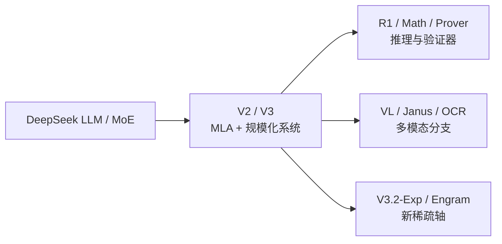

# DeepSeek 系列演进

学习导航：本页把 DeepSeek 的 MoE、MLA、代码/数学、推理 RL、验证器、视觉和稀疏注意力放在一条问题链上；完成后应能说出每个分支解决的瓶颈和没有解决的部分。

## 为什么先读 DeepSeek

DeepSeek 的公开材料覆盖从基础模型到训练系统、数学证明和 OCR 的多个层面。它很适合练习“同一家族内部也不能只用一个能力排名解释”：本页把 V2/V3 作为规模化与效率的阅读入口，把 R1 作为推理后训练入口，把 Prover 作为可验证证明入口，把 VL/Janus/OCR 作为模态接口入口；V3.2-Exp 和 Engram 则是实验性架构方向。这里是阅读分工，不是对每个版本贡献来源的因果证明。

## 推荐路线

| 顺序 | 资料 | 观察点 |
|---:|---|---|
| 1 | [DeepSeek LLM](https://arxiv.org/abs/2401.02954) | 开放基础模型的规模、数据和评测基线。 |
| 2 | [DeepSeekMoE](https://arxiv.org/abs/2401.06066) | 专家专门化、共享专家、激活参数与通信。 |
| 3 | [DeepSeek-V2](https://arxiv.org/abs/2405.04434) | MLA、MoE 和经济性怎样一起设计。 |
| 4 | [DeepSeek-V3](https://arxiv.org/abs/2412.19437) | FP8、并行、数据和训练稳定性如何共同贡献。 |
| 5 | [DeepSeekMath](https://arxiv.org/abs/2402.03300) → [DeepSeek-R1](https://arxiv.org/abs/2501.12948) | 从数学 RL 到通用推理 RL 的证据边界。 |
| 6 | [DeepSeek-Prover-V2](https://arxiv.org/abs/2504.21801) | 证明助手、子目标分解和可验证奖励。 |
| 7 | [Janus](https://arxiv.org/abs/2410.13848) → [DeepSeek-OCR](https://arxiv.org/abs/2510.18234) | 视觉理解、生成和上下文压缩的不同接口。 |
| 8 | [V3.2-Exp](https://github.com/deepseek-ai/DeepSeek-V3.2-Exp) → [Engram](https://github.com/deepseek-ai/Engram) | 只有发布说明或仓库论文时，如何诚实标注证据层级。 |

## 三个核心连接

### 1. MoE 的收益来自容量与访问分离

DeepSeekMoE/V2/V3 反复出现总参数、激活参数、专家数、路由和通信。先把每 token 实际访问的参数和集群通信列出来，再谈“高效”。如果只看总参数，无法判断显存、带宽和尾延迟。

### 2. R1 不是“随机采样产生推理”

生成时的采样是在固定权重下进行的解码选择；R1 报告描述的推理训练链包含数据、RL 目标、奖励/验证信号、推理预算和后训练过程，但仅凭一份组合报告不能把每项因素的独立贡献完全分离。读 R1 时要把“模型通过训练学到的策略”和“本次请求用了多少 token”分成两行，也要把模型能力与部署引擎的调度、采样实现分开记录。

### 3. 验证器能提高可检查性，但不自动覆盖现实

形式化证明通常有可执行的证明助手；部分数学任务可以检查最终答案或程序结果，但不是所有数学题都有同等强度的过程验证器。开放世界问答更缺少稳定的真值检查。DeepSeekMath-V2 的官方仓库说明应标为仓库随附报告；它的自验证方向很有教学价值，但不能把竞赛证明的结果直接推广成通用事实性保证。

## 反例

如果任务是开放世界新闻问答，形式化证明验证器不可能直接判断事实；如果输入是短文本、小 batch，V3.2-Exp 的稀疏注意力也可能无法抵消索引和内核调度成本。方法必须回到问题、负载和验收集。

## 继续阅读

- 想理解训练链：进入[模型后训练](../模型后训练/)和[幻觉与可靠性](../幻觉与可靠性/)。
- 想理解系统链：进入[软硬件瓶颈](../软硬件瓶颈/)并阅读 DeepSeek-V2/V3 的并行与精度口径。
- 想理解多模态：先读[多模态基础](../多模态基础/)，再比较 VL、Janus 和 OCR 的接口图。
