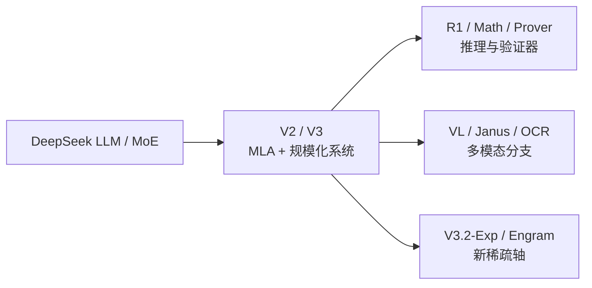

# DeepSeek 系列选读地图

学习导航：本页是[DeepSeek 论文深读](DeepSeek深读/)的路线地图；逐篇正文会拆解 MoE、MLA、规模化训练、推理 RL 和视觉接口。完成后应能说出每个分支解决的瓶颈和没有解决的部分。

> **怎么读**：先读 [DeepSeek LLM：开放基座的训练账本](DeepSeek深读/01-DeepSeek-LLM基础模型.md)，再进入 MoE、V2、V3、R1 和 Janus。Prover、OCR、Engram 等材料保留在[论文库](01-论文库.md)作为选读。

## 为什么先读 DeepSeek

DeepSeek 的材料覆盖基础模型、训练系统、数学证明和 OCR，不能用一个总分解释。本页把 V2/V3 放入规模化路线，R1 放入推理后训练，Prover 放入可验证证明，VL/Janus/OCR 放入多模态；V3.2-Exp 与 Engram 作为实验架构。这个分组是阅读入口，不是贡献归因。

## 推荐路线

| 顺序 | 站内深读 | 论文原文 | 观察点 |
|---:|---|---|---|
| 1 | [DeepSeek LLM](DeepSeek深读/01-DeepSeek-LLM基础模型.md) | [arXiv 2401.02954](https://arxiv.org/abs/2401.02954) | 开放基础模型的规模、数据和评测基线。 |
| 2 | [DeepSeekMoE](DeepSeek深读/02-DeepSeekMoE专家路由.md) | [arXiv 2401.06066](https://arxiv.org/abs/2401.06066) | 专家专门化、共享专家、激活参数与通信。 |
| 3 | [DeepSeek-V2](DeepSeek深读/03-DeepSeek-V2-MoE与MLA.md) | [arXiv 2405.04434](https://arxiv.org/abs/2405.04434) | MLA、MoE 和经济性怎样一起设计。 |
| 4 | [DeepSeek-V3](DeepSeek深读/04-DeepSeek-V3规模化训练.md) | [arXiv 2412.19437](https://arxiv.org/abs/2412.19437) | FP8、并行、数据和训练稳定性如何共同贡献。 |
| 5 | [DeepSeek-R1](DeepSeek深读/05-DeepSeek-R1推理强化学习.md) | [arXiv 2501.12948](https://arxiv.org/abs/2501.12948) | 从数学 RL 到通用推理 RL 的证据边界；DeepSeekMath 作为前置伴读。 |
| 6 | [Janus](DeepSeek深读/06-Janus统一视觉生成.md) | [arXiv 2410.13848](https://arxiv.org/abs/2410.13848) | 视觉理解、生成和上下文压缩的不同接口。 |
| 7 | 分支选读 | [DeepSeek-Prover-V2](https://arxiv.org/abs/2504.21801) · [DeepSeek-OCR](https://arxiv.org/abs/2510.18234) | 形式化验证与视觉压缩适合在主线后比较。 |

主线之外，可选读 [DeepSeekMath](https://arxiv.org/abs/2402.03300)、[V3.2-Exp](https://github.com/deepseek-ai/DeepSeek-V3.2-Exp) 和 [Engram](https://github.com/deepseek-ai/Engram)。

完整条目见[论文库](01-论文库.md)。

## 三个核心连接

### 1. MoE 的收益来自容量与访问分离

DeepSeekMoE/V2/V3 反复出现总参数、激活参数、专家数、路由和通信。先把每 token 实际访问的参数和集群通信列出来，再谈“高效”。如果只看总参数，无法判断显存、带宽和尾延迟。

### 2. R1 不是“随机采样产生推理”

采样是在固定权重下选择 token。R1 的训练链还包含数据、RL 目标、奖励或验证信号、推理预算和后训练，仅凭组合报告无法分离每项贡献。阅读时要分开记录训练所得策略、本次 token 预算，以及部署引擎的调度和采样实现。

### 3. 验证器能提高可检查性，但不自动覆盖现实

形式化证明可由证明助手检查，部分数学题也能验证答案或程序结果，但并非所有任务都有可靠的过程验证器；开放世界问答更缺少稳定真值。DeepSeekMath-V2 属于仓库随附报告，其自验证结果不能直接推广为通用事实性保证。

## 反例

如果任务是开放世界新闻问答，形式化证明验证器不可能直接判断事实；如果输入是短文本、小 batch，V3.2-Exp 的稀疏注意力也可能无法抵消索引和内核调度成本。方法必须回到具体问题、系统负载和评测协议。

## 继续阅读

- 想理解训练链：进入[模型后训练](../模型后训练/)和[幻觉与可靠性](../幻觉与可靠性/)。
- 想理解系统链：进入[软硬件瓶颈](../软硬件瓶颈/)并阅读 DeepSeek-V2/V3 的并行与精度口径。
- 想理解多模态：先读[多模态基础](../多模态基础/)，再比较 VL、Janus 和 OCR 的接口图。
