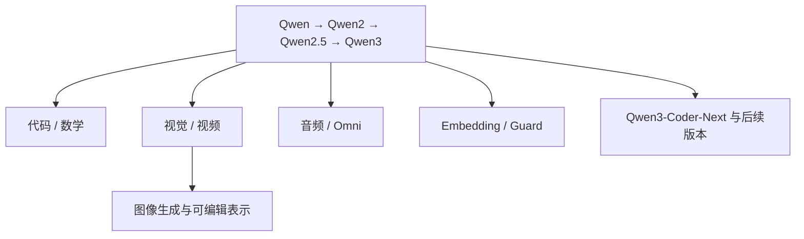

# Qwen 系列选读地图

学习导航：本页是[Qwen 论文深读](Qwen深读/)的任务地图；逐篇正文负责解释通用主干、视觉、代码、推理和 Omni 的接口差异。完成后应能按任务选择论文，而不是把“Qwen”当成一种单一模型。

> **怎么读**：先读 [Qwen：多语言通用基座起点](Qwen深读/01-Qwen基础模型.md)，再按通用、视觉、代码、推理、Omni 路线选读；音频、Embedding、Guard、图像生成仍在[论文库](01-论文库.md)中按证据等级维护。

## 为什么先读 Qwen

Qwen 的公开材料最能展示“一个模型家族如何分化”：基础报告提供主干，专门报告讨论代码/数学/检索，视觉和 Omni 讨论跨模态，Qwen3Guard 面向安全判定，Qwen-Image 走图像生成路径。这里的“面向/讨论”是资料的阅读入口，不等于报告已经证明它们在所有任务上都有效；它适合建立“同一品牌，不同输入输出和训练目标”的初学者边界感。

## 推荐路线

| 顺序 | 资料 | 观察点 |
|---:|---|---|
| 1 | [Qwen](https://arxiv.org/abs/2309.16609) → [Qwen2](https://arxiv.org/abs/2407.10671) → [Qwen2.5](https://arxiv.org/abs/2412.15115) | 通用文本主干怎样逐代改变数据、上下文和后训练。 |
| 2 | [Qwen2.5-Coder](https://arxiv.org/abs/2409.12186) → [Qwen3-Coder-Next](https://arxiv.org/abs/2603.00729) | 代码继续预训练、Agent 轨迹和仓库级验收。 |
| 3 | [Qwen2.5-Math](https://arxiv.org/abs/2409.12122) → [Qwen3](https://arxiv.org/abs/2505.09388) | 数学自我改进、thinking/non-thinking 和推理 RL。 |
| 4 | [Qwen-VL](https://arxiv.org/abs/2308.12966) → [Qwen2-VL](https://arxiv.org/abs/2409.12191) → [Qwen3-VL](https://arxiv.org/abs/2511.21631) | 分辨率、视频、OCR、视觉推理和工具调用。 |
| 5 | [Qwen-Audio](https://arxiv.org/abs/2311.07919) → [Qwen2.5-Omni](https://arxiv.org/abs/2503.20215) → [Qwen3-Omni](https://arxiv.org/abs/2509.17765) | 音频输入、实时输出和多模态对齐。 |
| 6 | [Qwen3 Embedding](https://arxiv.org/abs/2506.05176)、[Qwen3Guard](https://arxiv.org/abs/2510.14276)、[Qwen-Image](https://arxiv.org/abs/2508.02324) | 检索、安全判定和图像生成不是同一条生成主线。 |

## 三个核心连接

### 1. 词表不是多模态万能接口

Qwen 的文本主干使用文本 tokenizer；视觉、音频和视频在不同版本中可能先变成连续特征，也可能经过离散化，再通过连接器或统一序列接口进入主干。读 Qwen2-VL、Qwen2.5-Omni 和 Qwen3-Omni 时，分别画出模态输入、形状、对齐方式和输出头；不能预设它们共用文本词表，也不能仅因最后生成文字就断定接口完全相同。

### 2. thinking 与 non-thinking 是行为/推理预算的选择

Qwen3 的 thinking/non-thinking 是运行时模式选择，不是“模型随机变聪明”。它可能同时受后训练策略、提示格式、推理 token、解码和服务控制影响。评测必须记录模式、预算、是否使用工具和是否包含答案验证；否则不同模式的分数没有可比性。

### 3. 分支模型的验收集不同

代码要看编译、测试和仓库级修改；数学要看答案与过程验证；视觉要看小字、布局和空间关系；音频要看噪声、口音和时间对齐；Embedding 要看检索召回与排序；Guard 要看误拒和漏放。一个 Qwen 总分不能代表所有分支。

## 版本空白也要记录

Qwen3.6 和 QwQ 的官方仓库/博客提供了版本信息，但本目录核查时没有为它们找到独立稳定的技术论文；它们被保留为“发布说明”。截至同一核查日，尚未找到可核验的 Qwen3.5 官方仓库或独立技术报告，因此没有把 Qwen3.5 填入论文库。等正式一手报告出现后再补入，比复制博客里的性能叙述更诚实。

## 反例

一个 Qwen-VL 模型在图表问答上领先，不代表它在长文本事实问答、音频转写或向量检索上也领先；一个 Qwen3-Coder-Next 在仓库级 Agent 任务上变好，也不能直接推断基础文本模型的所有能力都变好。
