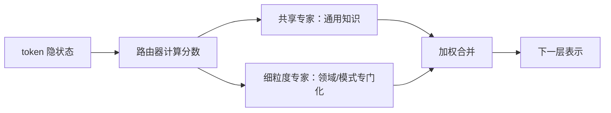

# DeepSeekMoE：专家如何专门化

> 学习导航：这篇论文用 MoE 解释“总容量很大、每 token 只计算一部分”到底意味着什么，并把专家专门化、共享专家和通信代价放在同一张图里。

```paper-lesson
deepseek-moe
```

## 论文回答什么

稠密模型让每个 token 经过全部 FFN，容量和计算一起增长。MoE 把 FFN 分成专家，每个 token 只访问少数专家，以更大总容量换取较少激活计算。DeepSeekMoE 进一步追问：怎样减少专家的重复学习，同时保留共享能力？



## 核心机制

- **细粒度专家**：把 FFN 拆得更细，让路由组合更多专门化路径。
- **共享专家**：每个 token 都经过共享分支，承载通用知识，减轻路由器重复负担。
- **负载均衡**：限制某个专家过载，否则容量再大也会被最忙的专家拖慢。
- **容量与激活分离**：总参数是所有专家容量，激活参数是本 token 实际经过的分支。

路由不是“专家自己思考后投票”，而是一个可训练的门控函数；它的选择会受训练数据、辅助损失、容量上限和并行通信影响。

## 训练与推理分开

训练需要把 token dispatch 到不同设备的专家，再聚合输出，通信和负载不均是主要系统问题。推理阶段也要进行路由和跨卡通信；低 batch 或短请求时，稀疏计算的理论优势可能被调度成本抵消。

## 数字证据账本

| 指标 | 解释 |
|---|---|
| 总参数 | 所有专家与共享层的容量 |
| 激活参数 | 一个 token 实际计算的参数近似 |
| top-k | 每个 token 选择的专家数 |
| 专家负载 | token 在专家间的分布与溢出 |
| 通信量 | dispatch、聚合和并行拓扑的成本 |

教学复核：8 个专家每 token 选 2 个，粗略激活比例是 $2/8=25\%$；若还有共享专家、路由投影和其他层，这不是完整 FLOPs 比例，只是帮助建立口径。

## 代价与边界

- 负载均衡损失可能与质量目标冲突；均匀分配不等于语义最优。
- 专家专门化受数据分布影响，换领域或语言后可能出现冷门专家不足。
- MoE 不会自动减少 KV Cache，也不会自动降低所有硬件上的端到端延迟。

## 本课验收

**L1 · 直接应用**：为什么不能用总参数直接估算每 token 计算量？

<details><summary>参考答案</summary>

MoE 每 token 只激活部分专家，还要加共享专家、路由和非 FFN 层；总参数只表示总容量。

</details>

**L2 · 变形迁移**：共享专家解决了什么问题？

<details><summary>参考答案</summary>

它让所有 token 都有通用路径，减少多个路由专家重复学习相同基础知识，同时保留专门化分支。

</details>

**L3 · 构造反例**：专家负载很均匀但质量下降，怎样解释？

<details><summary>参考答案</summary>

路由器可能为了均匀而把 token 分给不适合的专家；负载指标只说明容量使用，不证明语义路由正确。

</details>

**L4 · 多概念综合**：部署 MoE 前至少要同时测哪三类指标？

<details><summary>参考答案</summary>

任务质量、专家负载/溢出与通信、端到端吞吐和尾延迟；需要在目标 batch 与硬件上测。

</details>

## 方法边界

DeepSeekMoE 是机制论文，V2/V3 又加入 MLA、训练配方和系统优化。不能把本页的专家比例、路由或收益数字直接套到后续版本。

来源：[DeepSeekMoE: Towards Ultimate Expert Specialization in Mixture-of-Experts Language Models](https://arxiv.org/abs/2401.06066)。
