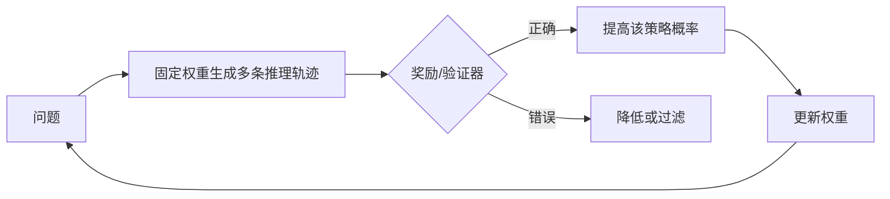

# DeepSeek-R1：推理能力的强化学习

> 学习导航：R1 是理解“模型为什么会推理、为什么仍会幻觉”的关键案例。它把奖励、搜索预算、蒸馏和验证器拆开，不把随机采样当成学习。

```paper-lesson
deepseek-r1
```

## 论文回答什么

许多数学和代码题可以检查最终答案，适合用强化学习鼓励正确的多步策略。R1 报告研究如何通过纯 RL、冷启动和蒸馏让模型形成更长的推理行为，并比较不同大小学生模型的迁移。它并没有证明开放世界问题也有同样可靠的奖励。



## 核心机制

- **可验证奖励**：数学答案、代码测试或规则检查比主观“像不像好答案”更稳定。
- **推理预算**：训练后的模型可以在一次请求里生成更长轨迹，但 token 多不是正确性的充分条件。
- **冷启动与拒绝采样**：先用高质量示范建立格式，再用 RL 扩展策略空间。
- **蒸馏**：把大模型轨迹或分布传给小模型，是另一个训练过程，不是部署时调用教师。

幻觉为什么难消失：开放问答缺少可靠奖励；参数保存的是统计关联而非数据库证明；检索可能失败；解码只在模型给出的分布里选 token。R1 能改善可验证推理，却不能把这些来源统一消除。

## 训练与推理分开

训练期的 rollout 可能有随机采样，但随后奖励筛选和梯度更新改变权重。推理期的 temperature/top-p 只改变这次选择，vLLM 等引擎负责执行效率和采样实现，不负责决定模型“学会什么”。

## 数字证据账本

| 证据 | 需要问 |
|---|---|
| AIME/代码分数 | 是否多次采样、投票、工具或答案验证？ |
| RL 训练曲线 | 奖励定义、失败样本和长度是否公开？ |
| 蒸馏结果 | 学生尺寸、轨迹筛选、词表和预算是否一致？ |
| 通用问答 | 是否测事实性、拒答和引用，而非只看数学？ |

教学例子：对同一道题采样 8 次，只要至少一个候选通过，该题的 pass@8 就记为成功；“3 个候选通过”是本组样本的通过比例，不是 pass@8。评测集上的 pass@8 汇总多道题，不能当成单次回答准确率。

## 代价与边界

- 规则验证器覆盖不到开放世界事实、主观写作和复杂多模态环境。
- 长推理增加延迟、成本和错误累积，可能出现 reward hacking 或循环。
- 蒸馏会丢失教师的多样策略，学生还受词表、容量和访问状态限制。

## 本课验收

**L1 · 直接应用**：R1 训练中的随机性和推理时随机性分别在哪里？

<details><summary>参考答案</summary>

训练时随机生成轨迹并按奖励更新权重；推理时随机采样只是从固定权重的 next-token 分布选择输出。

</details>

**L2 · 变形迁移**：为什么数学 RL 的成功不能直接推出新闻问答不幻觉？

<details><summary>参考答案</summary>

数学有明确答案/证明检查器，新闻事实需要检索、时间版本和来源核验，奖励可验证性完全不同。

</details>

**L3 · 构造反例**：设计一个“推理更长但更差”的情况。

<details><summary>参考答案</summary>

模型在错误前提上不断展开，或者奖励只鼓励格式和长度；最终答案仍错且成本更高。

</details>

**L4 · 多概念综合**：要降低开放问答幻觉，R1 式 RL 之外至少还需要哪三层措施？

<details><summary>参考答案</summary>

可靠检索与证据引用、拒答/校准策略、外部验证器或人工复核，并用事实性和误拒回归集持续评测。

</details>

## 方法边界

R1 报告的主要证据集中在数学、代码和推理任务；“推理能力”不能简化为思考文字长度。课程不把 R1 结果推广到所有模型或所有事实性问题。

来源：[DeepSeek-R1: Incentivizing Reasoning Capability in LLMs via Reinforcement Learning](https://arxiv.org/abs/2501.12948)。
