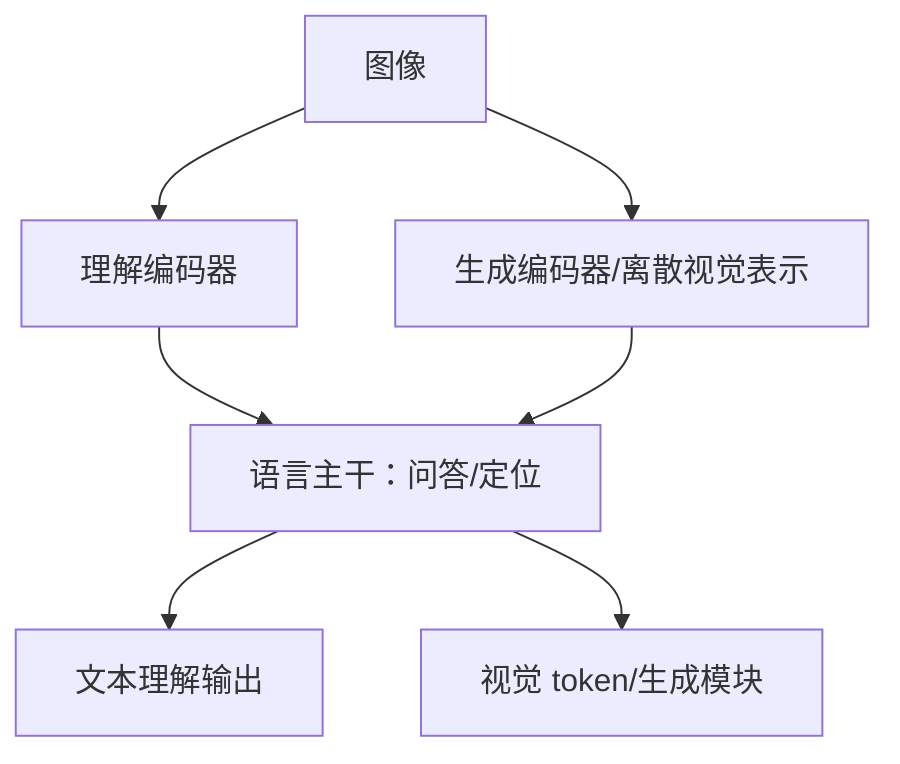

# Janus：理解与生成的视觉分工

> 学习导航：Janus 说明“统一多模态”不等于所有视觉任务共用一条编码器。理解和生成对信息粒度、空间细节和解码目标的要求不同。

```paper-lesson
janus
```

## 论文回答什么

视觉理解希望把图像压成适合问答、定位和 OCR 的语义表示；图像生成则需要保留局部纹理和空间细节。Janus 的核心做法是解耦视觉理解和视觉生成的编码路径，同时共享语言主干，让两种任务在接口处协作而不强迫表示完全相同。



## 核心机制

共享主干带来跨任务迁移，但输入接口仍然不同：理解分支关注全局语义和文字，生成分支关注可还原的局部结构。若强行共用同一视觉表示，可能出现语义理解好却生成细节差，或图像还原好却不利于 OCR 的折中。

## 训练与推理分开

训练需要图文理解数据、图像生成数据和跨模态对齐目标；各分支损失权重会影响共享主干。推理时，理解通常是视觉特征进入语言模型，生成还要经过视觉解码器/流模型等模块；不能把图像生成当成普通文本 next-token 采样。

## 数字证据账本

| 证据 | 需绑定的任务 |
|---|---|
| 理解分数 | OCR、定位、问答、空间关系 |
| 生成分数 | 文字渲染、构图、细节和审美指标 |
| 参数/速度 | 视觉编码、语言主干、生成解码器分别计 |
| 统一性主张 | 哪些权重共享、哪些接口解耦 |

教学复核：如果理解路径输出 576 个视觉特征、生成路径输出 1024 个离散视觉 token，不能用“都是视觉 token”相加比较；它们的对象、粒度和用途不同。

## 代价与边界

- 解耦增加模块和训练目标，部署时也需要更多显存/转换逻辑。
- 统一主干不保证理解与生成互相提升，负迁移需要用分支消融查证。
- 生成图像中的事实、文字和安全仍需单独验证，不能由问答分数替代。

## 本课验收

**L1 · 直接应用**：Janus 为什么不强求一条视觉编码路径？

<details><summary>参考答案</summary>

理解需要语义和空间关系，生成需要可还原的细节；两者的最优表示不同，解耦能减少互相牺牲。

</details>

**L2 · 变形迁移**：输出都是文本，能否证明视觉接口相同？

<details><summary>参考答案</summary>

不能。文本只是最终输出形式，前面可能有不同视觉编码器、连接器和损失目标。

</details>

**L3 · 构造反例**：理解分数提高但图像生成变差，可能发生在哪一层？

<details><summary>参考答案</summary>

共享主干更新偏向语义任务，生成编码器/解码器或损失权重没有同步，出现跨任务负迁移。

</details>

**L4 · 多概念综合**：比较 Janus 与文本模型时，最少要画出哪三段信息流？

<details><summary>参考答案</summary>

视觉输入编码、语言主干/连接器、理解或生成输出头；还要标注训练损失与推理解码是否不同。

</details>

## 方法边界

Janus 是视觉统一模型的代表性论文，不代表 DeepSeek-VL、VL2 或 OCR 使用相同架构。多模态路线应回到具体输入形状、连接器和评测任务。

来源：[Janus: Decoupling Visual Encoding for Unified Multimodal Understanding and Generation](https://arxiv.org/abs/2410.13848)。
