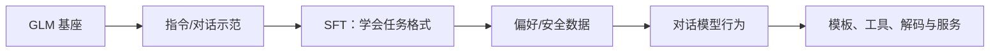

# ChatGLM：从基座到可用对话

> 学习导航：这篇论文把“会续写”与“能完成对话任务”拆开，看 SFT、偏好对齐、工具格式和安全数据如何改变运行行为。

```paper-lesson
chatglm-family
```

## 论文回答什么

用户不仅需要基座预测下一个 token，还需要它理解轮次、遵守指令、拒绝危险请求，并在有限显存中服务。ChatGLM 家族报告因此是一条后训练与产品化路线，不能把变化都归因于模型规模。



## 核心机制：行为是多阶段产物

- **SFT** 让模型看到“用户问题 → 合适回答”的示范，主要塑造格式和任务行为。
- **偏好/奖励阶段** 让多个候选回答有相对优劣，但奖励模型和标注规则会把偏好带入模型。
- **模板与工具** 把角色、历史、函数参数编码成 token；模板错了，模型能力可能看起来像消失。
- **安全数据** 影响拒答边界，不能用一个“安全分”概括所有风险。

对话时，模型仍然在固定权重上逐 token 解码；多轮记忆通常来自输入上下文或外部状态，不是每次聊天都在线更新权重。

## 训练与推理分开

训练改变权重和行为分布。推理改变的是本次请求的上下文、采样参数、工具循环和 KV Cache。一个 ChatGLM 接入搜索工具后事实性提高，不能直接说“后训练消除了幻觉”；事实可能来自检索证据和引用约束。

## 数字证据账本

| 证据 | 应读什么 | 常见误读 |
|---|---|---|
| 对话数据规模与来源 | 人工/合成、语言、任务类型 | 数据多就一定更安全 |
| 多任务基准 | 任务、模板、shot 数、解码预算 | 一个总分代表真实对话 |
| 人类偏好或安全评测 | 标注协议和拒答定义 | 偏好分就是事实正确率 |
| 量化/部署结果 | 精度、上下文、batch、硬件 | 量化后所有任务等价 |

## 一个小算例：上下文不是永久记忆

假设每轮对话平均 80 个 token，保留 12 轮历史就是 $80\times12=960$ 个 token；若还要拼接系统提示、工具 schema 和检索片段，真正的上下文会更长。KV Cache、截断策略和摘要决定模型“记得多少”，并不是 ChatGLM 参数在后台自动增长。

## 代价与边界

- 对齐可能牺牲一部分开放式续写、多样性或少数语言能力；需要回归测试。
- 安全拒答可能误伤正常请求，必须同时看误拒与漏放。
- 公开报告常把模型、模板、量化和服务优化一起展示，归因要按层拆开。

## 本课验收

**L1 · 直接应用**：SFT 主要改变了什么？

<details><summary>参考答案</summary>

它用示范改变任务格式和行为分布，例如学会多轮角色、结构化输出和回答风格；不等于自动补充最新事实。

</details>

**L2 · 变形迁移**：为什么同一个 ChatGLM 换提示模板后效果会明显变化？

<details><summary>参考答案</summary>

模板决定角色、轮次、特殊 token 和工具参数的边界；训练时学到的格式若与推理输入不一致，模型就会落到未见过的分布。

</details>

**L3 · 构造反例**：工具检索后回答更准确，为什么不能把提升全部算给对齐训练？

<details><summary>参考答案</summary>

新增证据、检索质量、引用约束和工具循环都可能贡献提升；需要裸模型、无检索和同预算的对照。

</details>

**L4 · 多概念综合**：为一个客服 ChatGLM 系统设计三层验收。

<details><summary>参考答案</summary>

先测裸模型的任务理解，再测模板/工具链的格式与调用成功率，最后测含真实知识库的事实性、安全误拒和端到端延迟。

</details>

## 方法边界

ChatGLM 家族包含多个版本和规模，本页抽象的是报告共同的对话后训练与服务边界，不把某一版本分数迁移到另一版本。具体模型的 tokenizer、上下文长度和安全策略应以对应模型卡为准。

来源：[ChatGLM: A Family of Large Language Models from GLM-130B to GLM-4 All Tools](https://arxiv.org/abs/2406.12793)。
