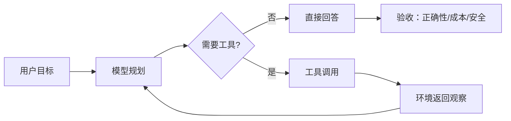

# GLM-4.5：通用模型变成智能体

> 学习导航：这篇报告用 Agent、推理和代码任务说明“模型分数”已经不等于“单次回答质量”，必须把环境循环和预算写进问题定义。

## 论文回答什么

真实工作往往需要搜索、读文件、写代码、运行测试和根据失败重试。GLM-4.5 的研究问题不是再做一个聊天机器人，而是让同一个基座在思考、工具调用和代码执行之间切换。初学者若只看聊天基准，会漏掉 Agent 任务的状态、工具和失败恢复。

## 核心机制：能力与环境组成闭环

1. **推理轨迹**：模型先生成中间计划或思考，再决定下一步，不代表这些文字都是可靠证明。
2. **工具协议**：函数名、参数 schema、错误返回会成为模型要学习的语言。
3. **长任务数据**：轨迹包含成功、失败和修复；只收集最终答案会丢失恢复行为。
4. **评测 harness**：是否提供浏览器、终端、文件和重试次数，直接影响结果。

训练学到的是“在某类环境反馈下如何行动”；推理时的工具权限和循环控制决定它能否把能力兑现。

## 训练与推理分开

训练阶段可用人工示范、合成轨迹、可验证奖励和结果筛选塑造策略。推理阶段仍使用静态权重，但通过更长思考预算、多次采样、工具和重试获得不同轨迹。服务平台负责调度和采样实现，却不能凭空创造模型没有学到的工具语义。

## 数字证据账本

| 指标 | 必须绑定的条件 | 不能直接说 |
|---|---|---|
| 通用知识/推理基准 | thinking 开关、token 预算、模板 | Agent 能力已被证明 |
| 软件工程任务 | 仓库版本、工具权限、测试命令、重试 | 裸模型写代码能力 |
| 工具调用成功率 | schema、错误处理、并发和超时 | 真实生产成功率 |
| 端到端延迟 | 模型、引擎、网络、工具等待 | 单纯由模型参数决定 |

一个小算例：一次任务生成 2,000 个思考 token，调用工具 3 次，每次工具平均等待 1.5 秒；仅等待时间就是 $3\times1.5=4.5$ 秒，优化模型 decode 不能消除这部分成本。

## 代价与边界

- 更长思考提高正确率的机会，也提高延迟、费用和泄露敏感中间信息的风险。
- Agent 失败可能来自模型规划、工具 schema、环境状态或验收脚本，不能只归咎于模型。
- 复杂工具链容易出现循环调用和权限扩大，安全策略必须在环境层执行。

## 本课验收

**L1 · 直接应用**：Agent 与普通问答最少多了哪一个环节？

参考答案

它有环境观察与行动循环：模型调用工具，收到结果，再决定下一步，而不是只生成一次回答。

**L2 · 变形迁移**：为什么“多生成一些 token”不等于“拥有工具能力”？

参考答案

工具能力需要学会协议和根据反馈修正；没有工具 schema、权限和环境返回，额外 token 只是更长的文本。

**L3 · 构造反例**：模型基准分上升但软件工程任务变差，如何解释？

参考答案

后训练可能优化知识问答却减少代码轨迹多样性，或新模板与工具 harness 不匹配；要做分层回归而不是看单一总分。

**L4 · 多概念综合**：比较“模型能力”“Agent 系统能力”“服务平台能力”各自的验收证据。

参考答案

模型能力看固定提示和预算下的任务分数；系统能力看工具调用、失败恢复和端到端任务完成；平台能力看调度、缓存、吞吐、尾延迟和权限控制。

## 方法边界

GLM-4.5 报告中的模型、轨迹、工具和评测是组合方案；页面用它建立拆分方法，不声称某个单项组件贡献了全部提升。真实 Agent 还需独立验收数据安全、权限和长期维护。

来源：[GLM-4.5: Agentic, Reasoning, and Coding Capabilities](https://arxiv.org/abs/2508.06471)。
