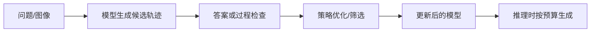

# Kimi k1.5：长思维链强化学习

> 学习导航：这篇论文用长上下文、长思维链和强化学习回答“推理能力能否通过后训练继续增长”。先区分训练学到的策略与推理时临时生成的 token。

```paper-lesson
kimi-k15
```

## 论文回答什么

数学题、代码题和视觉推理题常常需要多步尝试。仅用最终答案做 SFT，模型很难学会在中间失败后回退；k1.5 的路线是让模型生成更长轨迹，再用结果或过程反馈选择更好的策略。它不是把“想得久”当成智力，而是把更多搜索和反馈纳入训练/推理预算。



## 核心机制

- **长 CoT**：允许轨迹跨越更多 token，但长度增加也会增加错误累积和成本。
- **部分轨迹/课程**：不必每次都等到最终答案才学习，可以用中间状态或截断样本提高反馈密度。
- **策略优化**：奖励塑造“在什么状态选择什么动作”的分布，权重更新发生在训练阶段。
- **多模态 RL**：视觉题的输入表示、答案验证和文本思考轨迹需分别检查，不能把多模态分数当成文本分数。

## 训练与推理分开

训练时，奖励模型、规则验证器、采样器和 rollout 引擎参与生成数据；推理时只剩固定权重、提示、解码和可选工具。temperature 让同一权重产生不同轨迹，但不会把部署平台变成“会学习的模型”。

## 数字证据账本

| 记录 | 口径问题 |
|---|---|
| 思考 token 长度 | 平均、上限还是成功样本的长度？ |
| RL 奖励 | 最终答案、过程、规则验证器还是人工偏好？ |
| AIME/代码/视觉分数 | 是否允许多次采样、投票和工具？ |
| 速度与成本 | 是否把长轨迹和拒答样本计入？ |

教学例子：一次任务 4 条候选轨迹，长度分别为 100、200、300、400 token。平均长度是 250，但若只报告成功的 400 token 样本，会把“更长”误读成“更好”；统计口径必须先写清。

## 代价与边界

- 奖励可验证的数学题适合 RL，开放问答的事实奖励却不稳定。
- 更长轨迹会放大幻觉、循环和成本；推理预算需要按任务收益曲线设置。
- 论文结果常把数据、奖励、采样和模型结构一起改变，单项归因需要额外消融。

## 本课验收

**L1 · 直接应用**：采样的随机性发生在训练权重还是本次解码？

<details><summary>参考答案</summary>

temperature、top-p 等随机性发生在本次解码；RL 训练则通过许多轨迹和奖励更新权重，改变未来策略分布。

</details>

**L2 · 变形迁移**：长 CoT 为什么可能降低可靠性？

<details><summary>参考答案</summary>

每一步都有出错机会，错误会被后续 token 继续展开；没有验证器时，轨迹越长不等于证据越多。

</details>

**L3 · 构造反例**：一个模型平均思考 token 变长但准确率不升，可能是什么原因？

<details><summary>参考答案</summary>

奖励鼓励冗长表达而非正确步骤，或者采样预算增加但验证器弱，模型只是在重复错误路径。

</details>

**L4 · 多概念综合**：为数学、开放问答、视觉题各选一种更合适的反馈。

<details><summary>参考答案</summary>

数学可用答案/证明检查器，开放问答需检索证据与引用校验，视觉题要同时检查视觉读取和最终答案；三者不能共享一个无条件奖励。

</details>

## 方法边界

本页依据 k1.5 报告的公开摘要和实验描述做教学拆分；长 CoT、部分轨迹和多模态 RL 的具体配方以版本报告为准。它不能证明 RL 已解决通用推理或幻觉。

来源：[Kimi k1.5: Scaling Reinforcement Learning with LLMs](https://arxiv.org/abs/2501.12599)。
