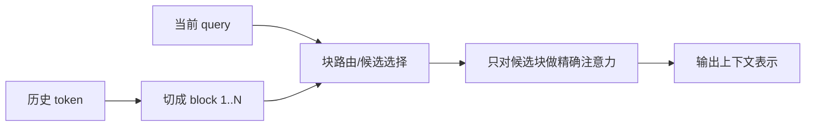

# MoBA：可组合的块稀疏注意力

> 学习导航：MoBA 是 Kimi 路线里的机制伴读。它把长上下文的“每个 query 看全部历史”改成“先按块选择候选”，帮助理解稀疏的收益与漏读风险。

```paper-lesson
moba
```

## 论文回答什么

全注意力在长度 $L$ 上要处理大量 query-key 配对；长文档、代码仓库和 Agent 历史会把成本推高。MoBA（Mixture of Block Attention）把历史切成块，让每个 query 只对少数块做注意力，同时保留块内的精细计算。



## 核心机制

块是调度单位，不是语义真理。路由器必须先估计哪些块值得读取；候选太少会漏证据，候选太多又接近全注意力。块大小、top-k、负载均衡和内核融合共同决定端到端表现。论文的“可组合”强调稀疏模式可以和其他注意力模块、缓存及并行策略组合，不等于任意组合都保持质量。

## 训练与推理分开

训练阶段要让路由选择可学习且梯度稳定，并用长依赖样本检验模型是否能找到远处证据。推理阶段还要计入块索引、内存访问和 batch 形状；理论 FLOPs 下降不保证 wall-clock 一定下降。

## 数字证据账本

| 指标 | 对照条件 |
|---|---|
| 读取块数/top-k | 序列长度、块大小、全注意力基线 |
| 质量变化 | 长依赖、短文本、代码和检索分别测 |
| 延迟/吞吐 | GPU、batch、内核版本和缓存命中 |
| 训练稳定性 | 路由负载、溢出、丢弃 token |

教学例子：历史有 64 个块，MoBA 每个 query 读取 8 个，理论读取量是 $8/64=12.5\%$；但如果 8 个块中没有唯一证据，质量会直接失败。稀疏比例要和“命中率”一起报告。

## 代价与边界

- 低频、跨段和需要全局计数的任务可能不适合过度稀疏。
- 路由器本身会增加计算与实现复杂度，短序列可能没有净收益。
- MoBA 解决访问成本，不解决知识缺失、奖励错误或工具安全。

## 本课验收

**L1 · 直接应用**：MoBA 的 block 是什么？

<details><summary>参考答案</summary>

它是把历史 token 分组后的计算/调度单位，便于选择少量候选块；不是天然的主题段落，也不是永久记忆单元。

</details>

**L2 · 变形迁移**：为什么 top-k 越小不一定越好？

<details><summary>参考答案</summary>

top-k 小能省读取，但会增加漏掉关键证据的概率；要在目标任务上用质量、延迟和命中率一起选。

</details>

**L3 · 构造反例**：设计一个最容易暴露 MoBA 漏读的输入。

<details><summary>参考答案</summary>

把约束分散在许多块，最后一问要求同时满足所有约束；记录关键块是否被路由到以及最终答案是否违反任一约束。

</details>

**L4 · 多概念综合**：解释“FLOPs 降低但延迟不变”的三种可能原因。

<details><summary>参考答案</summary>

索引/路由开销占比高、内存访问不连续导致带宽受限、batch 或内核没有针对稀疏形状优化；因此必须看 profile 而不是只看理论复杂度。

</details>

## 方法边界

MoBA 是独立机制论文，不能直接当成 Kimi K3 中所有稀疏注意力的同义词。不同版本可能使用 KDA、MLA、DSA 或混合方案；跨论文比较要对齐块定义、状态和评测长度。

来源：[MoBA: Mixture of Block Attention for Long-Context LLMs](https://arxiv.org/abs/2502.13189)。
