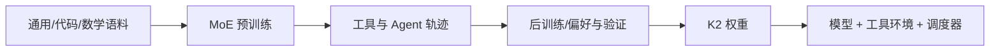

# Kimi K2：原生 Agent 基座

> 学习导航：K2 报告最值得读的不是“1T”这个宣传数字，而是如何把大规模 MoE、代码/数学数据和 Agent 后训练放进同一套证据账本。

## 论文回答什么

传统聊天模型通常在最终答案处结束；Agent 需要连续规划、调用工具、读写文件并处理错误。K2 的问题是：怎样训练一个总容量很大、每 token 只激活一部分专家、又能稳定完成长工具轨迹的开放基座。

## 核心机制：容量、激活、行为三张表

- **容量表**：总参数、专家数、共享专家。
- **激活表**：每 token 选择的专家和激活参数，决定大致算力。
- **行为表**：工具 schema、轨迹数据、奖励和重试策略，决定是否会行动。

报告中的 1T 总参数和约 32B 激活参数是不同口径；不能把它们相加，也不能从激活参数直接推出所有任务速度。MuonClip、路由和通信优化还会改变训练稳定性与成本。

## 训练与推理分开

训练用大规模文本和代码数据建立知识，再用 Agent 轨迹、可验证任务和偏好数据塑造工具行为。推理时，模型本身不更新；工具返回的观察、上下文压缩和调度器才决定下一轮输入。vLLM 等引擎可以改变批处理和采样吞吐，但不会替 K2 学会新的 API。

## 数字证据账本

| 记录 | 需要拆开的因素 |
|---|---|
| 1T/32B | 总参数 vs 每 token 激活参数 |
| Agent 任务分数 | 裸模型 vs 工具 harness、重试和预算 |
| 训练效率 | GPU、精度、并行、通信和故障恢复 |
| 长上下文表现 | 上下文长度、检索位置、压缩和答案验收 |

教学例子：若一次任务最多 5 轮工具调用，每轮平均产生 300 token，则模型输出至少 $5\times300=1500$ token；再加工具返回和系统提示，KV Cache 预算可能比单轮聊天大很多。

## 代价与边界

- MoE 降低每 token 计算却增加专家通信、负载不均和部署复杂度。
- Agent 轨迹的成功率依赖工具质量和验收脚本，不能只报告模型文本分数。
- 代码/数学后训练可能带来通用对话回归，必须做跨领域回归。

## 本课验收

**L1 · 直接应用**：1T 总参数与 32B 激活参数分别回答什么问题？

参考答案

1T 说明模型总容量，32B 近似说明每 token 实际参与计算的参数规模；两者都不是单独的显存或质量指标。

**L2 · 变形迁移**：为什么工具调用属于模型运行闭环而不是一个特殊 token？

参考答案

模型生成结构化动作后，外部环境执行并返回观察，模型再继续生成；特殊 token 只编码协议，真正的结果来自环境循环。

**L3 · 构造反例**：一个 K2 Agent 分数很高，但换成你的工具仍然失败，可能为什么？

参考答案

工具 schema、错误码、权限、返回格式或任务分布与评测 harness 不同；模型没有学到这套接口，系统层就会失败。

**L4 · 多概念综合**：为 K2 部署写出四项不可省略的验收记录。

参考答案

记录模型版本与量化、激活/总参数口径、工具权限与失败恢复、请求长度/并发下的质量和尾延迟。

## 方法边界

K2 是技术报告，组合了架构、数据、后训练和系统工程。页面只把报告中的数字和机制作为审计练习，不把它们推广为所有 MoE Agent 的定律。

来源：[Kimi K2: Open Agentic Intelligence](https://arxiv.org/abs/2507.20534)。
