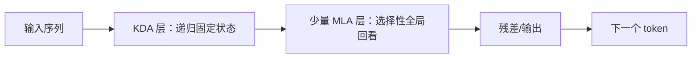

# Kimi Linear：混合注意力

> 学习导航：这篇论文把“固定状态省缓存”和“全局注意力保留精确回看”放到同一个主干中，帮助初学者理解为什么真实系统常用混合架构。

## 论文回答什么

全注意力能精确回看历史，却让 KV Cache 和长序列读写成本上升；纯线性注意力状态固定、便宜，却可能压缩掉细节。Kimi Linear 的研究问题是：能否用 KDA 处理大多数历史，再用少量 MLA 层做精确全局回看。

## 核心机制

线性注意力把历史压进状态 $S_t$，更新可写成抽象形式：

$$S_t=\lambda_t S_{t-1}+k_t v_t^\top.$$

这样读历史不必保存每个 token 的完整 KV，但压缩状态可能丢失精确顺序和少数事实。MLA 层保留显式历史的精细访问，像在一本压缩笔记旁边放少量原始页。混合比例、层位置和门控方式是模型设计的一部分，不能把 KDA 等同于“无损注意力”。

## 训练与推理分开

训练要让 KDA 和 MLA 共同适应同一隐藏表示，避免一个分支学会而另一个分支失配。推理时 KDA 的状态大小近似固定，MLA 仍需要 KV Cache；所以节省量取决于 MLA 层数、头维度和上下文长度，不是简单的“线性注意力零缓存”。

## 数字证据账本

| 记录 | 必须绑定 |
|---|---|
| KDA/MLA 层比例 | 层数、头数、隐藏宽度 |
| KV Cache 节省 | 精度、batch、上下文、是否计入 KDA 状态 |
| 质量变化 | 短/长上下文、检索位置、代码和多轮任务 |
| TPOT/吞吐 | 内核、硬件、并发和预填充/解码阶段 |

教学例子：若 24 层中只有 4 层保留 MLA，那么不能写成“缓存只剩 $4/24$”；KDA 状态、层间激活和实现开销仍要计入。这个比例只能作为第一眼的结构提示。

## 代价与边界

- 纯递归状态对精确复制、跨段指代和任意检索并不稳，混合层是补偿而非魔法。
- 少量 MLA 仍可能成为长上下文的瓶颈；层比例需要按任务和硬件调优。
- 论文 benchmark 的质量/速度比较若更换内核或 batch，结论不能直接迁移。

## 本课验收

**L1 · 直接应用**：KDA 与 MLA 各保留了什么？

参考答案

KDA 用固定形状状态递归压缩历史，降低读写；MLA 保留显式 KV 的精细全局回看，弥补压缩损失。

**L2 · 变形迁移**：为什么“4 层 MLA/24 层”不能直接当作缓存节省比例？

参考答案

还要算每层 KV 维度、KDA 状态、精度、batch、实现和其他缓存；层数比例不是内存比例。

**L3 · 构造反例**：什么任务会暴露纯 KDA 的信息压缩问题？

参考答案

在长文本中把两个相似实体的关键差异放在很远位置，要求精确引用其中一个；递归压缩可能混淆顺序或细节。

**L4 · 多概念综合**：选择 KDA/MLA 比例时应同时看哪三类指标？

参考答案

看目标任务质量与远距离检索、缓存/吞吐等资源指标，以及不同上下文长度和并发下的尾延迟。

## 方法边界

Kimi Linear 的方法不能替代 Kimi K3 报告中的完整架构说明；本页只抽出混合注意力这一研究问题。具体层配置、状态形状和 kernel 以论文版本为准。

来源：[Kimi Linear: An Expressive, Efficient Attention Architecture](https://arxiv.org/abs/2510.26692)。
