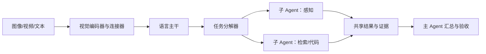

# Kimi K2.5：原生多模态与 Agent Swarm

> 学习导航：这篇技术报告用视觉文本持续训练和多智能体协作说明：多模态不是给文本模型外挂一个图片按钮，Agent Swarm 也不是简单复制多个聊天窗口。

```paper-lesson
kimi-k25
```

## 论文回答什么

真实任务可能同时需要读图、读长文档、调用工具和拆分子任务。K2.5 的路线把视觉输入接入语言主干，再让多个 Agent 分工处理复杂任务。初学者要先问清楚每个模态以什么表示进入模型，以及子 Agent 如何共享上下文和结果。



## 核心机制

- **模态接口**：图像通常先变成连续视觉特征或视觉 token，再通过连接器对齐到语言空间；不能因为输出是文字，就说视觉和文本共用同一套词表。
- **持续训练**：文本主干先有语言能力，再加入图文/视频数据和交互轨迹；顺序会影响语言能力保持和视觉对齐。
- **Agent Swarm**：多个角色并行或串行解决子任务，但需要任务分解、消息协议、冲突合并和最终验收。

## 训练与推理分开

训练阶段学习视觉-语言对齐、工具协议和协作轨迹。推理阶段的视觉编码耗时、图片分辨率、子 Agent 数量、重复上下文和协调等待都会增加成本；主模型分数不能代表 Swarm 的端到端效率。

## 数字证据账本

| 记录 | 要补全的条件 |
|---|---|
| 图像 token 数 | 分辨率、切块、压缩和连接器 |
| 视频能力 | 帧数、采样策略、时间跨度 |
| Swarm 成功率 | 子 Agent 数、并行度、工具、重试与汇总规则 |
| 端到端成本 | 重复输入、视觉编码、网络与协调等待 |

教学例子：一张图被编码为 1,200 个视觉 token，文本提示 200 token，两个子 Agent 都各自重复接收图像，则输入量至少是 $2\times(1200+200)=2800$ token；共享视觉结果或缓存才可能减少重复成本。

## 代价与边界

- 高分辨率能保留小字，却增加视觉 token、显存和延迟；动态分辨率要按任务取舍。
- 多 Agent 可能通过重复上下文和沟通抵消并行收益，也可能放大错误。
- 视觉问答正确不等于真实世界安全，图像中的隐私、提示注入和工具权限要单独验收。

## 本课验收

**L1 · 直接应用**：视觉输入进入语言主干前通常经过什么？

<details><summary>参考答案</summary>

先经过视觉编码器得到特征，再由连接器或投影对齐到语言主干可处理的表示；具体是否离散成 token 要看模型。

</details>

**L2 · 变形迁移**：为什么增加分辨率可能提高 OCR 又降低吞吐？

<details><summary>参考答案</summary>

更多像素通常产生更多视觉 token，细节更丰富但计算、显存和传输量增加；要用分层评测而非只看 OCR 分数。

</details>

**L3 · 构造反例**：多 Agent 比单 Agent 差的一个具体原因是什么？

<details><summary>参考答案</summary>

每个子 Agent 重复读取整张图和长历史，协调等待与冲突合并超过并行节省，最终主 Agent 还可能汇总错误。

</details>

**L4 · 多概念综合**：为图像客服系统列出三层验收。

<details><summary>参考答案</summary>

先测视觉读取和 OCR，再测语言回答/引用与工具调用，最后测隐私、提示注入、并发和端到端成本。

</details>

## 方法边界

K2.5 是官方技术报告，且模型版本和产品形态会更新。本文用它讲接口和系统思维，不把 Agent Swarm 的演示效果等同于所有任务上的独立能力提升。

来源：[Kimi K2.5 技术报告](https://github.com/MoonshotAI/Kimi-K2.5/blob/master/tech_report.pdf)。
