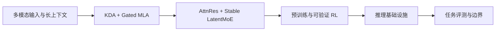

# Kimi K3：完整技术报告

> 学习导航：这是 Kimi 系列的第 6 篇单篇论文课。先看下方论文认知图，再沿六个子课把架构、训练、系统和评测接成一条因果链。

```paper-lesson
kimi-k3
```

## 论文回答什么

Kimi K3 不是只提出一个新模块。报告把 KDA、Gated MLA、AttnRes、Stable LatentMoE、长上下文、多模态、后训练和基础设施放进同一模型系统。阅读重点不是背缩写，而是分清三类证据：单个机制改变了什么，完整系统报告了什么，哪些贡献缺少独立消融。



## 为什么拆成六个子课

这仍是一篇技术报告，只是信息密度远高于普通单机制论文。主页面负责建立论文位置和总因果链；子课分别放大一段信息流，避免把架构数字、训练数据、服务优化和最终分数混在同一段里。

| 顺序 | 子课 | 带走的问题 |
|---:|---|---|
| 1 | [三维信息流全景](06-Kimi-K3技术报告/01-三维信息流全景.md) | 序列、深度、宽度分别在扩什么？ |
| 2 | [KDA 与混合注意力](06-Kimi-K3技术报告/02-KDA与混合注意力.md) | 固定状态省了什么，又牺牲了什么？ |
| 3 | [AttnRes 与 Stable LatentMoE](06-Kimi-K3技术报告/03-AttnRes与Stable-LatentMoE.md) | 为什么深度和宽度都需要新的信息通路？ |
| 4 | [预训练、长上下文与原生多模态](06-Kimi-K3技术报告/04-预训练长上下文与原生多模态.md) | “1M 上下文”是架构、数据还是训练课程的结果？ |
| 5 | [后训练与可验证 RL](06-Kimi-K3技术报告/05-后训练与可验证RL.md) | 奖励、吞吐和部署约束如何共同塑造训练？ |
| 6 | [基础设施与评测](06-Kimi-K3技术报告/06-基础设施与评测.md) | 如何把模型分数还原成可比较的实验？ |

每个子课末尾都有 L1–L4 四级练习。先闭卷作答，再展开参考答案。不会做 L3 反例题，通常说明只记住了机制优点，还没有理解适用边界。

## 训练与推理分开

训练阶段共同决定“参数学到了什么”：报告覆盖视觉与语言联合预训练、长上下文课程、SFT、策略蒸馏、部分 rollout 和可验证奖励。推理阶段决定“这些参数怎样被执行”：KDA 状态、MLA 缓存、专家路由、量化格式、并行和上下文管理共同影响延迟与吞吐。训练分数不能代替服务测量，推理优化也不会自动补回模型没有学到的能力。

## 数字证据账本

| 报告数字 | 正确口径 | 不能直接推出 |
|---|---|---|
| 2.78T 总参数 | 包含当前 token 未选择的专家 | 每 token 都计算 2.78T 参数 |
| 104.2B 激活参数 | 报告采用的单 token 前向口径 | 延迟必然比稠密模型低 26.7 倍 |
| 93 个注意力层 | 69 个 KDA 层与 24 个 Gated MLA 层 | 3:1 混合比例对所有任务最优 |
| 896 个路由专家 | 每 token 选 16 个，另有 2 个共享专家 | 未选专家不占参数显存或通信成本 |
| 1,048,576 token 上下文 | 模型卡给出的最大上下文口径 | 任意位置、任意细节都能可靠回忆 |

数字先用来还原配置，再结合评测条件判断效果。总参数、激活参数、FLOPs、显存、通信和端到端延迟必须分栏记录。

## 开始前

- 先完成 D05–D07，能解释注意力、残差连接和 KV Cache。
- 先完成 D10、D12，知道显存、并行和评测条件为什么重要。
- 先读[高维表示、投影与降维](../../../03-数学急救包/08-高维表示、投影与降维.md)，能区分隐藏宽度、线性投影、子空间、矩阵秩与可视化降维。
- 公式卡住时查[外积与状态矩阵](../../../03-数学急救包/06-外积与状态矩阵.md)和[分位数与平滑封顶](../../../03-数学急救包/07-分位数与平滑封顶.md)。

## 代价与边界

- KDA 减少随长度增长的缓存，却用固定状态压缩历史，不能假设无损回忆。
- MoE 降低每 token 激活计算，却保留全部专家参数，并引入路由、负载均衡和跨设备通信。
- AttnRes 增强跨层访问，也增加历史表示保留和流水线通信成本。
- 技术报告给出完整系统结果；缺少单项消融时，不能把总提升精确分配给某个模块。

学习时不需要推导 KDA 的完整分块并行式、Quantile Balancing 的对偶问题，也不需要运行 2.8T 模型或自定义 GPU 内核。能画出信息流、复核关键数字、说清每项设计的交换条件，就达到了本课目标。

## 本课验收

**L1 · 直接应用**：K3 的 93 个注意力层由哪两类层组成？

<details><summary>参考答案</summary>

69 个 KDA 层加 24 个 Gated MLA 层。这个配置说明 K3 同时保留固定状态和 token 级全局访问，不表示 69:24 是其他模型的推荐比例。

</details>

**L2 · 变形迁移**：为什么 $2.78\text{T}/104.2\text{B}\approx26.7$ 不能解释为推理快 26.7 倍？

<details><summary>参考答案</summary>

这个比值只比较总参数与激活参数，未计注意力、路由、专家通信、参数搬运、批处理、量化算子和硬件利用率。速度必须用同一服务条件下的端到端测量验证。

</details>

**L3 · 构造反例**：构造一个“支持 1M 上下文但仍可能答错”的任务。

<details><summary>参考答案</summary>

在接近 1M token 的位置放入大量随机键值对，最后要求逐字复述一个很早出现的随机长值。输入可以装进窗口，但固定状态压缩、相似键干扰和远距离定位仍可能让模型答错。

</details>

**L4 · 多概念综合**：如何验证 K3 的长上下文优势来自模型，而不是评测外壳？

<details><summary>参考答案</summary>

固定提示、工具、上下文管理、采样、最大输出、硬件和并发，只改变模型版本；同时报告准确率、TTFT、TPOT、吞吐和失败样本。再做关闭上下文压缩或改变 KDA/MLA 配置的消融，才能逐步缩小归因范围。

</details>

来源：[Kimi K3 技术报告](https://arxiv.org/abs/2607.24653)、[官方模型卡](https://huggingface.co/moonshotai/Kimi-K3)。
