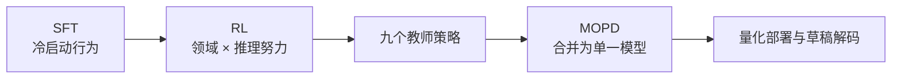

# 后训练与可验证 RL

## 学习目标

把 K3 后训练读成一条系统链：SFT 提供冷启动，RL 训练领域与推理预算专家，MOPD 再把专家能力合并回单一模型。

## 三阶段不是三个孤立算法

报告描述三个领域和 low/high/max 三种推理努力，组合成九个教师策略。MOPD 使用逐 token 的教师/学生对数概率比作为稠密奖励，并对极端值裁剪。它是作者采用的合并方案，不代表任何九个模型都能无损蒸馏成一个模型。

## 部分 rollout：吞吐换陈旧

长任务完成时间差异很大。部分 rollout 在一部分轨迹完成后就开始优化，不等最慢任务；未完成轨迹下一轮继续。收益是减少等待，代价是轨迹跨越多个策略版本，数据变得陈旧。报告称逐 token 正则化把更新限制在局部邻域，从而保持稳定，但没有给出所有超参数和完整消融。

## 可验证奖励先堵漏洞

报告中的环境设计体现三条通用原则：

- 正确性是硬门槛，性能等软目标在通过门槛后连续计分。
- 奖励只看最终环境状态时，执行器与验证器应隔离，隐藏测试不能暴露给策略。
- 固定 agent harness 会让模型过拟合工具 schema、系统提示和上下文管理，因此训练环境动态组合 harness 模块。

非确定性任务使用模型裁判时，作者要求先读结果、生成量表、逐项评分并记录分数，同时用长度预算抑制“写得越长越占便宜”。流程能减少部分漏洞，但模型裁判偏差仍需人工校准和对抗测试。

## 部署约束提前进入训练

K3 从 SFT 起对 MoE 专家权重使用 MXFP4 量化感知训练，专家输入激活使用 MXFP8，其他组件保持更高精度，以缩小训练与部署的精度差异。这不表示所有层都适合 4-bit，也不表示量化无损。

## 四级练习

**L1 · 直接应用**：三个领域与三档推理努力能形成多少教师策略？

参考答案

$3\times3=9$。

**L2 · 变形迁移**：部分 rollout 的完成比例越小，吞吐和数据陈旧风险如何变化？

参考答案

通常更早开始优化、等待更少，但更多轨迹会跨迭代继续，陈旧和方差风险增大。实际关系取决于任务时长分布与实现。

**L3 · 构造反例**：设计一个能骗过“只奖励输出更长”的模型裁判策略。

一种构造

重复量表关键词、加入大量看似严谨但不增加事实的信息，让裁判误把篇幅当完整性。长度预算能挡住极端情况，却仍需逐项事实检查。

**L4 · 多概念综合**：为什么隐藏验证器、harness 多样化和逐 token 正则化不是同一种防护？

参考答案

隐藏验证器防策略直接针对判分规则作弊；harness 多样化防交互外壳过拟合；逐 token 正则化约束陈旧数据下策略更新幅度。它们分别作用于奖励、环境分布和优化稳定性。

来源：[Kimi K3 技术报告 §4](https://arxiv.org/abs/2607.24653)。
