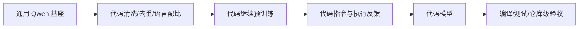

# Qwen2.5-Coder：代码领域继续训练

> 学习导航：这篇论文用代码专门化解释“领域模型”怎样从通用基座出发，并提醒：会补全代码不等于能完成仓库级工程任务。

## 论文回答什么

代码有严格语法、依赖关系和测试反馈，适合做继续预训练与可验证后训练。但代码数据还包含重复、许可证、低质量生成和安全风险。Qwen2.5-Coder 的问题是如何增加代码能力，同时保留通用语言和推理能力。

## 核心机制

- **代码继续预训练**让模型看到更多语法、API 和仓库结构。
- **代码指令数据**训练解释、重构、调试和补丁格式。
- **执行反馈**把编译、单元测试或静态检查变成更接近真实目标的验收。
- **混合数据**防止模型只会代码而忘记自然语言任务。

代码模型的 token 仍可能是文本 tokenizer；缩进、符号和长标识符的切分会影响上下文和生成效率。仓库 Agent 还需要文件系统、测试命令和补丁策略。

## 训练与推理分开

训练更新权重和代码风格。推理时，IDE/Agent 可以提供检索、编译和测试反馈；服务引擎只负责执行前向和解码。一个模型“生成能编译的函数”与“自主修复整个仓库”是不同层级的任务。

## 数字证据账本

| 记录 | 证据要求 |
|---|---|
| 代码数据 | 语言、仓库去重、许可证和污染检查 |
| 补全分数 | prompt 形式、截断、pass@k 采样次数 |
| 单元测试 | 测试覆盖、依赖和执行环境 |
| 仓库任务 | issue、工具、重试、补丁和验收脚本 |

教学复核：pass@10 不是“每次都 90% 正确”，而是 10 次候选中至少一个通过测试的概率估计；线上只采样一次时，应单独报告 pass@1。

## 代价与边界

- 代码数据污染会让基准高估，必须做仓库级去重和时间切分。
- 继续训练可能造成自然语言能力或安全边界回退。
- 执行反馈受环境、依赖和测试质量影响；绿灯不一定代表需求正确。

## 本课验收

**L1 · 直接应用**：代码继续预训练和 SFT 的差别是什么？

参考答案

继续预训练主要改变代码分布和表示，SFT 用任务示范改变解释、修复和输出格式；两者目标和数据结构不同。

**L2 · 变形迁移**：为什么 pass@10 不能替代 pass@1？

参考答案

pass@10 允许十次尝试，反映搜索空间里是否存在可行答案；用户常只接受一次回答，需看 pass@1 和成本。

**L3 · 构造反例**：生成代码通过单元测试但仍不应合并，为什么？

参考答案

测试覆盖不足、需求边界/安全审查缺失、许可证或性能问题都可能让绿灯不代表可发布。

**L4 · 多概念综合**：代码 Agent 的验收为什么必须包含仓库级任务？

参考答案

仓库级任务需要定位文件、理解依赖、修改多处并运行测试，能暴露单函数补全看不到的规划、工具和回归问题。

## 方法边界

Qwen2.5-Coder 报告中的代码基准不等于所有 IDE 或仓库 Agent 的表现。真实系统还要审许可证、依赖、执行隔离和数据安全。

来源：[Qwen2.5-Coder Technical Report](https://arxiv.org/abs/2409.12186)。
