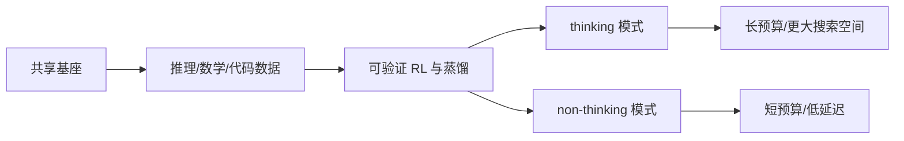

# Qwen3：思考模式与推理后训练

> 学习导航：Qwen3 用 thinking/non-thinking 讲清楚“运行时选择推理预算”和“训练阶段学会推理策略”是两件事。

```paper-lesson
qwen3
```

## 论文回答什么

有些任务需要长推理，有些任务更在意低延迟。Qwen3 报告把两种行为模式放进同一家族：thinking 模式允许更长的内部轨迹，non-thinking 模式直接回答。研究问题是如何通过预训练、蒸馏和 RL 同时保留两种行为，而不是让模型随机变聪明。



## 核心机制

thinking 是提示格式、特殊标记、后训练策略和解码预算共同形成的行为接口。它不意味着模型在后台改变参数；同一权重可以根据模式生成不同长度的轨迹。蒸馏可能把长轨迹的结构压进更小模型，但学生是否形成可迁移的能力，要看独立任务和长度效率。

## 训练与推理分开

训练期用示范、验证器和偏好/策略优化塑造两种分布。推理期由模式开关、最大 thinking token、temperature/top-p、工具和服务引擎执行。若只提高 max token 而没有更好的策略，模型可能只是更冗长。

## 数字证据账本

| 记录 | 口径 |
|---|---|
| thinking 分数 | 实际 thinking token、采样次数、工具 |
| non-thinking 分数 | 是否允许短链、模板是否一致 |
| 长度效率 | 正确率/平均 token/延迟，而不是只看正确率 |
| 蒸馏结果 | 教师轨迹、学生容量、词表和目标损失 |

教学复核：两个模型准确率都是 80%，A 平均 2,000 thinking token、B 平均 800 token；若任务和硬件相同，B 的单位正确答案 token 成本更低，但不代表 B 在所有困难样本上更强。

## 代价与边界

- thinking 模式提高预算可能增加正确机会，也增加延迟、费用和错误展开。
- 模式切换依赖模板和服务实现，跨引擎比较要固定特殊 token。
- 数学/代码验证器的收益不能直接推广到开放世界事实性。

## 本课验收

**L1 · 直接应用**：thinking/non-thinking 是权重的两个副本吗？

<details><summary>参考答案</summary>

通常是同一模型权重下的两种行为接口，由后训练、提示和预算控制；具体实现需查模型卡。

</details>

**L2 · 变形迁移**：为什么 max thinking token 增大不保证准确率上升？

<details><summary>参考答案</summary>

额外预算只是允许更长生成，若策略不会利用搜索或验证，可能重复错误并增加噪声和成本。

</details>

**L3 · 构造反例**：一个模型 thinking 分数高但 non-thinking 回退，可能发生什么？

<details><summary>参考答案</summary>

后训练过度偏向长轨迹，短模式数据不足或模板冲突，导致直接回答能力和校准变差。

</details>

**L4 · 多概念综合**：比较两个 thinking 模型至少要固定哪五项条件？

<details><summary>参考答案</summary>

模型版本、模式模板、thinking 上限、采样/投票策略、工具与评测脚本；还应记录平均输出长度和延迟。

</details>

## 方法边界

Qwen3 的 thinking/non-thinking 是版本级行为设计；它不是所有模型的通用二元开关。课程不把模式分数直接解释成“模型有两个大脑”。

来源：[Qwen3 Technical Report](https://arxiv.org/abs/2505.09388)。
