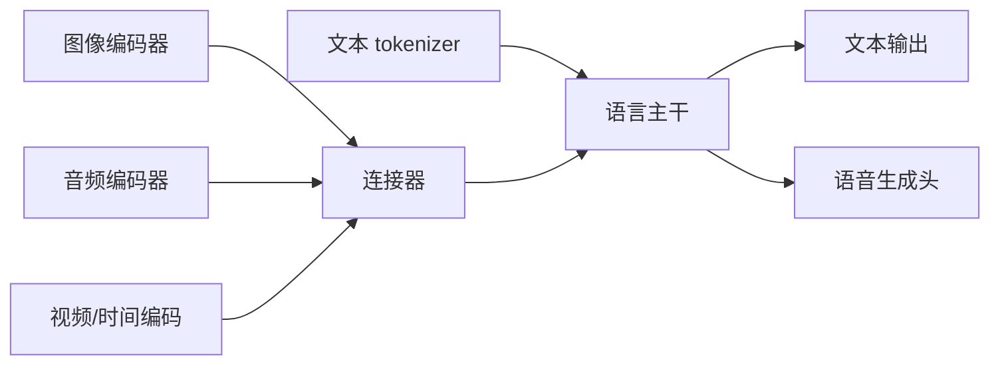

# Qwen2.5-Omni：端到端多模态交互

> 学习导航：Omni 报告把文本、图像、音频和视频放进一条交互链，重点是接口和实时性，而不是“所有模态共用一个词表”。

```paper-lesson
qwen25-omni
```

## 论文回答什么

普通视觉语言模型常常只输入图像、输出文字；Omni 还要听语音、看视频并实时输出语音。这要求不同模态编码器、时间对齐、语言主干和语音生成头协同工作。初学者应先画信息流，再讨论“原生”是什么意思。



## 核心机制

- 文本 token 是离散 id；图像/音频/视频通常先变成连续特征或各自离散表示。
- 连接器负责尺度、位置和语义对齐，不是一个万能翻译器；不同模态需要不同时间/空间信息。
- 端到端语音输出还要处理声学细节、流式 chunk、延迟和中断。
- 多模态联合训练会带来跨模态迁移，也可能造成语言能力、音频质量和视觉理解之间的竞争。

## 训练与推理分开

训练阶段要安排图文、语音、视频和交互数据，并分别监督文本与语音输出。推理阶段必须计入编码、融合、生成、播放缓冲和网络；模型权重静态，实时性由模型、服务和音频管线共同决定。

## 数字证据账本

| 记录 | 口径 |
|---|---|
| 输入模态 | 单模态/混合、分辨率、采样率、帧数 |
| 延迟 | 首字、首音频、持续输出和端到端 |
| 输出质量 | 文本正确、音频自然度、时间对齐分别测 |
| 模型接口 | 哪些编码器/连接器共享，哪些头独立 |

教学复核：若视频每秒采样 2 帧，10 秒输入就是 20 帧；若每帧 256 个视觉 token，则仅视觉部分约 $20\times256=5120$ token，文本上下文还要另算。这说明实时视频的瓶颈可能在输入而非 decode。

## 代价与边界

- 多模态输入会显著扩大上下文和显存，实时场景需要缓存、降采样和流式调度。
- 音频输出的自然度、事实性和安全不是同一个指标。
- “原生多模态”描述联合训练/接口方式，不代表所有模态共享相同词表或同等能力。

## 本课验收

**L1 · 直接应用**：为什么文本词表不能直接覆盖音频波形？

<details><summary>参考答案</summary>

波形是连续时间信号，需要音频编码器或离散声学表示；文本 tokenizer 只定义文字 token id。

</details>

**L2 · 变形迁移**：视频帧数增加会改变哪些成本？

<details><summary>参考答案</summary>

视觉 token、prefill 计算、显存和传输增加，时间对齐和实时缓冲也更难；输出文字速度不一定是主瓶颈。

</details>

**L3 · 构造反例**：文本回答正确但语音交互体验很差，可能原因是什么？

<details><summary>参考答案</summary>

语音头或流式缓冲延迟高、音频韵律/口音不佳、网络抖动或中断处理差；文本指标看不出这些问题。

</details>

**L4 · 多概念综合**：设计 Omni 系统的最小验收矩阵。

<details><summary>参考答案</summary>

按文本/视觉/音频/视频输入，分别测理解与生成质量，再测首响应、持续延迟、并发、隐私和跨模态冲突样例。

</details>

## 方法边界

Qwen2.5-Omni 的接口和指标属于具体版本。Qwen3-Omni、Qwen2-VL 或 Qwen-Audio 可能使用不同编码器、连接器和输出头，不能仅凭家族名推断。

来源：[Qwen2.5-Omni Technical Report](https://arxiv.org/abs/2503.20215)。
