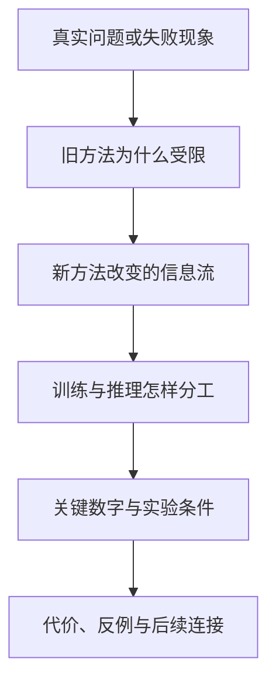

# 论文研读

学习导航：这里把大模型论文组织成“研究问题、模型系列、单篇课件”三条互相连接的路线；先从你真正想解决的问题进入，再选择一个系列或一篇论文，读完后应能讲清它为什么出现、改了哪里、带来什么代价。

## 从哪里进入

| 你的目标 | 入口 | 进入后会看到什么 |
|---|---|---|
| 不知道该先学哪篇 | [论文知识图谱](02-跨系列问题地图.md) | 六类研究问题与代表论文的连接 |
| 想查某个模型或主题 | [全部论文与学习进度](01-论文库.md) | 可按系列、主题和材料类型筛选的目录 |
| 想看一个模型家族怎样演进 | [按模型系列学习](#按模型系列学习) | GLM、Kimi、DeepSeek、Qwen 的主线与分支 |
| 想把一篇论文真正讲明白 | [单篇论文课件](#单篇论文课件) | 场景、机制、数字、边界和练习 |

## 按研究问题学习

论文不是按产品发布时间才能理解。先选择瓶颈，再比较不同团队的回答：

- [预训练目标与数据](02-跨系列问题地图.md#预训练目标与数据)：模型最初在学什么，数据与目标怎样决定能力边界？
- [模型容量与计算效率](02-跨系列问题地图.md#模型容量与计算效率)：MoE、低精度和并行如何改变参数量与计算成本？
- [长上下文与注意力](02-跨系列问题地图.md#长上下文与注意力)：模型怎样减少历史访问、缓存和带宽压力？
- [推理与后训练](02-跨系列问题地图.md#推理与后训练)：奖励、验证器、蒸馏和推理预算怎样改变行为？
- [多模态输入与生成](02-跨系列问题地图.md#多模态输入与生成)：图像、音频和视频怎样进入模型，输出头又如何分工？
- [Agent、系统与可靠性](02-跨系列问题地图.md#agent、系统与可靠性)：模型、工具、调度、硬件和安全边界怎样组成完整系统？

## 按模型系列学习

| 系列 | 演进地图 | 单篇课程 |
|---|---|---|
| GLM | [从空白填充到长任务 Agent](04-GLM系列演进.md) | [GLM 论文课程](GLM深读/) |
| Kimi | [从长思维链到原生多模态](05-Kimi系列演进.md) | [Kimi 论文课程](Kimi深读/) |
| DeepSeek | [从开放基座到推理与视觉](06-DeepSeek系列演进.md) | [DeepSeek 论文课程](DeepSeek深读/) |
| Qwen | [从多语言基座到 Omni](07-Qwen系列演进.md) | [Qwen 论文课程](Qwen深读/) |

系列演进页负责回答“前后版本为什么变化”，单篇课程负责放大一次关键研究转折。不要只背版本名称，也不需要按年份读完全部材料。

## 单篇论文课件

当前主线包含 22 篇独立课件。每篇课件都从一个真实困难开始，然后依次建立：

论文库中的其他材料仍然可以查看原文和课程导读；发布说明、模型卡与仓库说明会明确标记，不会被伪装成完整论文。

## 专题论文课程

- [Kimi K3 技术报告](../Kimi-K3深读/)：把架构、预训练、后训练、多模态、基础设施和评测串成一张完整模型图。
- [在策略蒸馏论文](../在策略蒸馏深读/)：沿教师能力、学生访问状态和长轨迹三个矛盾理解策略蒸馏。

## 完成一篇后

完成一篇论文课件，不要求下载代码或逐字读完整篇 PDF。你应该能闭卷回答四个问题：

1. 它试图解决什么真实失败，旧方法为什么不够？
2. 输入经过哪些模块，论文具体改变了哪一步？
3. 哪个数字支持作者的结论，它在什么条件下成立？
4. 这个方法牺牲了什么，什么场景下可能失效？

接下来回到[论文知识图谱](02-跨系列问题地图.md)，把这篇论文连接到同一问题下的另一种方案。
