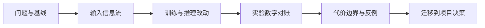

# 论文研读中心

学习导航：这里承接基础课、专题课和前沿瓶颈地图；本页先建立阅读方法，再进入[论文库与阅读状态](01-论文库.md)，用一个系列导读或一个问题路线完成可检查的证据卡。

## 为什么要单独设计论文研读

模型论文越来越像一个研究生态，而不是一本产品说明书。同一系列可能同时有基座报告、代码/数学分支、多模态分支、推理方法、内核实现和只有仓库说明的实验版本。如果按发布时间平铺，初学者会遇到四种误判：

- 把产品宣传、模型卡、论文和第三方评测当成同一种证据。
- 只记住“用了 MoE、RL 或长上下文”，却说不清改动解决了哪个瓶颈。
- 把一份报告里的组合结果归因给某个模块，忽略数据、训练配方和系统共同变化。
- 读完摘要就把作者主张当成已经被独立复现的事实。

所以本中心使用“双索引”：一条按 **研究问题** 找论文，另一条按 **模型系列** 看演进；论文库中的阅读状态只保存到当前浏览器，方便把几十篇材料分成自己的队列。

> **读图提醒**：本中心的路线、表格和“观察点”是阅读索引，不是论文结论。文中出现“解决、提升、能力来自”等说法时，仍要回到原文的基线、消融、数据、预算和评测条件；标为“发布说明”或“仓库随附报告”的材料，只能证明公开材料记录的版本与作者主张，不能自动等同于独立论文或同行评审结论。

## 推荐入口

| 入口 | 适合的问题 | 页面产物 |
|---|---|---|
| [论文库与阅读状态](01-论文库.md) | 我应该先读哪一篇？哪些已经读过？ | 一份可筛选的论文队列 |
| [跨系列问题地图](02-跨系列问题地图.md) | 四个系列分别在解决什么瓶颈？ | 研究问题对照图 |
| [论文证据卡](03-论文证据卡.md) | 怎样把一篇论文读成可核查结论？ | 一张事实、实验、代价和边界卡 |
| [GLM 系列选读地图](04-GLM系列演进.md) | GLM 从预训练目标走到 Agent 和稀疏注意力经历了什么？ | 路线地图 → [GLM 逐篇深读](GLM深读/) |
| [Kimi 系列选读地图](05-Kimi系列演进.md) | Kimi 如何把 RL、MoE、混合注意力和原生多模态串起来？ | 路线地图 → [Kimi 逐篇深读](Kimi深读/) |
| [DeepSeek 系列选读地图](06-DeepSeek系列演进.md) | DeepSeek 如何在 MoE、推理 RL、视觉和验证器之间扩展？ | 路线地图 → [DeepSeek 逐篇深读](DeepSeek深读/) |
| [Qwen 系列选读地图](07-Qwen系列演进.md) | Qwen 如何从通用文本扩展到代码、数学、视觉、音频和安全？ | 路线地图 → [Qwen 逐篇深读](Qwen深读/) |

已经具备阅读基础后，再进入四个[系列逐篇深读](#系列逐篇深读)、[Kimi K3 技术报告深读](../Kimi-K3深读/)或[在策略蒸馏论文深读](../在策略蒸馏深读/)；它们是完整案例，不是论文目录的替代品。

## 系列逐篇深读

| 系列 | 主线篇数 | 选择逻辑 |
|---|---:|---|
| [GLM](GLM深读/) | 5 | 预训练目标 → 规模化 → 对话 → Agent → 长任务 |
| [Kimi](Kimi深读/) | 5 + K3 案例 | RL → 稀疏注意力 → MoE Agent → 混合注意力 → 多模态 |
| [DeepSeek](DeepSeek深读/) | 6 | 基座 → MoE → MLA → 训练系统 → 推理 RL → 视觉 |
| [Qwen](Qwen深读/) | 6 | 通用基座 → 主干升级 → 视觉 → 代码 → 推理 → Omni |

“主线篇数”不是论文总数。论文库中的条目按 **主线 / 选读 / 查阅** 标记；只有能独立回答真实问题、公开足够证据、且能构造小白验收题的材料才进入逐篇深读。这样既不会把每个版本硬写成文章，也不会因为只讲四个系列概览而让学习者错过关键论文。

## 五遍阅读法

1. **问题与基线**：用一句话写“作者想改善什么、拿谁比较、指标是什么”。没有基线就不接受“提升”这个词。
2. **输入信息流**：画出数据、token 或模态表示怎样进入模型，哪些参数训练、哪些状态只在本次推理存在。
3. **训练与推理改动**：把架构、数据、优化器、后训练、解码和服务引擎分栏；不要把系统速度归因给模型能力。
4. **实验数字对账**：记录版本、数据、硬件、上下文长度、推理预算、评测 harness 和是否为作者自评，至少复算一个数字。
5. **代价边界与反例**：回答“什么情况下它会失效、牺牲了什么、怎样设计反例”。最后把结论翻译成项目选择，而不是背诵缩写。

## 证据标签

| 标签 | 可以说什么 | 不可以说什么 |
|---|---|---|
| 一手论文事实 | 原文明确给出的公式、配置、数据或流程 | 把推断写成原文原话 |
| 作者实验 | 在指定条件下作者报告的分数、消融或曲线 | 自动推广到所有模型和负载 |
| 作者主张 | 作者对设计动机和效果的解释 | 没有对照就写成已证明因果 |
| 仓库随附报告 | 官方仓库提供的技术报告或实验说明 | 因为没有 arXiv 编号就视为不可信，或反过来视为同行评审 |
| 教学推导 | 用报告公开数字直接计算出的关系 | 把课程算式伪装成论文结果 |
| 待核查 | 版本漂移、定义不清或缺少独立比较 | 放进主线结论而不标注不确定性 |

补充一点：目录中的“正式论文”表示存在独立论文条目，不表示它一定已经通过同行评审；arXiv 预印本、官方技术报告和博客的证据强度仍需分别记录。

## 完成标准

完成一个论文单元，不要求逐字读完全文，也不要求下载、运行或复现实验。你需要能：

- 画出一张输入到输出的信息流图，并说出改动发生在哪一层。
- 从原文或官方报告找出一个可复算数字，说明它的口径。
- 写出一个方法的收益、代价、失败边界和至少一个反例。
- 把“事实、作者主张、教学推导、待核查”分开，并说明下一步该查什么。

论文库的日期是目录核查日期，不是论文的永久正确性承诺。前沿版本会继续增加，新增材料应先进入目录、标注来源类型，再决定是否值得做成完整深读路线。
