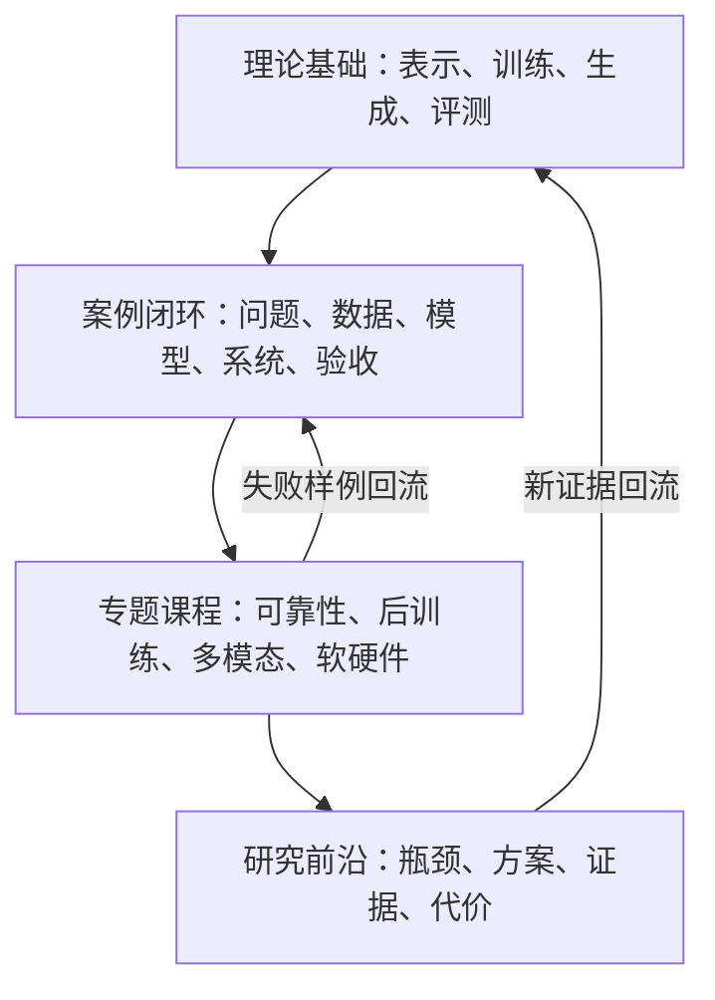
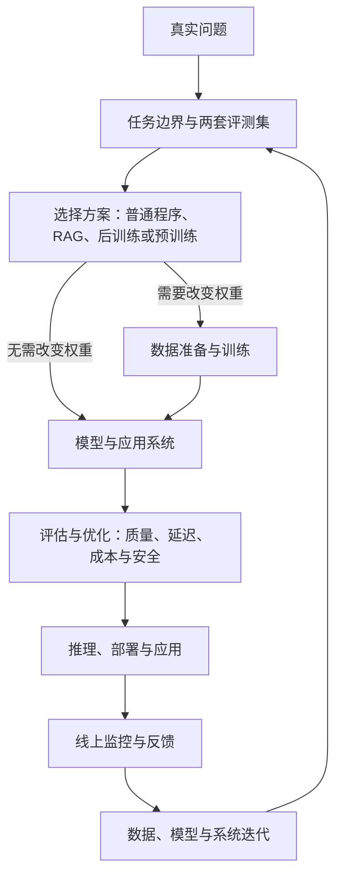
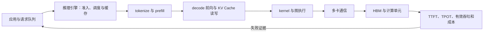
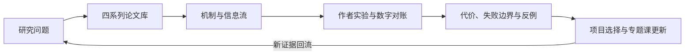

# 全局知识图谱

这张图先回答“我正在学整套系统的哪一层”。第一次只沿粗箭头阅读，不要求记住所有分支；遇到新术语时，先回到本页定位它的上游、下游和责任边界。

如果你还不知道该从哪个问题进入，请先看[学科地图](学科地图.md)。学科地图负责选择观察角度，本页负责解释依赖与责任边界。

## 两个机制对象与一条生命周期

| 先建立哪个完整对象 | 核心因果链 | 进入课程 |
|---|---|---|
| 模型原理 | 数据 -> loss -> 梯度 -> 参数；上下文 + 固定参数 -> 候选分布 | [模型原理总纲](../01-14天理论课/模型原理总纲.md) -> D01-D04 |
| 模型架构 | 完整模型 -> Block -> 子层 -> 参数矩阵；输入 -> 激活/缓存 -> logits | [模型架构总纲](../01-14天理论课/模型架构总纲.md) -> D05-D07 |
| 模型全生命周期 | 问题 -> 数据与训练 -> 评估优化 -> 部署应用 -> 监控反馈 -> 持续迭代 | [模型全生命周期总纲](../01-14天理论课/模型训练总纲.md) -> D08-D14 |

原理解释为什么成立，架构解释由什么组成，生命周期解释怎样从真实问题得到可验收、可运行且能持续改进的系统。三者共用教学模型 L0，但不能压成一张模糊流程图；学习者应能在机制、组件、训练 step、完整项目和线上系统之间切换。

## 从学科到项目的层级结构



这些层级不是难度排行榜。理论解释稳定机制，案例展示项目证据怎样形成，专题把共性问题展开，研究则追踪尚未稳定解决的瓶颈。

## 一次模型项目的完整生命周期



图中有两条容易混淆的链：训练链把数据变成参数，推理链用静态参数计算结果；部署后的监控与反馈再把可核验的失败证据送回下一轮方案。RAG 把资料放进本次上下文，不等于重新训练；采样由解码代码执行，不等于模型参数随机变化。

## 统一模型运行地图：把整套课程放回一条路径

下面的地图是全课程的“脑内播放键”。选择**推理**时，从输入、表示、前向计算走到输出；选择**训练**时，从数据、损失和梯度走到检查点。可旋转舞台只把阶段和因果关系排在一条路径上，不把不同对象放进同一个数学空间；只有数值张量与缓存中的点表示抽样数值，形状标签和正文定义才是精确信息。

```model-runtime
{
  "ariaLabel": "大模型训练链与推理链的统一运行地图",
  "learningGoal": "能把输入、张量形状、模型权重、缓存、解码和评测放回同一条责任清晰的链路。",
  "watchFor": "先看数据对象如何变化，再看哪一步由模型权重、解码代码或推理引擎负责。",
  "initialMode": "inference",
  "checkpoint": { "title": "闭卷重建两条链", "prompt": "先按顺序重建当前模式，再切换另一模式比较哪些对象会更新。" },
  "modes": [
    {
      "id": "inference",
      "label": "推理链",
      "overview": "同一请求在静态权重上前向计算；logits 交给解码策略选择 token，KV Cache 只服务当前请求。",
      "rebuild": ["input", "tokenize", "position", "embedding", "block", "cache", "logits", "sample", "output"],
      "nodes": [
        { "id": "input", "label": "文本 / 图像 / 语音", "shape": "原始模态", "kind": "input", "visual": "modalities", "visualMeaning": "三个入口片段表示不同输入类型，不共用一组参数点。", "owner": "应用与模态编码器" },
        { "id": "tokenize", "label": "Tokenize / 编码", "shape": "(B,T) 或模态特征", "kind": "represent", "visual": "operation", "visualMeaning": "两块输入/输出板表示编码操作，不是一个隐藏空间。", "owner": "Tokenizer 或模态编码器" },
        { "id": "position", "label": "位置信息", "shape": "序列轴 T", "kind": "represent", "visual": "sequence", "visualMeaning": "位置序列条只标记先后关系，不把位置编号当作距离。", "owner": "模型位置机制" },
        { "id": "embedding", "label": "Embedding", "shape": "(B,T,D)", "kind": "represent", "visual": "tensor", "visualMeaning": "数值张量板中的点是抽样浮点值，真实轴以形状标签为准。", "owner": "模型权重" },
        { "id": "block", "label": "Transformer Blocks", "shape": "(B,H,T,Dh) / (B,T,D)", "kind": "compute", "visual": "operation", "visualMeaning": "两块数值板和中间箭头表示多层前向操作，不是一个参数云。", "owner": "模型前向算子" },
        { "id": "cache", "label": "KV Cache", "shape": "各层历史 K/V", "kind": "system", "visual": "cache", "visualMeaning": "叠放数值板表示按层保存的历史 K/V；可见点只是抽样数值，不是模型知识点。", "owner": "推理引擎管理的请求状态" },
        { "id": "logits", "label": "词表 logits", "shape": "(B,T,V)", "kind": "compute", "visual": "scores", "visualMeaning": "每格代表词表中的候选分数；柱高只作教学示意，不是实测 logits。", "owner": "LM Head" },
        { "id": "sample", "label": "解码 / 采样", "shape": "(B,V) → 1 个 ID", "kind": "choose", "visual": "selection", "visualMeaning": "候选分数槽位与一个接收标记，表示选择过程，不表示多条文本分支。", "owner": "解码代码" },
        { "id": "output", "label": "文本 / 工具调用", "shape": "输出 token 序列", "kind": "system", "visual": "output", "visualMeaning": "文本条表示输出字符或工具调用，不是浮点张量。", "owner": "应用层" }
      ],
      "edges": [
        { "id": "e1", "from": "input", "to": "tokenize", "label": "整理与编码" },
        { "id": "e2", "from": "tokenize", "to": "position", "label": "保留顺序" },
        { "id": "e3", "from": "position", "to": "embedding", "label": "形成输入表示" },
        { "id": "e4", "from": "embedding", "to": "block", "label": "多层前向" },
        { "id": "e5", "from": "block", "to": "logits", "label": "投影到词表" },
        { "id": "e5-cache", "from": "block", "to": "cache", "label": "写入 / 更新历史 K/V" },
        { "id": "e5-reuse", "from": "cache", "to": "block", "label": "下一轮读取历史 K/V" },
        { "id": "e6", "from": "logits", "to": "sample", "label": "选择候选" },
        { "id": "e7", "from": "sample", "to": "output", "label": "反分词 / 展示" },
        { "id": "e8", "from": "sample", "to": "position", "label": "接受 ID，并加入新位置" }
      ],
      "steps": [
        { "title": "先整理输入", "watch": "输入可以是文本，也可以先由图像或语音编码器变成模型能接收的表示。", "purpose": "确定一次请求真正送入模型的内容。", "detail": "系统提示、工具结果和用户消息都可能改变最终上下文；它们不是模型权重本身。", "reflection": "同一用户问题换一个系统提示，权重没变，输入会不会变？", "active": ["input", "e1"], "shape": "原始模态 → 模型接口" },
        { "title": "切成 token 并保留位置", "watch": "文本被切成离散 token ID，位置是独立的序列轴，不是 ID 的大小排序。", "purpose": "把字符串变成模型的离散输入接口。", "detail": "Tokenizer 和位置机制共同决定模型看到的序列；图像 patch、音频帧也会经过对应编码而不是假装成汉字。", "reflection": "token ID 842 比 ID 17 大，能说明语义更强吗？", "active": ["tokenize", "e2", "position"], "shape": "(B,T)" },
        { "title": "查表并进入多层前向", "watch": "ID 只定位 Embedding 的一行，真正计算的是 (B,T,D) 的浮点隐藏表示；生成时，Block 还会读写各层 KV Cache。", "purpose": "让离散符号进入矩阵、注意力和 MLP 的连续计算。", "detail": "位置数通常保持为 T；每个 Block 更新隐藏值。KV Cache 是前向的输入输出状态，不会脱离模型自行产生 logits；普通推理读取权重，不执行反向传播。", "reflection": "推理时做了前向计算或更新缓存，模型文件会永久改变吗？", "active": ["position", "e3", "embedding", "e4", "block", "e5-cache", "cache", "e5-reuse"], "shape": "(B,T,D) + 各层历史 K/V" },
        { "title": "得到 logits 而不是答案", "watch": "最后隐藏状态经过 LM Head，对词表每个候选产生一个未归一化分数。", "purpose": "把上下文表示转换成下一 token 的候选空间。", "detail": "logits 不是概率，也不是事实表；它们还要交给解码策略，并可能经过应用层核验或工具调用。", "reflection": "最高 logit 是否自动等于事实正确？", "active": ["block", "e5", "logits"], "shape": "(B,T,V)" },
        { "title": "选择并循环输出", "watch": "解码代码接受 token ID，反分词后展示；若继续生成，ID 先获得新的序列位置，再进入 Embedding 和模型前向。", "purpose": "形成可见回答，同时解释流式输出为何看起来像连续写作。", "detail": "基础路径通常逐 token 接受；推测解码等实现可以批量验证并接受多个。模型权重通常静态，KV Cache 是前向读写的请求状态，推理引擎负责调度和缓存。", "reflection": "界面出现整句话，能证明模型一次计算出了整句话吗？", "active": ["logits", "e6", "sample", "e7", "output", "e8", "position"], "shape": "已接受 ID → 新位置 → 下一轮前向" }
      ]
    },
    {
      "id": "training",
      "label": "训练链",
      "overview": "训练通过目标与预测的差异产生梯度，再更新参数；检查点经过独立评测后才有资格进入下一轮项目决策。",
      "rebuild": ["data", "tokenize", "forward", "loss", "backward", "optimizer", "checkpoint", "evaluate"],
      "nodes": [
        { "id": "data", "label": "数据与任务", "shape": "样本 + 目标", "kind": "input", "visual": "message", "visualMeaning": "样本条表示输入与目标的配对，不是模型参数。", "owner": "数据管线" },
        { "id": "tokenize", "label": "切分 / 模态编码", "shape": "(B,T) 或特征", "kind": "represent", "visual": "operation", "visualMeaning": "两块输入/输出板表示编码操作，不是一个隐藏空间。", "owner": "Tokenizer / 编码器" },
        { "id": "forward", "label": "前向预测", "shape": "logits / 输出", "kind": "compute", "visual": "tensor", "visualMeaning": "数值张量板中的点是抽样中间值，具体输出形状以标签为准。", "owner": "模型" },
        { "id": "loss", "label": "损失函数", "shape": "标量或各位置损失", "kind": "compute", "visual": "scalar", "visualMeaning": "一个环表示汇总后的标量损失，不是一个坐标轴。", "owner": "训练目标" },
        { "id": "backward", "label": "反向传播", "shape": "∂loss / ∂参数", "kind": "compute", "visual": "gradient", "visualMeaning": "回指箭头表示梯度沿计算图回传，不是数据向前流动。", "owner": "自动微分" },
        { "id": "optimizer", "label": "优化器更新", "shape": "参数增量", "kind": "compute", "visual": "parameter-update", "visualMeaning": "两块参数板表示更新前后，差异由优化器规则决定。", "owner": "优化器与学习率" },
        { "id": "checkpoint", "label": "检查点", "shape": "权重 + 配置", "kind": "system", "visual": "checkpoint", "visualMeaning": "叠放快照表示某一时刻保存的模型状态，不是新的推理数据。", "owner": "训练系统" },
        { "id": "evaluate", "label": "独立评测", "shape": "质量 / 成本 / 安全", "kind": "system", "visual": "metrics", "visualMeaning": "三根指标柱代表质量、成本、安全等评测维度，不是参数大小。", "owner": "评测与项目决策" }
      ],
      "edges": [
        { "id": "t1", "from": "data", "to": "tokenize", "label": "清洗与编码" },
        { "id": "t2", "from": "tokenize", "to": "forward", "label": "送入模型" },
        { "id": "t3", "from": "forward", "to": "loss", "label": "和目标比较" },
        { "id": "t4", "from": "loss", "to": "backward", "label": "求梯度" },
        { "id": "t5", "from": "backward", "to": "optimizer", "label": "更新规则" },
        { "id": "t6", "from": "optimizer", "to": "checkpoint", "label": "保存参数" },
        { "id": "t7", "from": "checkpoint", "to": "evaluate", "label": "冻结后评测" },
        { "id": "t8", "from": "evaluate", "to": "data", "label": "失败样本回流" }
      ],
      "steps": [
        { "title": "定义数据与目标", "watch": "先看样本、目标和评测边界，再谈模型大小。", "purpose": "让训练优化一个可检查的问题。", "detail": "通用预训练、领域继续预训练、监督微调和偏好优化使用的目标不同；数据质量与覆盖范围会进入参数。", "reflection": "没有独立评测数据，只看训练损失，能知道真实任务变好了吗？", "active": ["data", "t1"], "shape": "样本 + 目标" },
        { "title": "前向得到预测", "watch": "编码后的张量经过模型，产出 logits 或任务输出。", "purpose": "把当前参数下的预测与目标放在同一坐标系比较。", "detail": "前向和推理共享主要计算骨架，但训练还要保留反向所需的激活或检查点。", "reflection": "训练中的 logits 和部署时的 logits 来自完全不同的模型吗？", "active": ["tokenize", "t2", "forward", "t3"], "shape": "(B,T,V) 或任务输出" },
        { "title": "损失产生梯度", "watch": "看预测与目标的差异先变成损失，再沿计算图反向传播。", "purpose": "把“哪里错了”转换成参数更新方向。", "detail": "反向传播不是让模型查答案，而是依据训练目标计算梯度；错误目标或偏置数据会把错误规律写入参数。", "reflection": "把损失降到很低，是否就证明模型在所有场景都可靠？", "active": ["forward", "t3", "loss", "t4", "backward"], "shape": "标量 → 参数梯度" },
        { "title": "更新并保存参数", "watch": "优化器使用梯度和学习率修改权重，检查点记录这一时刻的模型状态。", "purpose": "让下一批数据看到新的计算规则。", "detail": "参数更新发生在训练阶段；普通推理只读已加载的检查点。量化、蒸馏或 LoRA 可能另存不同形式的可部署资产。", "reflection": "KV Cache 能代替优化器更新模型知识吗？", "active": ["backward", "t5", "optimizer", "t6", "checkpoint"], "shape": "参数张量" },
        { "title": "独立评测并回流", "watch": "评测同时看质量、延迟、成本、安全和失败边界，结果决定是否回到数据或方案选择。", "purpose": "把一次训练变成可复盘的项目闭环。", "detail": "单一榜单或平均分不能替代任务的开发评测集与冻结测试集；失败样本应标注是数据、架构、解码、系统还是应用层问题。", "reflection": "为什么评测结论可能让团队回到数据，而不是继续堆参数？", "active": ["checkpoint", "t7", "evaluate", "t8", "data"], "shape": "指标与失败样本" }
      ]
    }
  ]
}
```

阅读时记住三个不变量：**ID 是索引，位置是序列轴，矩阵是映射规则**；模型权重通常跨请求不变，KV Cache 随当前请求变化；采样是模型外的选择程序，不能替模型核验事实。

## 放大一：参数怎样训练出来

| 输入 | 发生的动作 | 输出交给下一层 |
|---|---|---|
| 合法且切分好的数据 | tokenizer 或模态编码 | token ID 或模态表示 |
| ID 与位置 | Embedding 和模型前向 | 隐藏表示与 logits |
| 预测和目标 | loss、反向传播、优化器更新 | 新参数与检查点 |
| 检查点 | 验证、失败分析、模型卡 | 可比较的模型资产 |

## 放大二：一次请求怎样得到输出

| 输入 | 负责组件 | 产生什么 |
|---|---|---|
| 文本、图像、语音或工具结果 | tokenizer、模态编码器和模型前向 | logits 或任务特征 |
| logits | greedy、temperature、top-k、top-p | 当前选中的 token |
| 请求与缓存 | 推理引擎、KV Cache、批处理和并行 | 回答或结构化结果 |
| 实际输出 | 应用评测与监控 | 失败分类和下一轮改进证据 |

## 放大三：强模型怎样变成低成本系统

| 阶段 | 必须保留的对照 | 决策条件 |
|---|---|---|
| 选择学生 | 教师、原始学生、最简单规则基线 | 预设记录证明学生适合目标硬件 |
| 蒸馏 | 回答、logit、特征或策略信号分别记录 | 关键任务超过原始学生 |
| 压缩 | 未量化学生与量化/剪枝/QAT 版本 | 质量仍高于冻结底线 |
| 部署 | 相同输入长度、输出长度、batch 和并发 | 延迟、吞吐、显存和成本达标 |

离策略蒸馏学习固定教师轨迹；在策略蒸馏则在学生访问的状态上请求教师信号。后者更贴近学生分布，但仍要检查教师是否带来新增能力、高概率 token 是否重合、长轨迹尾部监督是否退化。见[在策略蒸馏深读](../06-拓展知识库/在策略蒸馏深读/)。

## 放大四：一次请求怎样穿过 AI Infra



这张图要求把模型语义和系统执行分开：权重与上下文产生 logits，解码策略选 token，推理引擎调度请求与缓存，算子和硬件负责把张量计算实际跑完。任一层都不能单独解释完整用户体验。

## 知识图谱中的常见关系

| 关系 | 例子 | 学习时要问 |
|---|---|---|
| 前置于 | softmax 前置于注意力权重 | 不会前置知识，后面会卡在哪里？ |
| 组成 | 注意力与 MLP 组成一个 Block 的主要计算 | 当前对象是谁的一部分？ |
| 产生 | LM Head 产生词表 logits | 输入、动作和输出分别是什么？ |
| 实现于 | top-p 通常在模型外的解码代码中执行 | 这一步由权重、框架还是应用负责？ |
| 解决 | GQA 主要缓解 KV Cache 成本 | 它针对哪一个瓶颈？ |
| 局限 | 固定状态可能压缩丢失历史细节 | 得到效率时牺牲了什么？ |
| 替代或互补 | RAG 与 SFT 处理不同类型的问题 | 两个方法能否直接互相替代？ |

术语之间只有“链接到定义”还不算知识图谱。正文首次引入重要概念时，必须至少标明上面一种关系。

## 论文怎样回流到知识图谱



[论文研读中心](../06-拓展知识库/论文研读/)按研究问题和模型系列索引，[论文库](../06-拓展知识库/论文研读/01-论文库.md)保存当前浏览器的阅读状态。模型系列只是索引；知识图谱真正连接的是瓶颈、前置、代价和证据。

## 必须能闭卷重画的图

1. `文本 -> token -> ID -> Embedding -> Transformer -> logits`。
2. `训练数据 -> loss -> 梯度 -> 参数更新 -> 检查点`。
3. `请求/上下文 -> 推理引擎（调度与缓存） -> 模型前向 -> logits -> 解码策略 -> 输出`。
4. `真实问题 -> 两套评测集 -> Prompt/RAG/微调/预训练/蒸馏选型 -> 独立评测`。
5. `应用队列 -> 推理引擎（调度） -> prefill/decode -> kernel/通信 -> 硬件 -> SLO`。

不知道某层为何要学，先看[课程安排](课程为什么这样安排.md)；第一次进入课程，再选[能力路线](能力路线.md)。

已有问题时，可直接进入[实际模型案例](../06-拓展知识库/实际模型项目/)、[幻觉与可靠性](../06-拓展知识库/幻觉与可靠性/)、[模型后训练](../06-拓展知识库/模型后训练/)、[多模态基础](../06-拓展知识库/多模态基础/)或[软硬件瓶颈](../06-拓展知识库/软硬件瓶颈/)。

阅读新架构前，先看[前沿瓶颈地图](../06-拓展知识库/前沿瓶颈地图.md)。
