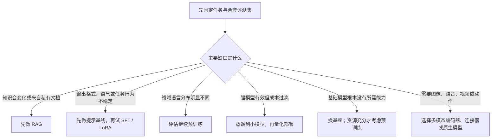

# 能力路线

课程本身持续更新，但每条路线必须有可检查的能力出口。不要把“读完整个知识库”作为目标；先选择要回答的问题，再用站内练习证明自己能解释、比较和审查证据。

如果公式暂时挡住了理解，先用[模型算法图解](../09-模型算法图解/)沿“输入、动作、输出、边界”看清机制，再回到对应路线；图解不替代正式课程和证据评测。

## 路线总览

| 路线 | 建议前置 | 核心内容 | 完成证据 |
|---|---|---|---|
| 零基础认知 | 学前自测 | 总纲与理论主线、D01-D14、按需数学急救 | 闭卷画出原理、运行与全生命周期，并解释每层责任 |
| 训练过程案例 | 零基础认知 | D15-D21、预生成 tiny-llm 材料 | 解释检查点、训练/验证曲线、对照实验和模型卡 |
| 模型评测与选型 | D12-D14、实际模型案例 | 指标口径、证据等级、现实开放权重模型、组件选择与冻结验收 | 审查模型选择合同、榜单证据卡和本地验收记录 |
| 小模型与蒸馏 | D02、D04、D07-D12 | 小基座选型、SFT、回答/logit 蒸馏、量化 | 从教师与学生基线判断蒸馏收益和部署代价 |
| 数据与训练工程 | 模型全生命周期总纲、D08-D10 | 语料治理、训练预算、项目/任务/step 尺度、并行、故障恢复 | 审查数据卡、预算表、运行记录和失败复盘 |
| 推理与部署 | D06-D07、D13 | 解码、KV Cache、量化、批处理、推测解码 | 解释质量不变条件下的延迟、吞吐和显存对照 |
| RAG 与 Agent | D07、D12-D13 | 检索、工具、工作流、权限和评测 | 从预设问答和工具轨迹完成失败归因 |
| 多模态 | D02、D06 | 视觉/音频编码器、连接器、模态 token 和联合训练 | 画出模态接口形状，并完成一个独立模态评测 |
| 幻觉与可靠性 | D07、D12-D13 | 真实性、忠实度、校准、拒答、引用核验与监控 | 幻觉归因矩阵、冻结失败集和可靠性报告 |
| 模型后训练 | D10-D12 | SFT、偏好优化、RLVR、回归保护与安全评测 | 审查后训练方案卡、能力回归矩阵和模型卡 |
| 软硬件瓶颈 | D06-D07、D10、D13 | 算子、引擎、KV Cache、并行、HBM、延迟与吞吐 | 从冻结性能记录定位瓶颈 |
| 前沿研究阅读 | 理论基础和至少一条案例路线 | 长上下文、MoE、SSM、推理训练、世界模型 | 区分事实、主张、推导和未证实项 |

## 先选问题，再选训练方式

“训练模型”不是默认答案。普通代码能稳定完成的规则不要交给生成模型；检索问题不要默认写进参数；部署太贵也不等于必须从零训练一个更小模型。

## 每条案例路线的统一验收

每条路线都从一份预设问题卡开始：用户问题、输入输出、失败代价、冻结测试集、最简单基线和资源上限。验收要求是从提供的配置、数据说明、记录、质量指标、系统指标和失败样例中判断结论是否成立，并指出适用边界和下一步决策。

一个指标不能代替完整验收。生成质量变好但延迟超标，或模型变小但关键类别召回率下降，都不能笼统写成“模型更好了”。

## 推荐第一次路径

第一次接触大模型时，按[基础闭环路线](基础闭环路线.md)完成一次理论和微型训练案例闭环。之后停止顺序通读，根据自己的目标从上表选择下一条路线。

仍没有明确目标时，推荐按“实际模型案例 -> 模型评测与选型 -> 模型后训练 -> 幻觉与可靠性 -> 小模型与蒸馏 -> 多模态基础 -> 软硬件瓶颈 -> 前沿瓶颈 -> 论文研读”建立第二层知识。具体案例可以跳过无关分支，但论文研读应放在至少一条案例路线之后，避免只记模型名和结论。

仍不确定时，从[学科地图](学科地图.md)的“现象”入口开始：先描述你观察到的失败，再回到对应生命周期和项目路线。
