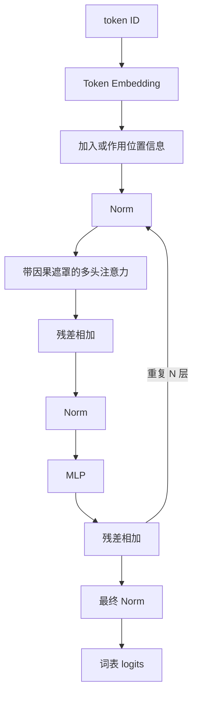

# D06：拼出完整 Transformer

> **学习导航**：这是“模型架构”主线的组装课；本课承接 D02 的表示与 D05 的注意力，把零件装成 Decoder-only 主干；完成后应能从完整模型逐级定位到 Block、子层和参数矩阵，再从 token ID 沿形状走到 logits。

> **主线位置**：[模型架构总纲](模型架构总纲.md) -> D05 Attention 子层 -> **D06 组装完整模型** -> D07 运行模型。先确认自己能区分模型层级、参数和运行时状态。

## 本课目标

能画出 Decoder-only Transformer 的主要数据流，追踪其中的序列轴与特征轴，并解释残差连接、归一化和 MLP 的作用。

## 为什么要学这一课

只理解注意力还不等于理解大模型。真实模型还要组合 Embedding、位置机制、归一化、残差连接、MLP 和输出头；架构论文也常只修改其中一部分。本课把零件装回数据流，帮助你以后判断一个新方法解决的是表示、信息汇总、训练稳定性还是输出计算。

```lesson-board
{
  "ariaLabel": "Decoder-only Transformer 从 token ID 到 logits 的课程总览",
  "eyebrow": "D06 一页总览",
  "title": "Transformer 主干由重复 Block 组成，但完整模型不只有 Block",
  "subtitle": "序列先获得向量和位置信息，在每个 Block 中汇总上下文并逐位置变换，最后才映射到词表分数。",
  "panels": [
    {
      "id": "levels",
      "label": "A",
      "title": "从整体缩放到一个参数",
      "subtitle": "先定位层级，才不会把矩阵说成“空间”",
      "tone": "blue",
      "span": 6,
      "steps": [
        { "title": "完整模型", "text": "Embedding + N 个 Block + 最终 Norm + LM Head" },
        { "title": "一个 Block", "text": "Attention、MLP、Norm 与残差路径共同组成", "tone": "green" },
        { "title": "参数矩阵", "text": "例如 W_Q 表示一个可训练线性映射；它不是被映射的输入空间本身", "tone": "orange" }
      ]
    },
    {
      "id": "block",
      "label": "B",
      "title": "一个 Decoder Block 有两个主子层",
      "subtitle": "Attention 与 MLP 负责主要变换，Norm 和残差组织稳定的信息通路",
      "tone": "green",
      "span": 6,
      "rows": [
        { "label": "Attention", "value": "在可见位置之间汇总上下文" },
        { "label": "MLP / FFN", "value": "对每个位置分别做非线性特征变换，常先扩宽再投回 D", "tone": "orange" },
        { "label": "Norm", "value": "按具体架构控制进入子层或离开子层时的数值尺度" },
        { "label": "残差连接", "value": "把子层输入与输出相加，保留直接的信息与梯度通路", "tone": "rose" }
      ],
      "callout": { "label": "重复 N 次", "text": "形状可能仍是 (B,T,D)，但数值与包含的上下文信息逐层改变。", "tone": "rose" }
    },
    {
      "id": "shapes",
      "label": "C",
      "title": "沿着形状走一次：哪条轴变了，哪条轴没有变",
      "subtitle": "以 L0 为例：V=8、D=4、H=2、Dh=2、T=4",
      "tone": "orange",
      "span": 12,
      "compare": {
        "headers": ["位置", "示意形状", "关键变化"],
        "rows": [
          { "label": "token ID", "values": ["(B,T)", "离散编号进入模型"] },
          { "label": "Embedding", "values": ["(B,T,D)", "每个位置有 D 个浮点特征"] },
          { "label": "Q/K/V 分头后", "values": ["(B,H,T,Dh)", "教学设定中 D=H×Dh；这是注意力内部形状，不是 Block 最终输出形状"] },
          { "label": "LM Head", "values": ["(B,T,V)", "隐藏宽度 D 映射为词表候选 V"] }
        ]
      },
      "callout": { "label": "边界", "text": "这里的形状表用文字标出 T、H、D 等轴；示意卡片只帮助对齐这些关系，真实隐藏状态不是可直接看完的三维空间。", "tone": "rose" }
    }
  ],
  "takeaways": [
    { "number": "01", "title": "模型有层级", "text": "模型、Block、子层、参数不同。", "tone": "blue" },
    { "number": "02", "title": "Attention 管跨位置", "text": "让当前位置汇总上下文。", "tone": "green" },
    { "number": "03", "title": "MLP 管逐位置", "text": "通常扩宽、非线性变换再投回。", "tone": "orange" },
    { "number": "04", "title": "输出映射到词表", "text": "logits 之后才由解码选择。", "tone": "rose" }
  ],
  "conclusion": "一句话重建：ID 变成表示，N 个 Block 更新表示，最后 LM Head 为每个位置给出词表分数。",
  "footer": "这是 Decoder-only 的教学骨架；具体模型会更换 Norm、位置机制、MLP、MoE 或权重共享方式。"
}
```

## 先从完整模型逐级放大

| 层级 | L0 中的具体对象 | 它与下一层的关系 |
|---|---|---|
| 完整模型 | Embedding、2 个 Block、最终 Norm、LM Head | 完整模型包含输入、重复主干和输出 |
| 一个 Block | Attention、MLP、两个 Norm 与两条残差路径 | Block 包含多个子层，不等于只有注意力 |
| 一个子层 | 例如 Attention | 子层内部调用若干参数矩阵和算子 |
| 一个参数张量 | 例如形状为 `4 × 4` 的 $W_Q$ | 张量包含 16 个可训练标量 |
| 一个参数 | 例如 $W_Q$ 第 2 行第 3 列的数 | 单个数只在整体映射中发挥作用 |

教学模型 L0 固定为 `V=8、D=4、N=2、H=2、D_h=2、M=8、T=4`。在省略 bias、使用简化 MLP 且 LM Head 与 Embedding 共享权重时，共 308 个参数，便于手算层级和形状。真实模型还会改变 Norm、位置机制、MLP、MoE 和权重共享，参数量须按配置重算。

参数点阵适合看“参数由许多标量组成”，下面的流程图适合看“这些参数属于哪里、怎样参与一次前向”。两张图回答不同问题，不能只看点阵数量而失去模型结构。

## 一个现代 Decoder 的教学骨架



具体模型会改变 Norm 的类型和位置、位置编码、激活函数、是否使用 MoE、是否共享输入输出权重等。上图是理解主干，不是所有模型的逐层施工图。

## 把矩阵与张量放回运行地图

上面的骨架回答“有哪些零件”，下面的地图回答“一个具体张量怎样穿过这些零件”。这里的可旋转舞台只按流程顺序摆放对象；数值张量的点是抽样示意，不能逐点绘出真实的 4096 维隐藏状态，精确含义以形状和轴说明为准。

```model-runtime
{
  "ariaLabel": "Token ID 经过 Embedding、重复的 Transformer Block、最终 Norm 和 LM Head 变成词表 logits 的运行地图",
  "learningGoal": "能沿着张量形状解释 Transformer 中的查表、矩阵投影、分头、加权汇总和输出映射。",
  "watchFor": "区分序列轴 T、隐藏宽度 D、头数 H、每头宽度 Dh 与词表轴 V；矩阵是映射规则，不是一个空间容器。",
  "checkpoint": { "title": "闭卷重建 Transformer", "prompt": "按 ID、Embedding、重复 Block、最终 Norm、LM Head 的顺序重建，并说出每一步改变了哪条轴。" },
  "modes": [
    {
      "id": "transformer",
      "label": "前向主干",
      "overview": "Decoder-only Transformer 通常保持序列长度 T 和残差宽度 D，在 Block 内反复汇总上下文并更新隐藏状态，最后映射到词表 V。",
      "rebuild": ["ids", "embed", "attention", "mlp", "norm", "final-norm", "head"],
      "nodes": [
        { "id": "ids", "label": "Token ID", "shape": "(B,T)", "kind": "input", "visual": "sequence", "visualMeaning": "离散 ID 格表示词表索引，编号不是连续语义坐标。", "owner": "Tokenizer 输出" },
        { "id": "embed", "label": "Embedding + 位置", "shape": "(B,T,D)", "kind": "represent", "visual": "tensor", "visualMeaning": "数值张量板中的点是抽样浮点值，真实轴以形状标签为准。", "owner": "查表与位置机制" },
        { "id": "attention", "label": "QKV / 注意力", "shape": "(B,H,T,Dh)", "kind": "compute", "visual": "operation", "visualMeaning": "两块数值板和中间箭头表示 Q/K/V 与注意力汇总操作；板内坐标被省略。", "owner": "线性层与注意力算子" },
        { "id": "mlp", "label": "MLP / FFN", "shape": "(B,T,M) → (B,T,D)", "kind": "compute", "visual": "operation", "visualMeaning": "两块数值板表示逐位置变换前后，宽度变化以形状标签核对。", "owner": "逐位置前馈网络" },
        { "id": "norm", "label": "Block 内 Norm / 残差 × N", "shape": "(B,T,D)", "kind": "system", "visual": "operation", "visualMeaning": "两块数值板表示 Block 内归一化和残差路径的状态变化，不表示一个新的空间。", "owner": "Block 结构" },
        { "id": "final-norm", "label": "最终 Norm", "shape": "(B,T,D)", "kind": "system", "visual": "operation", "visualMeaning": "数值板表示最后一个 Block 输出经最终归一化；形状保持不变，数值会改变。", "owner": "模型输出前归一化" },
        { "id": "head", "label": "LM Head", "shape": "(B,T,V)", "kind": "compute", "visual": "scores", "visualMeaning": "每格代表词表中的候选分数；柱高只作教学示意，不是实测 logits。", "owner": "输出投影" }
      ],
      "edges": [
        { "id": "b1", "from": "ids", "to": "embed", "label": "查表" },
        { "id": "b2", "from": "embed", "to": "attention", "label": "生成 Q/K/V" },
        { "id": "b3", "from": "attention", "to": "mlp", "label": "回到 D" },
        { "id": "b4", "from": "mlp", "to": "norm", "label": "残差与归一化" },
        { "id": "b5", "from": "norm", "to": "attention", "label": "重复 N 层" },
        { "id": "b6", "from": "norm", "to": "final-norm", "label": "最后一个 Block 输出" },
        { "id": "b7", "from": "final-norm", "to": "head", "label": "归一化后投影" }
      ],
      "steps": [
        { "title": "ID 进入 Embedding", "watch": "(B,T) 的整数索引被查成 (B,T,D) 的浮点表示，序列位置 T 没有消失。", "purpose": "建立残差流的初始宽度 D。", "detail": "Embedding 是查表；位置机制提供顺序线索。这里没有把 ID 当成连续坐标做升维。", "reflection": "为什么 Embedding 后形状多了 D，却不等于 ID 做了数值乘法？", "active": ["ids", "b1", "embed"], "shape": "(B,T) → (B,T,D)" },
        { "title": "线性层生成 Q、K、V", "watch": "隐藏表示经过矩阵投影并重排成多个头，每头宽度 Dh，满足 D = H × Dh。", "purpose": "为每个位置准备查询、匹配和被汇总的三套表示。", "detail": "Q、K、V 是不同的投影结果；分头主要是重排与并行计算，不是凭空增加信息。", "reflection": "把 D 拆成 H 和 Dh，序列长度 T 是否因此改变？", "active": ["embed", "b2", "attention"], "shape": "(B,T,D) → (B,H,T,Dh)" },
        { "title": "注意力汇总可见上下文", "watch": "因果遮罩让当前位置只能读取允许的历史位置，Value 按匹配权重加权汇总。", "purpose": "让每个位置获得与上下文相关的新表示。", "detail": "注意力分数典型形状为 (B,H,T,T)，最后再拼回 D；它改变的是数值和信息来源，不必改变序列长度。", "reflection": "为什么生成第 3 个 token 时不能读取未来第 4 个 token？", "active": ["attention", "b3", "mlp"], "shape": "分数 (B,H,T,T) → 输出 (B,T,D)" },
        { "title": "MLP 逐位置变换特征", "watch": "MLP 暂时把每个位置的特征宽度扩到 M，再投影回 D 与残差相加。", "purpose": "在不混合不同位置的前提下增加非线性表达能力。", "detail": "注意力主要负责位置之间的信息路由，MLP 主要负责每个位置的特征变换；二者分工不是绝对隔离，但有助于建立第一张脑内地图。", "reflection": "MLP 的中间宽度变大，是否等于序列里 token 数变多？", "active": ["mlp", "b4", "norm"], "shape": "(B,T,D) → (B,T,M) → (B,T,D)" },
        { "title": "重复 Block，经最终 Norm 后投影到词表", "watch": "残差宽度通常保持 D；最后一个 Block 的输出先经最终 Norm，再由 LM Head 映射到 V 个候选分数。", "purpose": "把上下文化隐藏状态接到下一 token 的候选空间。", "detail": "Block 内 Norm、残差和子层的具体顺序因架构而异；最终 Norm 不改变形状，LM Head 才把末轴从 D 映射为词表 V。", "reflection": "为什么最终 Norm 保持 D，而 LM Head 的输出轴变成 V？", "active": ["norm", "b5", "attention", "b6", "final-norm", "b7", "head"], "shape": "(B,T,D) → (B,T,D) → (B,T,V)" }
      ]
    }
  ]
}
```

把这张地图和论文放在一起读时，先标出新模块改动的是哪条轴：序列、深度、宽度，还是缓存与通信；再问它换来了什么收益、付出了什么代价。图中的每条矩阵边都对应输入形状、输出形状和可检查的作用，“矩阵是空间之间的映射”也就落到了具体计算上。

> **动画观察提示**：上面的运行地图就是本课的程序动效。依次点选 Embedding、Attention、MLP 和 LM Head，先看数据形状，再回到下表确认变化的是序列轴、特征轴还是数值；不要跳出本课寻找另一套图。

## 每个零件在做什么

- **Embedding**：把 token ID 查成向量。
- **注意力**：让当前位置按计算权重汇入自己和此前可见位置的信息。
- **MLP/FFN**：对每个位置分别做非线性变换，扩展表示能力。
- **残差连接**：把子层输入直接加回输出，为信息和梯度提供短路径。
- **归一化**：控制表示尺度，改善训练稳定性。LayerNorm 与 RMSNorm 计算不同，不能简单说后者只是“更快版”而忽略架构上下文。
- **LM Head**：把隐藏向量映射成词表中每个 token 的 logits。

## 用形状读完整模型

先约定：`B` 是 batch，`T` 是序列长度，`D` 是隐藏维度，`H` 是头数，`D_h=D/H` 是每头维度，`M` 是 MLP 中间维度，`V` 是词表大小。

| 阶段 | 典型形状 | 关键理解 |
|---|---|---|
| token ID | `(B, T)` | 两条轴是样本与序列位置，没有语义特征轴 |
| Embedding + 位置 | `(B, T, D)` | 每个位置获得 D 维初始表示 |
| QKV 线性层 | `(B, T, 3D)` | 一次产生三套投影，随后各自为 `(B, T, D)` |
| 多头内部 | `(B, H, T, D_h)` | `D = H × D_h`，拆头通常只是 reshape |
| 注意力输出 | `(B, T, D)` | 拼头并投影回残差宽度 |
| MLP 中间层 | `(B, T, M)` | 常见教学配置取 `M = 4D`，只变特征宽度 |
| MLP 输出 | `(B, T, D)` | 回到 D 才能与残差支路相加 |
| LM Head | `(B, T, V)` | 每个位置为整个词表产生 logits |
| 平均交叉熵 | 标量 | 汇总当前 batch 中有效 token 位置的预测误差；跨 batch 指标需另行累计并按有效位置加权 |

继续用 L0 的 `B=1、T=3、D=4、H=2、V=8` 检查：ID 是 `(1,3)`，Embedding 是 `(1,3,4)`，每头宽度 `D_h=2`，注意力分数是 `(1,2,3,3)`，logits 是 `(1,3,8)`。最后的 `8` 是词表候选数，不是隐藏维度。

不要把所有形状变化都叫升维或降维。Embedding 是按 ID 查表；多头拆分是重排；QKV、MLP 和 LM Head 才使用矩阵学习新的坐标组合。多数 Block 的入口和出口保持相同 `D`，因为残差相加要求两边形状兼容。

这张表也是阅读陌生架构的起点：先写每个轴代表什么，再判断哪一步改变了序列长度、网络深度或特征宽度。数学补充见[高维表示、投影与降维](../03-数学急救包/08-高维表示、投影与降维.md)。

## Encoder、Decoder 与 Encoder-Decoder

| 类型 | 典型注意力 | 常见用途 |
|---|---|---|
| Encoder-only | 双向自注意力 | 表示、分类、抽取 |
| Decoder-only | 因果自注意力 | 自回归生成，现代 LLM 主流 |
| Encoder-Decoder | 编码器双向，解码器因果并含交叉注意力 | 翻译、条件生成 |

“主流”不等于其他架构无用。还存在 RNN、状态空间模型和混合架构，它们在不同约束下有价值。

## 现代模型会改写哪些边界

教学骨架里的“注意力层”和“残差连接”不是只能有一种实现。长上下文模型可能把标准注意力与固定状态更新混合使用；超深模型也可能让当前层从多条历史表示中学习读取，而不只接收上一层输出。Kimi K3 就同时沿**序列、深度、宽度**三条轴改造信息流。

这不等于 Transformer 骨架消失。判断新模块时，先问它替换哪条信息通道、状态是什么形状，以及计算、显存、通信怎样变化。具体拆解见[Kimi K3 三维信息流](../06-拓展知识库/论文研读/Kimi深读/06-Kimi-K3技术报告/01-三维信息流全景.md)。

## 参数量在哪里

Embedding、注意力投影、MLP 和输出层都可能包含参数。序列长度主要影响本次计算和激活内存，不直接增加已训练模型的参数个数。

## 本课验收

<ExerciseBlock
  id="d06-transformer-flow"
  type="qa"
  question="闭卷说出 Decoder-only Transformer 从 token ID 到 logits 的主干流程。"
  :concepts="[{ id: 'transformer-flow', label: 'Decoder-only Transformer 主干', prerequisites: ['embedding-table', 'positional-information', 'attention-weighted-sum'] }]"
  :misconceptions="[{ id: 'transformer-parts-without-flow', label: '只记零件名但串不起信息流', explanation: '关键不是背模块清单，而是知道表示怎样从 ID 经 Embedding、Block 和 LM Head 逐步变成 logits。' }]"
  :remediation="{ href: '#一个现代-decoder-的教学骨架', title: '一个现代 Decoder 的教学骨架', reason: '沿输入、重复 Block、输出三段主干重新口述，并在每段说清张量含义。' }"
  answer="token ID 先变成 Embedding 并加入位置信息，再反复经过含 Norm、因果注意力、MLP 和残差的 Block，最后经 Norm 与 LM Head 得到词表 logits。"
  :steps="['输入侧先用 token ID 查 Embedding，并让模型获得位置信息。', '每个 Block 用注意力汇总序列信息，再用 MLP 做逐位置非线性变换，两个子层都有 Norm 与残差配合。', '重复 N 层后，最终隐藏表示映射成词表中每个 token 的 logits。']"
  :transfer="{
    question: '隐藏状态已经经过最后一层 Norm，下一步怎样得到每个词表项的分数？',
    options: ['经过 LM Head 映射到词表 logits', '重新训练 Tokenizer', '删除位置信息'],
    correct: 'A',
    explanation: 'LM Head 把最后隐藏维度投影到词表维度。'
  }"
  mistake="logits 还不是概率，通常还要经过 softmax 或生成策略。"
/>

<ExerciseBlock
  id="d06-attention-vs-mlp"
  type="choice"
  question="为什么现代 Transformer Block 通常还需要 MLP？"
  :concepts="[{ id: 'attention-vs-mlp', label: '注意力与 MLP 分工', prerequisites: ['transformer-flow'] }]"
  :misconceptions="[
    { id: 'attention-replaces-mlp', label: '认为注意力能替代所有变换', explanation: '注意力主要在位置间取信息，MLP 主要在每个位置内部做非线性特征变换。', options: ['A', 'C', 'D'] }
  ]"
  :remediation="{ href: '#每个零件在做什么', title: '每个零件在做什么', reason: '分别回答“从哪里取信息”和“取回后怎样变换”两个问题。' }"
  :options="['MLP 专门负责读取未来 token', 'MLP 对每个位置做非线性变换，补充注意力的信息混合', 'MLP 只是把 token ID 排序', '没有 MLP 就无法使用 tokenizer']"
  correct="B"
  answer="B。注意力主要在位置之间汇总信息，MLP 负责每个位置内部的非线性表示变换。"
  :steps="['注意力回答当前位置从哪些位置取信息。', '取回的信息仍需在特征维度上组合和变换。', '带激活或门控的 MLP 提供非线性表达能力，与注意力形成分工。']"
  :transfer="{
    question: '某层已从前文取回相关信息，接着要在当前 token 的特征维度做非线性组合，主要靠什么？',
    options: ['MLP', '因果遮罩', 'Tokenizer 文件名'],
    correct: 'A',
    explanation: '逐位置非线性特征变换是 MLP 的主要职责。'
  }"
  mistake="注意力和 MLP 不是谁完全替代谁，而是处理不同方向的变换。"
/>

<ExerciseBlock
  id="d06-mlp-shape"
  type="calculation"
  question="隐藏状态是 (4, 32, 64)，MLP 使用 4D 中间宽度。第一层和第二层线性变换后的形状分别是什么？"
  :concepts="[{ id: 'mlp-shape', label: 'Transformer MLP 形状', prerequisites: ['attention-vs-mlp'] }]"
  :misconceptions="[{ id: 'mlp-expands-sequence', label: '把 MLP 扩维误解成增加 Token', explanation: 'MLP 只改变最后的特征维度，batch 和序列长度保持不变。' }]"
  :remediation="{ href: '#用形状读完整模型', title: '用形状读完整模型', reason: '固定前两维，只追踪最后一维从 D 扩到 4D 再回到 D。' }"
  answer="第一层后是 (4, 32, 256)，第二层后回到 (4, 32, 64)。"
  :steps="['隐藏维度 D=64，因此中间宽度 4D=256。', 'MLP 对每个 batch、每个位置独立变换最后一维，所以前两维 4 和 32 不变。', '第二个线性层把 256 维映射回 64 维，才能与原残差支路相加。']"
  :transfer="{
    question: '输入形状 (2, 10, 128)，MLP 中间宽度 4D，第一层输出形状是什么？',
    options: ['(2, 10, 512)', '(2, 40, 128)', '(8, 10, 128)'],
    correct: 'A',
    explanation: '只把最后一维 128 扩为 512。'
  }"
  mistake="MLP 扩张的是每个位置的特征维度，不是把 32 个 token 扩成 256 个 token。"
/>

<ExerciseBlock
  id="d06-residual-connection"
  type="qa"
  question="为什么残差连接不只是把错误原样加回来？"
  :concepts="[{ id: 'residual-connection', label: '残差连接', prerequisites: ['transformer-flow'] }]"
  :misconceptions="[{ id: 'residual-copies-errors', label: '把残差理解成无条件复制错误', explanation: '残差提供原表示和梯度的短路径，子层学习修正；两条路径会在训练中共同适配。' }]"
  :remediation="{ href: '#每个零件在做什么', title: '每个零件在做什么', reason: '用输出 = 输入 + 子层修正观察信息路径与优化路径。' }"
  answer="残差连接为原表示和梯度提供短路径，子层学习的是在原表示基础上的修正；训练会共同调整这条组合路径。"
  :steps="['残差形式可以写成输出 = 输入 + 子层变换。', '若子层暂时没有学好，原信息仍有较直接的通路。', '反向传播也能沿较短路径传递梯度，改善深层网络优化。']"
  :transfer="{
    question: '子层暂时输出接近 0 时，残差块输出最接近什么？',
    options: ['原输入', '全零向量', '词表大小'],
    correct: 'A',
    explanation: '输入 + 接近 0 的修正仍接近原输入。'
  }"
  mistake="残差不能保证网络永不出错，它解决的是信息与优化路径问题。"
/>

<ExerciseBlock
  id="d06-depth-information-flow"
  type="choice"
  question="某层可以学习读取前一层以及更早多个层的表示，这主要改动了哪条信息流？"
  :concepts="[{ id: 'depth-information-flow', label: '深度方向信息流', prerequisites: ['residual-connection'] }]"
  :misconceptions="[
    { id: 'depth-confused-with-sequence', label: '把层间读取误认成序列注意力', explanation: '序列方向连接 token 位置，深度方向连接不同网络层的表示。', options: ['A', 'C', 'D'] }
  ]"
  :remediation="{ href: '#现代模型会改写哪些边界', title: '现代模型会改写哪些边界', reason: '分别画出横向 token 位置和纵向网络层，定位读取发生在哪条轴。' }"
  :options="['序列方向', '深度方向', '词表方向', '数据集切分方向']"
  correct="B"
  answer="B。它改变了不同网络深度之间如何传递和汇总表示。"
  :steps="['序列方向讨论不同 token 位置之间的信息。', '宽度方向通常讨论隐藏维度或专家计算。', '读取多个历史层表示发生在层与层之间，因此属于深度方向。']"
  :transfer="{
    question: '让第 20 层直接融合第 8、12、19 层表示，主要连接的是哪个方向？',
    options: ['深度方向', '词表方向', '样本顺序'],
    correct: 'A',
    explanation: '被连接的是不同层级的表示。'
  }"
  mistake="不要因为它也叫注意力读取，就自动判断为序列注意力。"
/>

<ExerciseBlock
  id="d06-lm-head-parameters"
  type="calculation"
  question="隐藏维度是 768，词表大小是 50,000。忽略 bias，一个独立 LM Head 矩阵有多少个参数？"
  :concepts="[{ id: 'lm-head', label: 'LM Head', prerequisites: ['transformer-flow', 'contextual-representation'] }]"
  :misconceptions="[{ id: 'lm-head-count-ignores-weight-tying', label: '忽略输出矩阵形状或权重共享', explanation: '独立 LM Head 的参数是隐藏维度乘词表大小；若与输入 Embedding 权重共享，不能重复计数。' }]"
  :remediation="{ href: '#参数量在哪里', title: '参数量在哪里', reason: '先写清输入维度和输出词表维度，再判断是否权重共享。' }"
  answer="有 38,400,000 个参数，约 3840 万。"
  :steps="['LM Head 要把 768 维隐藏向量映射到 50,000 个词表 logits。', '矩阵形状可看作 768 × 50,000。', '相乘得到 38,400,000。']"
  :transfer="{
    question: '隐藏维度 256、词表大小 10,000，独立 LM Head 忽略 bias 有多少参数？',
    options: ['2,560,000', '10,256', '256,000'],
    correct: 'A',
    explanation: '256 × 10,000 = 2,560,000。'
  }"
  mistake="若模型让输入 Embedding 与输出权重共享，这部分不能再简单重复计数。"
/>

下一课：[D07：模型一次运行到底发生什么](D07-模型一次运行到底发生什么.md)
