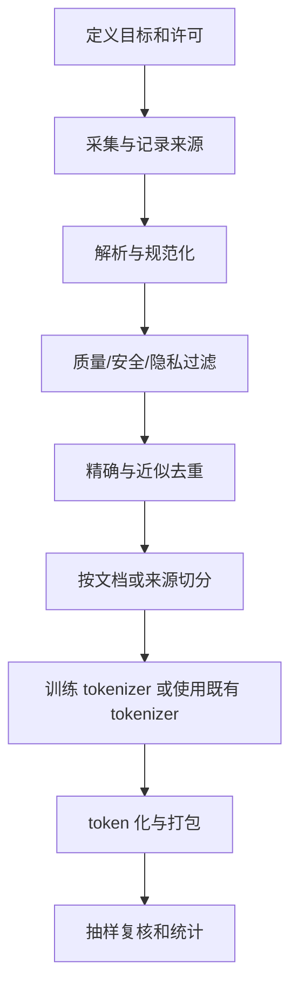

# D08：从原始文本到训练样本

> **学习导航**：[模型全生命周期总纲](模型训练总纲.md) -> **D08 数据与 Tokenizer** -> D09 训练任务；本课从“使用已有 tokenizer”前移到训练前的数据治理。完成后应能画出 `许可与目标 -> 清洗 -> 去重 -> 切分 -> token 化 -> 打包`，并指出至少三种泄漏、边界或质量风险。

## 先记四条数据纪律

1. **先定用途和许可，再决定哪些数据可以进入流水线。**
2. **先去重再切分，避免同源内容跨训练集与评测集泄漏。**
3. **Tokenizer 和打包会改变 token 预算、边界与 loss mask。**
4. **数据量不能替代质量、配比、覆盖和冻结测试隔离。**

## “监督”不等于必须人工写答案

**第一次必看：先分清训练信号。**

这里先用广义的**训练信号**表示“告诉训练过程什么输出更符合目标的信息”。狭义的监督学习通常指标签或目标直接提供监督；偏好和奖励更常单独称为偏好信号、奖励信号。它们都不要求人工逐条写出标准答案：

| 学习方式 | 样本怎样得到目标 | 例子 |
|---|---|---|
| 人工监督 | 标注者给输入补充类别、答案或结构化目标 | 工单 -> `退款问题` |
| 自监督学习 | 从原始数据隐藏、错开或变换一部分，让另一部分成为目标 | 文本前缀 -> 下一个 token |
| 偏好或奖励信号 | 比较多个输出，或由规则、环境和验证器产生分数 | 回答 A 优于 B；代码测试通过 |

因此，“没有人工标签的文本”不等于“训练没有监督目标”。因果语言模型会把文本错开一位，用后一个 token 作为当前训练标签；这是由数据自身构造目标的自监督学习。人工整理类别或理想回答的过程叫**数据标注**。

再分清三个数据词：**训练样本**是一个可处理单元，**数据集**是按用途组织的一组样本，**训练语料**通常指用于语言建模的大量文本或多模态材料。它们都必须记录来源和许可。

**数据泄漏**是开发或测试信息进入了本不该参与的训练、规则拟合或方案选择；**数据污染**常特指评测题、答案或近重复内容混入训练数据。污染是泄漏的一种常见来源，但泄漏还包括先看测试结果再调阈值等流程问题。

## 数据流水线（第一次必看）



相近文档不能一份进训练集、一份进验证集，否则验证结果会虚高。切分应尊重文档、会话或用户边界，避免把同一对象拆散后泄漏。

切分完成后，只有训练分区可用于拟合新 tokenizer 的词表内容、合并规则，以及估计归一化阈值、长度分桶等数据统计。验证集不更新参数，但可用于比较预先定义的 tokenizer 方案、模型配置、checkpoint、阈值和停止时机。

每次根据验证结果修改方案，都属于开发过程；反复适配会逐渐过拟合这把尺子。测试集应等方案与选择规则冻结后再用于最终评估。若先看验证或测试内容再拟合数据规则，评测信息就泄漏进了开发流程。使用已经固定的外部分词器不等于在当前数据上重新训练它，但仍要记录版本和配置。

## 文本到训练样本（第一次必看）

假设一份已获许可的短文档只有“今天天气”。数据流水线不会把这四个字原样塞进模型，而会留下每一步的可核对结果：

| 阶段 | 示例结果 | 此时要检查什么 |
|---|---|---|
| 原始记录 | 文档 `doc-017`，来源、许可和采集时间已登记 | 能否追溯，是否允许训练 |
| 规范化 | `今天天气` | 是否误删标点、空格、大小写或语言特征 |
| token 化 | `<bos> / 今 / 天 / 天 / 气 / <eos>` | 词表版本、未知 token、序列长度 |
| 编号 | `2, 4, 6, 6, 7, 3` | ID 是否能被同一 tokenizer 还原 |
| 长度为 4 的训练切片 | 输入 `2,4,6,6`；目标 `4,6,6,7` | 目标是否只向后错开一位 |

这一个切片含有 4 个可计分位置，而不是 1 个“整句答案”。这就是因果语言模型的自监督标签：输入与目标来自同一连续序列，目标向后错开一位。若最后一个位置没有合法的下一个 token，就应使用 EOS，或明确用 loss mask 忽略；不能从另一份无关文档随意接一个 token。打包多篇文档时，还要决定是否允许跨文档预测，并用边界 token 或 mask 保留这个决定。

同样的原文换一个 tokenizer，ID、token 数和可容纳的上下文都会改变。因此数据版本和 tokenizer 版本必须一起进入训练记录；只保存处理后的 ID 文件，之后很难解释它是怎样生成的。

## 打包不只是把短文本拼起来

**实现训练数据时必看。**

真实训练常把多篇短文档装进固定长度序列，减少 padding 浪费。假设两篇独立文档被编码为：

```text
文档 A：<bos> 今 天 <eos>
文档 B：<bos> 下 雨 <eos>
```

若直接装进同一条长度为 8 的序列，错位后的 7 个输入/目标位置是：

| 输入位置 | 目标 | 是否计入 loss | 原因 |
|---|---|:---:|---|
| `<bos>` | `今` | 是 | 文档 A 内部预测 |
| `今` | `天` | 是 | 文档 A 内部预测 |
| `天` | `<eos>` | 是 | 学习文档 A 结束 |
| `<eos>` | `<bos>` | 按打包策略决定，本例忽略 | 这是两篇独立文档的连接处 |
| `<bos>` | `下` | 是 | 文档 B 内部预测 |
| `下` | `雨` | 是 | 文档 B 内部预测 |
| `雨` | `<eos>` | 是 | 学习文档 B 结束 |

这里至少有三种容易都被叫作“mask”的对象：

| 对象 | 控制什么 | 出错后会怎样 |
|---|---|---|
| 因果注意力遮罩 | 当前位置不能读取未来 token | 训练时偷看答案，推理时条件不再成立 |
| 文档边界遮罩 | 是否允许文档 B 读取文档 A 的内容 | 独立样本可能互相泄漏上下文 |
| loss mask | 哪些目标位置参与损失汇总 | padding、用户文本或跨文档连接可能被错误监督 |

不同训练实现可以选择“用 EOS 连续串接文档”或“在打包序列中保持块状文档边界”，并不只有一种合法方案；关键是把选择写进数据配置，并让注意力边界、目标错位和 loss mask 彼此一致。只看 token ID 文件，通常看不出这三种边界是否正确。

打包效率可以直接算：

1. 四条有效长度为 `5、3、7、1` 的序列各自 padding 到 8，共占 `4×8=32` 个位置。
2. 有效 token 只有 16 个，利用率是 `16/32=50%`。
3. 若在不破坏文档边界语义的前提下装成两条长度 8 的序列，16 个有效 token 只占 16 个位置。

**打包节省的是 padding 计算，没有增加训练数据。**

## 数据配比最终要落到 token 预算

文件数、文档数和 token 数不是同一个配比分母。一份代码文件可能有数千 token，一条客服对话可能只有几十 token；按“文件各占一半”采样，不代表两类 token 各占一半。

假设原始可用语料中，通用文本有 9 亿 token，领域文本有 1 亿 token。若一轮训练预算是 10 亿 token，并把采样目标写成通用 70%、领域 30%，那么期望读取：

```text
通用文本：10 亿 × 70% = 7 亿 token
领域文本：10 亿 × 30% = 3 亿 token
```

领域语料只有 1 亿独特 token，却期望被读取 3 亿次，意味着平均重复约 3 遍。这个配方可能强化领域信号，也可能更快过拟合、放大错误或版权风险。因此训练记录要同时报告“训练累计看了多少 token”和“其中有多少独特、去重后的来源内容”，不能只报一个更大的训练 token 数。

配比还会改变“一个 epoch”的含义：多来源加权采样可能让某些数据重复多轮、另一些尚未遍历完。规模化语言模型训练更常用已处理 token 数或参数更新 step 记录进度，但仍要保存每个来源的抽样计数，才能解释模型到底反复练习了什么。

配比数字只是待验证假设，还要写明每类数据希望提供的信号和过量风险：

| 数据部分 | 希望提供的信号 | 过多时的风险 | 应单独观察什么 |
|---|---|---|---|
| 通用文本 | 基础语言和常见表达 | 挤占目标领域比例 | 通用能力是否保持 |
| 产品文档 | 领域术语和事实表达 | 记住旧版本、许可或时效问题 | 新旧版本、来源覆盖 |
| 指令示例 | 回答格式与任务行为 | 模板化、风格单一 | 格式通过率、失败类型 |

“30% 领域数据”不是天然正确的配方。应记录抽样单位、混合权重和重复规则，在开发评测集上比较；不能看完冻结测试集后继续调整比例。训练前至少交付互相对应的数据卡、切分清单和 tokenizer 报告，否则 loss 再漂亮也难以判断结论是否可信。

## Tokenizer 报告要看尾部失败

**选择词表时再读。**

平均 token 长度会掩盖少数极差样本。比较 tokenizer 时，至少按语种、代码/表格/公式、领域术语和异常字符分层，并记录：

- 每类文本的 token 数分布，而不只是总体平均数。
- 同一上下文预算下有多少原文被截断。
- 特殊 token、空白、换行和角色边界是否可逆。
- 长串数字、URL、罕见字和乱码是否产生异常膨胀。

例如两种 tokenizer 在普通样本上都平均 100 token，但方案 A 的合同编号样本是 180 token，方案 B 是 320 token。在固定 256-token 上下文中，B 会更早截断关键编号；这不是“词表大小”一个数字能说明的。最终选择应绑定目标数据分层、上下文预算和下游模型，而不是只选总体压缩率最高者。

## 分词器取舍

- **字符级**：概念简单，词表小，但序列通常较长。本课程的预生成微型模型案例使用它。
- **BPE 类方法**：反复合并常见相邻单元，常用于子词或字节级方案。
- **Unigram**：从候选子词集合中选择概率模型支持的切分。
- **SentencePiece**：一个 tokenizer 工具包，支持 BPE 和 Unigram；它不是单独一种与二者并列的切分原理。

不同 tokenizer 下的 token 数和困惑度不可直接混为同一尺度。

## 数据质检清单（训练前必查）

- 有权使用和再分发数据。
- 抽样查看原文，不只看统计。
- 记录语种、长度、重复率和异常字符。
- 检查个人信息、密钥和危险内容。
- 训练与验证没有文档级或近重复泄漏。
- tokenizer 词表、合并规则和数据统计只用训练分区拟合。
- 验证集用于有限的方案与超参数选择；最终测试集未参与调优。

## 本课验收

<ExerciseBlock
  id="d08-split-leakage"
  type="qa"
  question="为什么随机按行切分训练集和验证集可能造成泄漏？"
  answer="同一文档、会话或近重复内容可能被拆到两边，使验证集包含模型训练时已经见过的上下文或答案。"
  :steps="['一行通常不等于一个独立信息单元。', '同一文档的相邻行或同一会话的多条消息高度相关。', '若相关内容跨集合，验证指标会把记忆或近重复误当成泛化。']"
  mistake="随机化本身不是充分条件，切分单位必须尊重文档、会话或用户边界。"
/>

<ExerciseBlock
  id="d08-causal-label-shift"
  type="choice"
  question="因果语言模型中，输入序列是 今、天、天，正确的目标序列是哪一项？"
  :options="['今、天、天', '天、天、气', '气、天、今', '只预测第一个 今']"
  correct="B"
  answer="B。目标相对输入向后错开一位，每个位置预测下一个 token。"
  :steps="['第一个输入 今 的下一个 token 是 天。', '第二个输入 天 的下一个 token 还是 天。', '第三个输入 天 的下一个 token 是 气，因此目标是 天、天、气。']"
  mistake="padding 或不需要计分的位置还会被 mask，不能一律计入 loss。"
/>

<ExerciseBlock
  id="d08-dataset-split-counts"
  type="calculation"
  question="有 100 份互不重复的文档，按 80%/10%/10% 做训练、验证、测试切分，各有多少份？"
  answer="训练集 80 份，验证集 10 份，测试集 10 份。"
  :steps="['训练集：100 × 80% = 80。', '验证集：100 × 10% = 10。', '测试集也是 100 × 10% = 10，三者相加回到 100。']"
  mistake="实际切分还要先处理来源、近重复和用户边界，不能只追求比例。"
/>

<ExerciseBlock
  id="d08-tokenizer-tradeoffs"
  type="qa"
  question="字符级 tokenizer 与子词 tokenizer 各有什么典型取舍？"
  answer="字符级词表较小、概念简单但序列常更长；子词可缩短常见文本，但词表、训练和跨语言行为更复杂。"
  :steps="['字符级把较小书写单元直接编号，因此词表容易控制。', '常见词需要多个字符 token，导致序列和计算变长。', '子词把常见组合合并，可缩短序列，但效果取决于语料和规则。']"
  mistake="不存在对所有语言、领域和任务都唯一最优的 tokenizer。"
/>

<ExerciseBlock
  id="d08-sentencepiece-role"
  type="choice"
  question="关于 SentencePiece，哪一项最准确？"
  :options="['它只能做字符级切分', '它是支持 BPE 和 Unigram 等方案的 tokenizer 工具包', '它等于模型的 Embedding 层', '它会自动保证数据无版权问题']"
  correct="B"
  answer="B。SentencePiece 是工具包，不是与 BPE、Unigram 完全并列的单一切分原理。"
  :steps="['BPE 和 Unigram 描述不同的子词建模思路。', 'SentencePiece 提供训练和使用这些模型的工具。', '工具选择与数据许可、质量治理是不同问题。']"
  mistake="不要把软件工具名、算法名和模型层混成同一层级。"
/>

<ExerciseBlock
  id="d08-deduplication-count"
  type="calculation"
  question="数据集有 1,000 条样本，精确去重发现其中 5% 是应删除的重复项。删除后还剩多少条？"
  answer="删除 50 条，剩 950 条。"
  :steps="['重复项数量是 1,000 × 5% = 50。', '从原数据中减去重复项：1,000 - 50。', '结果是 950 条。']"
  mistake="近似重复检测还涉及阈值和误删风险，不能只靠精确字符串比较。"
/>

来源：[SentencePiece](https://arxiv.org/abs/1808.06226)

下一课：[D09：一个训练 Step 如何推动整次任务](D09-训练任务内部的一次完整循环.md)
