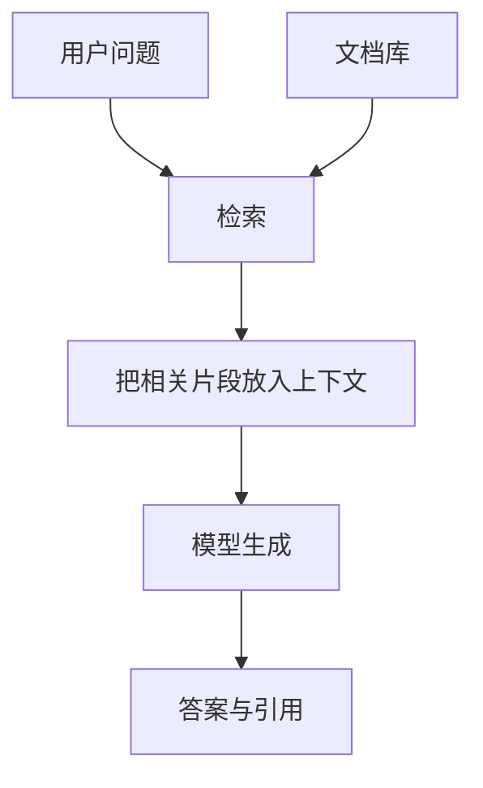

# D13：模型如何成为可用系统

> **学习导航**：[模型全生命周期总纲](模型训练总纲.md) -> D12 离线评测 -> **D13 推理、RAG 与 Agent 系统** -> D14 线上监控；本课把模型放进检索、工具和服务约束中。完成后应能划分责任层，结算 KV Cache 与上下文预算，并用检索、生成、轨迹三段证据定位失败。

## 先记四个系统判断

1. **模型推理只负责前向与解码；服务还要负责队列、缓存、超时、版本和错误。**
2. **RAG 必须把“检索到了”与“回答忠实”分开评。**
3. **Agent 是带状态的决策循环，必须有权限边界、停止条件和可恢复记录。**
4. **先用最小能工作的链路，再按证据决定是否加检索、工具或更大模型。**

## 从模型推理到部署产品

**第一次必看。**

| 层 | 负责什么 | 例子 |
|---|---|---|
| 模型推理 | 用已训练权重对输入做前向计算并解码 | 从 token 得到下一 token |
| 推理引擎 | 在硬件上执行模型算子、缓存和批处理 | vLLM、TensorRT-LLM 等运行层 |
| 模型服务 | 接收请求并管理队列、并发、超时、版本与错误 | HTTP 服务、路由和限流 |
| 模型部署 | 把权重、Tokenizer、引擎、服务配置和回滚方案交付到目标环境 | 一个可观测、可升级的线上版本 |
| 应用系统 | 组织权限、检索、工具、业务状态和用户界面 | 客服助手或工单系统 |

提示词（prompt）是本次交给模型的输入指令或示例；系统提示是应用放在更高优先级消息位置的行为约束，但它仍属于本次上下文，不是永久写入权重。上下文窗口是一次模型计算可接收的 token 范围；产品声称支持某个长度，不等于每个位置都能同样可靠地利用。

## 一次请求怎样穿过整套系统

以“根据最新制度解释差旅报销，并在我确认后提交”为例，一次请求至少会经过这些可观察节点：

| 顺序 | 系统动作 | 应留下的证据 | 失败时先看哪里 |
|---:|---|---|---|
| 1 | 鉴别用户和权限 | 用户权限域、请求 ID | 身份与访问控制 |
| 2 | 检索有效制度 | 文档版本、片段、检索分数 | 数据、索引和排序 |
| 3 | 组织模型上下文 | 提示版本、截断信息 | 上下文构造 |
| 4 | 模型生成解释和草稿 | 模型版本、解码配置、输出 | 模型与提示 |
| 5 | 校验结构和业务规则 | Schema 结果、金额与票据检查 | 普通程序规则 |
| 6 | 展示影响并等待确认 | 待提交字段、确认主体和时间 | 用户交互与审批 |
| 7 | 调用财务 API | 幂等键、API 返回和审计记录 | 工具、网络与下游系统 |

最终文字只是这条链的一项产物。模型说“提交成功”不等于 API 成功；检索片段正确也不等于回答忠实。只有把每层版本和结果串到同一个请求 ID，线上失败才有可能被复查。

## 推理服务关心什么

- **首 token 延迟**：用户多久看到第一个输出。
- **逐 token 延迟**：后续生成速度。
- **吞吐**：单位时间服务多少 token 或请求。
- **并发与队列**：高峰时如何批处理和限流。
- **显存与成本**：权重、KV Cache 和工作区。
- **可靠性**：超时、重试、回滚、监控和版本管理。

量化、连续批处理、KV Cache、推测解码和并行可以优化不同瓶颈，但收益取决于模型、硬件、负载和实现，不能引用一个固定倍数代表所有场景。

### 两种常见复用

- **前缀缓存**：多个请求共享完全相同的系统提示或文档前缀时，复用已经计算的 KV Cache。前缀必须真正一致，权限不同的缓存也不能串用。
- **推测解码**：较小的草稿模型先提出多个候选 token，目标模型再批量计算这些位置。经典无损推测采样会用目标分布 `p`、草稿分布 `q` 和接受/校正规则共同决定保留哪些候选；候选被拒绝时，还要按校正后的分布继续选择。满足算法条件时，最终采样分布仍与目标模型一致。它减少的是目标模型串行解码次数，不是让草稿模型替代最终模型。

优化前应先用首 token 延迟、逐 token 延迟、吞吐和显存画像定位瓶颈；否则某项技术可能只是在移动成本。

## KV Cache 为什么会吃掉并发显存

**规划服务时再读。**

对常见 Transformer，一条序列的 KV Cache 近似包含每层、每个已处理 token、每个 KV 头的 Key 和 Value。忽略分块元数据与对齐后，可以用下面的账本估算：

```formula-story
{
  "ariaLabel": "层数、缓存token数、KV头数、每头维度、K和V两份以及每个元素字节数共同形成一条序列的KV缓存字节数",
  "title": "KV Cache 是六条存储轴的乘积",
  "goal": "每增加一层、一个缓存位置、一个 KV 头或一个坐标，都要同时存 K 与 V 的相应数值。",
  "coversNext": 1,
  "pattern": "merge",
  "items": [
    { "label": "L×T", "name": "每层的每个已处理位置", "detail": "上下文越长，缓存线性增长", "tone": "blue", "arrow": "展开存储格" },
    { "label": "H_kv×D_h", "name": "每个位置的 KV 坐标数", "detail": "要用 KV 头数，不一定等于 Query 头数", "tone": "orange", "arrow": "展开每格宽度" },
    { "label": "2_K,V×b", "name": "K、V 两份与每元素字节", "detail": "BF16 通常每元素 2 bytes", "tone": "rose", "arrow": "换算字节" }
  ],
  "result": { "label": "M_KV", "name": "一条序列的近似 KV 数值体积", "detail": "再乘并发序列数才是并发主账", "tone": "green" },
  "example": { "label": "本例", "text": "32×4096×8×128×2×2 bytes=512 MiB；16 条满长序列约 8 GiB。" },
  "counterfactual": { "label": "漏一条轴", "text": "漏掉 K/V 的 2 会少算一半；把 32 Query 头误当 8 KV 头会多算 4 倍。" },
  "boundary": "这只是数值下界，真实引擎还有块元数据、碎片、工作区、前缀共享与分页分配。"
}
```

$$
M_{KV}=L\times T\times H_{kv}\times D_h\times2_{K,V}\times b
$$

假设 32 层、上下文 4096 token、8 个 KV 头、每头 128 维，K/V 用 BF16 的 2 bytes：

`32 × 4096 × 8 × 128 × 2 × 2 bytes = 536,870,912 bytes`，也就是每条满长序列约 512 MiB。若同时保持 16 条这样的序列，理想化 KV 数值就约占 8 GiB。

这里的 `8 个 KV 头` 对应 GQA 配置。若是 32 个 KV 头的多头注意力，其他条件相同，单序列会增到约 2 GiB；若是 1 个 KV 头的 MQA，则会显著更小。不能只拿“模型有多少注意力头”代入，必须查看 KV 头数。

这个公式也揭示了不同故障：权重能加载但并发一升就 OOM，优先核对实际上下文长度、并发序列与 KV 分配；请求结束后显存仍不释放，则检查缓存回收和分页管理；只有权重常驻空间超限时，才优先考虑权重量化或模型并行。真实引擎还会有块大小、碎片、前缀共享、工作区和临时张量，公式只给数量级下界。

要逐项检查每个乘数为什么存在、漏一项会少算哪条存储轴，回到[指标与容量账本](../06-拓展知识库/软硬件瓶颈/01-指标与容量账本.md#kv-cache-单独记账)；本课只把账本用于部署决策。

## 连续批处理怎样改变等待与吞吐

**规划服务时再读。**

静态批处理会等整批请求全部结束再换下一批，短请求可能被长请求拖住。连续批处理允许在已有请求逐 token 解码时，把完成请求移出，并让新请求经过调度后加入后续迭代。

假设 A、B 同时进入，A 还需 100 个 decode token，B 只需 10 个；稍后 C 到达并需 20 个。静态批若等 A 结束才接 C，C 会空等约 100 轮；连续批可以在 B 的 10 轮结束后释放槽位，让 C 加入，明显缩短 C 的排队时间。

但“能插入”不等于没有代价。C 的 prefill 会占用算力和内存带宽，可能拉长 A 某些 decode 轮次；调度器还要在首 token 延迟、逐 token 延迟和总吞吐之间取舍。因此延迟日志至少拆成：

| 阶段 | 起止点 | 看到变慢时先查什么 |
|---|---|---|
| 排队 | 请求到达 -> 获得调度 | 并发上限、优先级、负载突发 |
| prefill | 开始处理输入 -> 首个 logits | 输入长度、前缀缓存、批内 token 数 |
| decode | 首 token -> 最后 token | 活跃序列数、KV Cache、每轮调度 |
| 网络与后处理 | 服务产出 -> 用户收到 | 流式传输、序列化、下游网关 |

若吞吐提高而 P99 首 token 延迟恶化，不能只报“服务更快”；要核对目标负载下的队列策略和 SLO。若 GPU 利用率低且排队长，则可能是调度、CPU 前处理或外部工具限制，而不是模型矩阵乘法不够快。

要把“为什么通常一次接收一个 token、哪些计算可以并行、TPOT 由哪些阶段组成”串起来，继续看[Token 生成速度与并行解码](../06-拓展知识库/软硬件瓶颈/06-Token生成速度与并行解码.md)。

## RAG：先查再答（知识任务必看）

例如“根据公司最新报销制度回答并给出处”需要分开检索层、服务层、模型层和评测层的责任：检索层找到正确版本，服务层执行权限和超时控制，模型层只根据证据组织回答，评测层核对引用是否真的支持结论。把它们都写成“模型回答”会让排错失去方向。



RAG 适合知识频繁变化、私有资料或需要引用的场景。失败可能来自检索没找到、切块不当、排序错误、上下文冲突或模型没有忠实使用证据。检索到文档不代表文档真实，也不保证回答忠实。

## RAG 要把“取到”与“答对”分开评

一套 RAG 评测至少分成两段：

| 阶段 | 核心问题 | 示例证据 |
|---|---|---|
| 检索 | 正确证据是否进入候选和最终上下文 | 前 k 个候选是否含正确文档、文档版本、权限过滤、人工相关性 |
| 生成 | 回答是否由给定证据支持 | 引用对应句、忠实度、缺证据时是否拒答 |
| 端到端 | 用户任务是否完成且成本可接受 | 任务成功率、延迟、成本、人工接管 |

如果正确文档从未进入上下文，就不应把失败归给模型“不会读”；如果证据已经完整出现而回答仍编造，继续调检索排序也不会触及主要问题。还要专门测试相互冲突、已过期和无权限文档，因为普通相关性分数不会自动处理这些边界。

**检索指标的分母必须对应真实问题：**

| 指标 | 单个查询怎样算 | 适合回答什么 |
|---|---|---|
| Recall@k | 前 k 项中的相关项数 / 该查询全部相关项数 | 需要的证据找回了多少 |
| Hit@k | 前 k 项是否至少命中一个相关项，命中记 1，否则记 0 | 至少找到一条可用证据的查询占比 |
| 必要证据齐全率 | 所有必要证据都进入最终上下文的查询数 / 查询总数 | 多证据任务是否真的凑齐材料 |

只有每个查询恰好有一个相关项时，单查询 Recall@k 才会退化为 0 或 1，并与 Hit@k 相同。例如一道题需要合同正文和补充条款两份证据，前 5 项只找到正文，则 Recall@5 是 `1/2=50%`、Hit@5 是 1，但必要证据并未齐全。此时若只报 Hit@5，会把“找到一点”误写成“足以回答”。跨查询汇总还要说明是先逐查询求平均，还是先合并相关项计数；两种口径会给不同权重。

### 一次 RAG 请求的候选与上下文账本

假设系统最多容纳 8192 token，并为回答预留 1200 token。一次请求还包含系统提示 600、对话历史 1600、当前问题 100 token，留给检索证据的理论上限是：

`8192 - 1200 - 600 - 1600 - 100 = 4692 token`。

若重排后准备放入 8 个片段，每段正文 500 token，仅正文就要 4000 token；再加文档标题、来源和分隔符，很可能越过上限。系统必须按实际 token 计数截断、压缩历史、减少片段或缩短片段，并记录最终哪些证据真的进入上下文。只记录“检索返回了 8 条”无法证明模型看到了 8 条。

再看 100 个带已知证据的问题：初检前 20 个候选中有 82 题包含正确证据；重排并截到前 5 后只剩 70 题；这 70 题中模型有 63 题给出受证据支持的正确回答。

| 关口 | 通过题数 | 相对全部 100 题 | 能定位什么 |
|---|---:|---:|---|
| 初检候选含证据 | 82 | 82% | 索引、查询和初检召回 |
| 最终上下文保留证据 | 70 | 70% | 重排、权限过滤和预算截断 |
| 最终回答正确且有支持 | 63 | 63% | 生成忠实度与端到端效果 |

从 82 到 70 丢失的 12 题不该归给生成模型；证据已进入上下文却失败的 7 题，才应优先检查提示、冲突证据处理和模型。分层账本也防止用端到端 63% 一个数字同时调整所有组件。

## Agent：模型参与循环决策（工具任务必看）

一个简化循环：

```text
观察状态 -> 选择工具及参数 -> 执行工具 -> 读取结果 -> 决定继续或结束
```

工具调用需要结构校验、权限最小化、超时、预算、幂等性和人工确认。外部网页或文档可能包含提示注入，不能把检索文本当成可信系统指令。

Agent 适合步骤依赖运行结果、需要工具交互的任务。固定流程、强合规审批或简单 CRUD 往往应由普通程序主导，只在需要语言理解的节点使用模型。

## Agent 必须有显式状态和停止条件

一个可审计的工具循环不能只写 `while not done`。每轮至少记录当前目标、允许工具、已用预算、工具结果、待确认动作和终止原因。常见停止条件包括：任务已完成、达到最大步数或费用、连续重复动作、工具持续失败、需要新增权限，或即将执行不可逆操作。

例如查询接口连续两次超时后，系统可以停止自动重试并返回“暂时无法核验”，而不是让模型根据记忆补一个答案。写操作使用幂等键，能避免重试时重复扣款或重复提交；高风险动作则在执行前冻结最终参数，交给确定性校验和真实用户确认。

评测 Agent 时既看最终答案，也看轨迹：是否调用了必要工具、是否访问越权资源、是否在已有答案后继续浪费步骤、失败后是否进入预定降级路径。只按最终文本打分，会漏掉一次侥幸得到正确答案的危险过程。

| Agent 证据 | 分母 | 为什么不能被最终成功率替代 |
|---|---|---|
| 任务成功率 | 全部符合纳入规则的任务 | 总体是否完成目标 |
| 工具调用成功率 | 实际发起的工具调用 | 接口、参数和下游服务是否可靠 |
| 安全违规率 | 真正有机会触发该风险的任务或动作 | 越权、未确认写入等红线是否发生 |
| 平均步骤或成本 | 已明确成功、失败和超时口径的全部任务 | 是否靠无限重试换来少数成功 |

如果系统只在 20 个需要写操作的任务中有机会发生“未确认提交”，安全分母就是这 20 个风险机会，不是全部 1000 个普通问答。固定红队题用于覆盖攻击面和发现失败，不是从真实流量随机抽样，不能把其中的违规比例直接外推为线上发生率。

### 把循环写成可恢复的状态机

以提交报销为例，系统状态不应只存在于模型生成的文字里：

| 当前状态 | 允许的下一步 | 必须持久化的证据 | 失败或重试时 |
|---|---|---|---|
| `draft` | 补字段、校验 | 草稿版本、字段来源 | 保留错误，不调用写接口 |
| `validated` | 展示最终影响 | 校验规则版本、权限结果 | 规则变化后重新校验 |
| `confirmed` | 提交一次 | 确认人、时间、草稿哈希 | 草稿改变则确认失效 |
| `submitted` | 查询结果，不再重复写 | 幂等键、API 请求与响应 | 用同一幂等键查询或重试 |
| `failed` | 降级、人工接管 | 失败类型、已用预算 | 禁止模型凭记忆宣称成功 |

幂等键要绑定用户、业务动作和已确认参数，同一动作因网络超时重试时复用同一个键；若参数改变，就必须回到校验与确认，而不是悄悄生成新键再次提交。这样即使第一次 API 已成功但响应丢失，重试也不会重复扣款。

轨迹排错按状态转移进行：若自然语言正确但停在 `validated`，检查确认交互；若显示 `submitted` 却没有 API 成功记录，这是状态写入顺序错误；若连续出现不同幂等键的相同请求，检查重试策略。模型输出只是转移建议，确定性程序才负责鉴权、状态写入和不可逆调用。

## 本课验收

<ExerciseBlock
  id="d13-system-responsibilities"
  type="qa"
  question="为查询报销政策并提交报销划分检索、模型、审批、财务 API 和人工确认的职责。"
  answer="检索提供当前政策证据，模型解释并生成结构化草稿，审批规则和人工确认决定是否允许执行，财务 API 只接受经过鉴权与校验的请求。"
  :steps="['先用用户身份和问题检索其有权访问的政策片段。', '模型依据证据解释政策并填写报销草稿，但不直接获得最终写权限。', '系统校验金额、票据和权限，再经必要审批与人工确认后调用财务 API。']"
  mistake="模型自然语言说已确认不能替代真实身份、审批状态和 API 返回值。"
/>

<ExerciseBlock
  id="d13-program-vs-agent"
  type="choice"
  question="哪种场景更适合普通确定性程序主导，而不是让 Agent 自主循环？"
  :options="['需要根据搜索结果动态选择下一工具', '固定字段校验后按明确规则写入数据库', '需要在多个未知网页中调查', '步骤数量由中间结果决定']"
  correct="B"
  answer="B。固定 CRUD 和强规则流程更适合普通程序，模型只需在语言理解节点提供辅助。"
  :steps="['固定字段校验有明确输入、规则和输出。', '普通程序更容易测试、审计、保证幂等和控制权限。', 'Agent 更适合步骤依赖运行结果且需要语言判断的开放流程。']"
  mistake="使用大模型不等于必须把整个业务流程都改成 Agent。"
/>

<ExerciseBlock
  id="d13-prefix-cache-candidate"
  type="calculation"
  question="一批请求每条有 2,000 个输入 token，开头 80% 完全相同。理想情况下每条请求最多有多少个前缀 token 可作为缓存命中候选？"
  answer="最多有 1,600 个前缀 token 可作为命中候选。"
  :steps="['共享比例是 80%，总长度是 2,000 token。', '计算 2,000 × 0.80。', '得到 1,600 token；剩余 400 token 因请求不同需要单独处理。']"
  mistake="真正复用还要求 token 序列、模型版本和权限域一致，比例相同不等于一定命中。"
/>

<ExerciseBlock
  id="d13-irrevocable-action-safety"
  type="qa"
  question="为什么支付、删除和提交报销等不可逆操作不能仅凭模型自然语言结果直接执行？"
  answer="模型输出可能错误、被提示注入或越权，执行前必须经过结构校验、鉴权、业务规则、幂等保护和必要的人工确认。"
  :steps="['自然语言生成不是可信的权限证明。', '系统先把工具参数限制在明确 schema，并验证用户身份与最小权限。', '高风险操作还要展示最终影响、要求确认并记录可审计结果。']"
  mistake="让模型再说一遍我确认了，不等于独立确认。"
/>

<ExerciseBlock
  id="d13-speculative-decoding"
  type="choice"
  question="经典无损推测采样怎样在接受草稿 token 时保持目标模型分布？"
  :options="['草稿模型单独决定所有 token', '目标模型批量计算候选，接受与校正规则同时使用目标分布和草稿分布', 'Tokenizer 随机决定', '前缀缓存直接决定']"
  correct="B"
  answer="B。草稿模型负责提议，目标模型负责为候选计算目标概率；接受与拒绝后的校正规则同时用到目标分布和草稿分布，满足条件时才能保持目标分布。"
  :steps="['草稿模型先给出候选及草稿概率 q。', '目标模型用一次批量前向得到这些位置的目标概率 p。', '接受规则比较 p 与 q；候选被拒绝时按校正后的分布继续选择，从而避免把草稿模型的偏差直接带入结果。']"
  mistake="不同推测解码方案的验证规则可能不同；不能把它简化成草稿模型说了算，也不能省略目标模型的评分与校正。"
/>

<ExerciseBlock
  id="d13-output-latency"
  type="calculation"
  question="首 token 延迟是 0.8 秒，随后还要生成 19 个 token，每个平均 0.05 秒。看到完整 20-token 输出约需多少秒？"
  answer="约需 1.75 秒。"
  :steps="['第一个 token 在 0.8 秒时出现。', '剩余 19 个 token 需要 19 × 0.05 = 0.95 秒。', '总时间约为 0.8 + 0.95 = 1.75 秒。']"
  mistake="不要把首 token 再重复计入后续 19 个 token；真实服务还会受队列和网络影响。"
/>

来源：[RAG](https://arxiv.org/abs/2005.11401)、[ReAct](https://arxiv.org/abs/2210.03629)、[Speculative Sampling](https://arxiv.org/abs/2302.01318)

下一课：[D14：上线后如何发现并修正问题](D14-监控、反馈与持续迭代.md)
