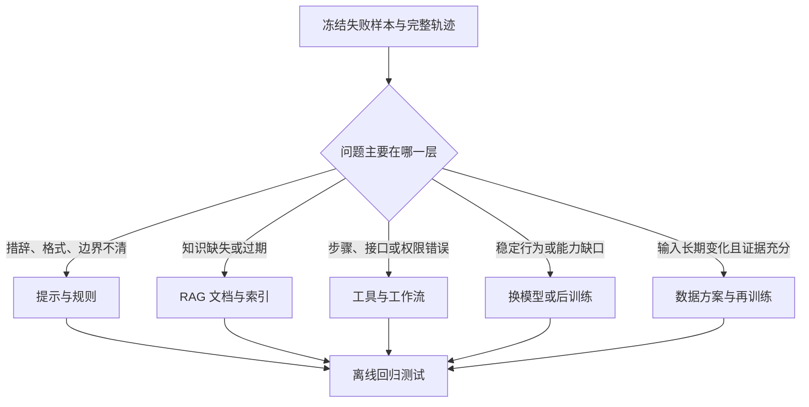
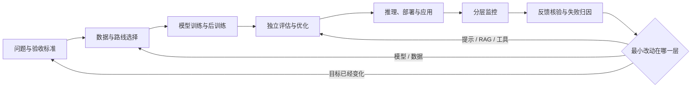

# D14：上线后如何发现并修正问题

> **学习导航**：承接 D12 的离线评测和 D13 的推理、部署与应用；本课追踪模型上线后怎样发现问题、定位责任、控制发布并把可靠证据送回下一轮。完成后应能计算样本不确定性与错误预算，写出灰度停止条件，画出从监控到受控迭代的闭环，并判断一个失败应先改提示、检索、工具、模型还是数据。

> **主线位置**：[模型全生命周期总纲](模型训练总纲.md) -> 主线四：D12 离线评估与优化 -> 主线五：D13 推理、部署与应用 -> **主线六：D14 线上监控、反馈与持续迭代** -> 回到问题定义、数据或方法选择。上线不是课程主线的终点。

## 本课目标

1. 区分服务健康、输出质量、任务效果和安全治理等监控层。
2. 区分数据漂移、概念漂移、系统变化与滥用变化。
3. 根据失败证据选择最小改动层，并说明怎样灰度、回滚和治理反馈数据。
4. 用样本量、SLO 和分层抽样账本判断一个百分比能否支持发布结论。

## 先记四个线上判断

1. **服务健康、输出质量、任务效果和安全治理必须分层看，不能压成一个总分。**
2. **反馈是待核验的观察信号，不是自动正确的训练标签。**
3. **先按证据定位责任层，再决定改提示、检索、工具、模型还是数据。**
4. **发布必须有回归、灰度、停止条件和可恢复版本包，监控才形成闭环。**

## 四层监控（第一次必看）

| 层 | 先问什么 | 常见证据 | 只看这一层会漏掉什么 |
|---|---|---|---|
| 服务健康 | 请求能否稳定、及时完成 | 可用率、超时率、首 token 延迟、单次成本 | 快速返回也可能答错或越权 |
| 输出质量 | 回答本身是否可靠 | 事实核验、引用一致性、格式通过率、拒答质量 | 一条漂亮回答未必解决用户任务 |
| 任务效果 | 用户最终是否完成目标 | 一次解决率、人工转接率、用户纠正、后续操作结果 | 点击和停留时长不一定代表正确 |
| 安全与治理 | 系统是否守住权限和责任边界 | 隐私泄露、提示注入、工具越权、审计记录 | 平均质量无法暴露低频高损害事件 |

这些层不能压成一个“总分”。例如服务可用率 99.9%，不代表引用正确；满意度高，也不能抵消一次不可逆的越权操作。

## 同一个百分比可能有完全不同的证据强度

**做发布结论时必看。**

两个版本的测试通过率都写着 90%，但一个来自 90/100，另一个来自 9000/10000。若先用独立同分布的二项样本做粗略估算，比例 $p$ 的标准误差约为：

$$
SE\approx\sqrt{\frac{p(1-p)}{n}}
$$

| 结果 | 样本数 | 标准误差 | 粗略 95% 区间 `p±2SE` |
|---|---:|---:|---:|
| 90/100 | 100 | 约 3% | 约 84% 到 96% |
| 9000/10000 | 10,000 | 约 0.3% | 约 89.4% 到 90.6% |

两者点估计相同，小样本的波动范围却大约宽十倍。这不是说大样本自动无偏：若 1 万条都来自同一种低风险问题，或同一用户的重复请求彼此相关，公式的独立同分布假设就不成立。发布报告因此要同时给分子、分母、抽样方式、时间窗口和切片，而不是只放一个百分比。

对零容忍风险，`0/100` 也不等于真实发生率严格为零，只能说明这 100 条里没有观察到。应结合专门攻击样本、权限测试和线上红线，不让平均质量区间替代安全边界。

## 反馈不是答案标签（准备数据回流时必看）

点赞、点踩、重试、复制、人工接管和客服备注都只是**观察信号**，不是自动正确的训练标签。

- 用户可能因为回答短而点赞，但内容有事实错误。
- 用户没有点踩，可能只是离开了页面。
- 同一句重试，可能说明答案差，也可能只是用户改变了目标。
- 人工改写更接近任务结果，但仍需核对权限、专业性和一致标注标准。

因此，反馈要先连接原请求、模型版本、提示版本、检索结果、工具轨迹和最终结果，再由规则或人工确认“发生了什么”。没有上下文的一个点击，无法告诉团队该改哪一层。

## 先判断发生了哪种变化

| 变化 | 含义 | 例子 | 优先检查 |
|---|---|---|---|
| 数据漂移（data drift） | 输入分布变了 | 用户开始大量询问新产品，语言和长度也变化 | 输入分布、知识覆盖、切片样本 |
| 概念漂移（concept drift） | 相同输入对应的正确规则变了 | 退款政策更新，旧答案曾经正确、现在错误 | 任务定义、标签标准、有效日期 |
| 系统变化 | 模型外的链路变了 | 提示、索引、工具接口或推理参数被更新 | 版本记录、调用轨迹、组件对照 |
| 对抗与滥用变化 | 用户在主动寻找新攻击面 | 新型提示注入诱导读取私有工具结果 | 攻击样本、权限日志、安全规则 |

数据漂移不等于模型一定失效；概念漂移也不一定需要再训练。若政策能从权威文档检索，先更新知识库通常比把新政策写进参数更及时、更可追溯。

## 从现象定位责任层

以“回答引用了过期退款政策”为例，按证据逐层缩小范围：

| 看到的证据 | 更可能的责任层 | 第一项改动 |
|---|---|---|
| 检索结果就是旧文档 | 数据、索引或检索 | 更新文档版本和索引规则 |
| 检索到新文档，回答却违背原文 | 提示、上下文组织或模型 | 固定失败集，比较提示与模型方案 |
| 回答正确，工具执行了旧流程 | 工具或工作流 | 修复接口、参数映射和权限 |
| 只在高并发时缺少引用 | 推理或服务系统 | 检查超时、截断、缓存和降级策略 |
| 新旧版本都无法完成稳定推理 | 模型能力或后训练 | 比较基座、SFT、偏好优化或换模型 |

一个故障可以跨层，但改动仍应从证据最明确、范围最小的一层开始。不要把每个线上错误都变成“再训一个更大的模型”。

## 一次线上故障怎样形成证据链

假设 10:05 开始出现“引用消失”，一条可复查的调查时间线可以这样组织：

| 时间 | 观察或动作 | 此时能下的结论 |
|---|---|---|
| 10:05 | 引用缺失率越过 3% 告警线 | 确认现象扩大，根因未知 |
| 10:08 | 只影响版本 `app-42`，模型权重未变 | 缩小到应用版本相关链路 |
| 10:12 | 失败请求的检索结果完整，但上下文被更早截断 | 找到可复现的上下文构造差异 |
| 10:18 | 回退 `app-41` 后错误率恢复 | 回退有效，仍需离线复现根因 |
| 11:00 | 固定失败集复现截断规则并加入回归测试 | 形成可防止复发的证据 |

这条记录把“发现、定位、止损、复现、预防”分开。版本相关和回退有效提供强线索，但仍不是形式上的唯一因果证明；若同一时间还有索引更新或流量变化，也要纳入对照。

每个失败样本至少关联请求 ID、时间、用户权限域、模型与应用版本、提示、检索片段、工具轨迹、最终输出和人工裁决。隐私字段要最小化、脱敏并设置保留期限，不能为了排错无限期保存完整对话。

## 决定改哪一层

Tokenizer、架构或从零预训练属于代价更高的上游改动。只有当词表覆盖、上下文机制、模态接口或基础能力确实成为瓶颈，并且更小改动无法达到门槛时，才应进入这些方案。

## 发布与回滚（上线前必看）

新版本先通过固定离线回归集，再逐步接触真实流量。回归集可反复用于发布门禁；冻结测试集只在方案、阈值和选择规则确定后用于本轮最终估计，不能根据其结果继续选择版本：

1. **离线回归**：在质量、安全、成本和旧能力测试上比较新旧版本。
2. **影子验证**：复制真实请求给新版本，但结果不展示给用户，用于比较分布和系统指标；工具与外部写操作必须禁用、模拟或放进隔离环境，避免影子请求产生真实副作用。
3. **灰度发布（canary release）**：只让少量真实流量使用新版本，并设置停止条件。
4. **逐步放量**：指标稳定后扩大比例，同时分人群、任务和风险等级观察。
5. **回滚**：触发质量、安全或服务红线时，恢复已验证版本并保留故障证据。

回滚不是失败后的临时动作。版本、配置、提示、索引和工具接口都要可追踪，停止条件也要在发布前写明。否则发现问题时，团队甚至不知道要回到哪个状态。

### 灰度对照要比较率、样本量和切片

假设新版本获得 500 个随机分配请求，其中 15 个失败，失败率是 3%；旧版本获得 9500 个请求，其中 190 个失败，失败率是 2%。不能因为“新版本只失败 15 次，旧版本失败 190 次”就说新版本更好，分母不同；也不能只凭 3% 对 2% 立刻断言必然退化，小流量新版本仍有较大抽样波动。

灰度前应写清：流量是否在同一时间、同一任务和风险层内随机分配；最低观察样本与时长是多少；普通质量允许多大退化；哪些安全事件一次就停止。高风险工具出现 1 次未确认写入，即使总体失败率的差异还不确定，也应触发独立红线。

回滚还必须恢复一个一致版本包，而不只是模型权重：

| 组件 | 灰度记录 | 回滚时要防的错配 |
|---|---|---|
| 模型与 tokenizer | 权重、量化、词表版本 | 旧权重配到新词表 |
| 提示与解码配置 | 模板、温度、长度上限 | 模型回退但提示未回退 |
| RAG | 语料快照、索引、重排器 | 回到已过期或不兼容索引 |
| 工具与权限 | Schema、接口、策略版本 | 输出格式与工具参数不一致 |

若回退模型后故障仍在，不应继续来回切模型；对照版本包能帮助检查真正没有回退的应用、索引或工具层。

## 告警要同时写阈值和动作

“关注错误率”不是可执行监控。每条关键告警至少要写清指标口径、统计窗口、分层维度、触发阈值、负责人和第一动作。例如：

> 过去 15 分钟中，高风险工具请求的未确认执行数大于 0，立即暂停该工具写权限，保留轨迹并通知值班人员。

平均值还要搭配尾部和分层。全站超时率 1% 可能掩盖某个地区 20% 超时；总体事实正确率 95% 也可能掩盖高风险医疗切片完全失败。低频高损害事件适合计数或零容忍红线，高频质量波动适合比例、趋势和抽样复核。

告警触发后的动作必须在权限上真实可执行：能否降级为只读、切回旧模型、禁用某个工具、限制新流量或人工接管。只有仪表盘没有止损入口，监控仍未闭环。

## SLO 与错误预算怎样约束发布速度

**运营服务时再读。**

SLO 把“服务要稳定”写成统计窗口内的明确目标。**错误预算（error budget）** 是该目标允许消耗的失败额度，不是鼓励制造错误。

假设 30 天窗口的可用性 SLO 是 99.9%。30 天共有 `30×24×60=43,200` 分钟，最多允许不可用：

`43,200×(1-99.9%) = 43.2 分钟`。

若前 10 天已经不可用 30 分钟，就消耗了 `30÷43.2≈69.4%` 的月度错误预算，但时间只过去 33.3%。这说明消耗速度过快，团队可以暂停高风险发布、优先修复可靠性；它不能证明故障来自模型，也不代表剩余 13.2 分钟可以故意用完。

不同 SLO 应分账。服务可用性还有预算，不能抵消“未确认支付必须为 0 次”的安全红线；同样，平均延迟达标也不能抵消某个地区 P99 超时。预算告警要绑定当前消耗、预计耗尽时间和具体动作。

## 反馈怎样回到下一轮

准备把反馈用于评测或训练前，还要经过：

- **许可**：确认数据可以被收集、审查和再次使用。
- **隐私与脱敏**：删除个人信息、密钥和不必要的敏感上下文。
- **裁决**：由明确标准确认失败类型和期望结果，而非直接采用点击信号。
- **去重与分层**：避免大量重复问题淹没罕见但高风险的问题。
- **测试隔离**：冻结测试集既不能混回训练，也不能反复据其结果选择方案或版本；否则它会变成开发证据，分数上升也不再代表对未见数据的真实泛化。

### 风险抽样可以找问题，不能直接估计总体比例

假设线上有 9000 条普通请求和 1000 条高风险请求。团队为了多发现严重问题，从两层各抽 90 条复核：普通层发现 9 条错误，错误率 10%；高风险层发现 18 条，错误率 20%。

直接合并会得到 `27÷180=15%`，但抽样时把只占总体 10% 的高风险请求扩大到了样本的 50%。若每层内部是随机样本，要估计总体错误率，应按真实流量占比加权：

`90%×10% + 10%×20% = 11%`。

| 抽样目的 | 合适做法 | 不能直接做什么 |
|---|---|---|
| 尽快发现罕见高风险失败 | 对高风险层过采样，逐条调查 | 把过采样后的 15% 当总体发生率 |
| 估计总体质量 | 保留随机基线样本，按流量层加权 | 只复核投诉或低分回答 |
| 构造训练候选 | 去重、脱敏、裁决并记录选择概率 | 把被选中的失败分布当线上自然分布 |

选择偏差还会进入“未反馈”样本：愿意点踩的用户、被送人工的任务、审核器判高风险的请求都不是随机子集。数据回流记录必须保留入选规则和来源层；训练时可以有意提高稀有失败的权重，但上线评测必须回到代表真实目标分布的独立样本。

这才是持续迭代：线上现象变成可复查证据，证据决定改动层，改动再经过独立验证和受控发布。它不是让所有对话自动进入下一轮训练。

## 本课验收

<ExerciseBlock
  id="d14-old-policy-diagnosis"
  type="qa"
  question="一个知识助手回答了旧政策。为什么不能立刻断言‘模型需要重新训练’？请给出排查顺序。"
  answer="旧答案可能来自过期文档、未更新索引、提示未携带有效日期、工具调用旧接口，也可能才是模型能力问题。应冻结请求与完整轨迹，依次核对知识源和检索、提示上下文、工具执行、服务截断，最后再比较模型或后训练方案。"
  :steps="['先保存请求、版本、检索结果、工具轨迹和最终输出。', '若检索结果已过期，先修数据或索引；若证据正确而回答错误，再查提示与模型。', '若回答正确而动作错误，修工具或工作流；所有改动都进入同一失败集回归。']"
  mistake="最终文字由整条系统链产生，不应把所有错误都归给模型权重。"
/>

<ExerciseBlock
  id="d14-concept-drift"
  type="choice"
  question="下面哪项最能说明发生了概念漂移？"
  :options="['请求平均长度从 80 字变成 120 字', '服务器升级后首 token 延迟下降', '同一退款问题因新政策生效而有了不同正确答案', '用户开始更多使用英文提问']"
  correct="C"
  answer="C。概念漂移指输入与正确目标之间的关系改变；A 和 D 更像输入分布变化，B 是系统变化。"
  :steps="['先固定同一个输入。', '再问正确目标或判断规则是否随时间改变。', '政策生效使旧标签失效，因此属于概念漂移。']"
  mistake="输入样式变化和正确规则变化是两件事，处理方式也可能不同。"
/>

<ExerciseBlock
  id="d14-timeout-rate"
  type="calculation"
  question="30 分钟内收到 2,400 个请求，其中 72 个超时。超时率是多少？若告警阈值是 2%，是否触发？"
  answer="超时率是 3%，高于 2%，应触发告警。"
  :steps="['超时率 = 72 ÷ 2,400。', '结果是 0.03，也就是 3%。', '3% > 2%，因此触发；随后还要按版本、任务和节点分组定位。']"
  mistake="告警只说明越过门槛，不能单独证明故障来自模型、网络还是推理服务。"
/>

<ExerciseBlock
  id="d14-feedback-as-evidence"
  type="qa"
  question="为什么用户点赞不能直接作为训练标签？怎样把它变成更可靠的证据？"
  answer="点赞受长度、语气、界面和用户目标影响，不等于事实正确。应连接原请求、版本、检索与工具轨迹及最终任务结果，再按统一标准抽样核验和标注。"
  :steps="['先把点赞视为待调查信号。', '补齐产生答案的上下文和系统轨迹。', '用任务标准与人工裁决确认正确性、失败类型和可用范围。']"
  mistake="模型自信、用户点击和事实正确是三个不同变量。"
/>

<ExerciseBlock
  id="d14-canary-release"
  type="choice"
  question="关于灰度发布，哪项最准确？"
  :options="['新版本通过一个总分后立即替换全部流量', '先让少量真实流量使用新版本，并预先设置停止与回滚条件', '只比较服务延迟，不检查输出质量', '灰度期间发现问题后继续放量以收集更多样本']"
  correct="B"
  answer="B。灰度发布限制风险暴露；它仍要同时监控服务、质量、任务和安全指标。"
  :steps="['先完成离线回归和必要的影子验证。', '再限定流量、人群与任务，并写明红线。', '触发红线就停止或回滚，保存证据后再修复。']"
  mistake="流量比例小不会自动消除高风险操作，权限和不可逆动作仍需单独限制。"
/>

<ExerciseBlock
  id="d14-review-rate"
  type="calculation"
  question="1,000 次真实请求中有 2% 被送去人工复核，需要复核多少次？若其中 5 次确认是严重问题，占全部请求多少？"
  answer="需要复核 20 次。5 ÷ 20 = 25% 是复核样本中的严重问题比例；5 ÷ 1,000 = 0.5% 是全部请求中已经确认的严重问题下限比例。"
  :steps="['复核数：1,000 × 2% = 20。', '复核样本中的严重问题比例：5 ÷ 20 = 25%。', '全部请求中已确认的严重问题下限：5 ÷ 1,000 = 0.5%。只有随机且有代表性的抽样，才能用样本比例估计总体发生率。']"
  mistake="两个分母回答不同问题。若 20 次复核来自风险筛选，25% 不能直接外推到全部请求；0.5% 也只是已确认下限，不是总体发生率估计。"
/>

## 主线完成后的去向

多模态不是生命周期最后一步，而是会重新经历表示、架构、训练、评估、部署和监控的专题。需要继续学习图像、语音和视频时，进入[多模态基础](../06-拓展知识库/多模态基础/)；需要理解算子、推理引擎、通信与硬件瓶颈时，进入[系统与软硬件瓶颈](../06-拓展知识库/软硬件瓶颈/)。

训练过程案例用预生成材料把主线压回一个可审查的小项目，不要求安装、运行或训练。下一课：[D15：先固定起点：未训练基线](../02-第3周实战/D15-确定目标与跑通基线.md)
