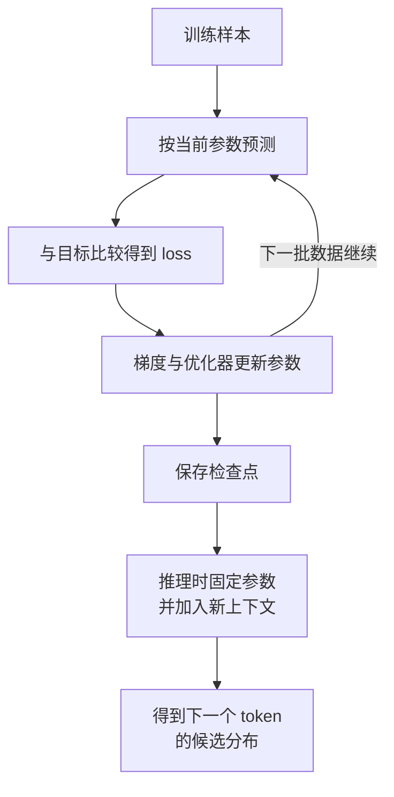

# 主线一：模型原理总纲

这条主线只回答一个完整问题：**一组不会说话的数字，为什么经过训练后能根据上下文预测下一个 token？**

先不要急着钻进注意力或工程框架。把模型看成一条可反复执行的因果链：



训练阶段把数据规律逐步写入参数；推理阶段读取已经得到的参数。两者共用模型前向计算，但只有训练会通过 loss、梯度和优化器更新参数。

## 全课程共用的教学模型 L0

这些总纲共用同一个预设模型，避免每一课都换一套数字：

统一配置写成一行是：`V=8、D=4、N=2、H=2、D_h=2、M=8、T=4`。

| 记号 | 教学配置 | 它回答什么 |
|---|---:|---|
| `V` | 8 | 词表里有多少个候选 token |
| `D` | 4 | 每个位置的隐藏表示有多少个坐标 |
| `N` | 2 | 主干重复多少个 Transformer Block |
| `H` | 2 | 注意力分成多少个头 |
| `D_h` | 2 | 每个头的宽度，`D_h = D / H` |
| `M` | 8 | 简化 MLP 的中间宽度 |
| `T` | 4 | 一个教学序列最多观察 4 个位置 |

L0 的词表固定为：`<pad>`、`<bos>`、`我`、`爱`、`学习`、`模型`、`。`、`<eos>`。示例序列固定为：

```text
<bos> / 我 / 爱 / 学习
```

L0 是为了让人能手算和追踪形状的**教学模型**，不是能承担真实问答的产品模型。真实大模型只是把词表、隐藏宽度、层数、数据和计算规模放大，并加入更多结构与训练设计；基本责任边界没有因此消失。

## 第一次前向：参数究竟做了什么

模型可以写成一个带参数的函数：

```formula-story
{
  "ariaLabel": "已有token沿模型结构传播，训练得到的参数决定每次变换数值，最后为词表所有候选同时产生logits",
  "title": "前向不是查答案，而是上下文穿过一串参数化变换",
  "goal": "f 表示结构怎样连接，θ 表示这些结构里的具体可训练数值；本次已有 token 是输入，logits 是输出分数。",
  "coversNext": 1,
  "pattern": "merge",
  "items": [
    { "label": "已有 token", "name": "本次上下文输入", "detail": "先查 Embedding，再逐层形成上下文化表示", "tone": "blue", "arrow": "送入结构" },
    { "label": "f_θ", "name": "结构与已训练参数", "detail": "Embedding、Attention、MLP 等连接及其数值", "tone": "orange", "arrow": "执行前向" }
  ],
  "result": { "label": "logits", "name": "词表候选的一组未归一化分数", "detail": "先全部算出，再经归一化与解码选择", "tone": "green" },
  "example": { "label": "L0", "text": "词表 V=8 时，最后位置一次产生 8 个 logits，不是先选一个候选再只计算它。" },
  "counterfactual": { "label": "误当查表", "text": "参数中没有‘完整句子 -> 唯一答案’的逐句索引；换上下文时同一 θ 会重新计算整组分数。" },
  "boundary": "函数写法隐藏了层内细节，但不表示内部只有一步；概率、采样与工具调用还在 logits 之后。"
}
```

$$
\text{logits}=f_{\theta}(\text{已有 token})
$$

先逐个解释符号：

| 符号 | 对象 | 这里的作用 |
|---|---|---|
| $f$ | 计算结构 | 规定 Embedding、Attention、MLP 等怎样连接 |
| $\theta$ | 所有可训练参数的集合 | 决定每次矩阵映射和归一化的具体数值 |
| 已有 token | 本次输入 | 提供当前要续写的上下文 |
| logits | 8 个分数 | 给 L0 词表中的 8 个候选分别打分 |

假设 L0 看完 `<bos> / 我 / 爱` 后，在最后一个位置产生下面这组**教学示例**：

| 候选 | `<pad>` | `<bos>` | `我` | `爱` | `学习` | `模型` | `。` | `<eos>` |
|---|---:|---:|---:|---:|---:|---:|---:|---:|
| 概率 | 0.01 | 0.01 | 0.05 | 0.04 | 0.52 | 0.25 | 0.08 | 0.04 |

这 8 个概率相加等于 1。模型没有直接吐出一句“答案”，而是先产生候选分布；解码代码再按贪心或采样规则选择一个 token。若选中“学习”，它会被追加到上下文，下一轮重新计算后续候选。

因此，大语言模型的核心原理不是“参数里有一个答案抽屉”，而是：

> **结构 $f$ 规定怎样算，参数 $\theta$ 决定具体怎么算，上下文决定这一次拿什么来算。**

## 一次学习：数据怎样改变参数

训练时，L0 已知目标 token 是“学习”。它当前给“学习”的概率越低，交叉熵 loss 越大。一次最小学习过程可以拆成四步：

1. **前向**：用当前参数计算 8 个候选分数。
2. **比较**：将分布与目标“学习”比较，得到 loss。
3. **反向**：计算当前参与计算的可训练参数对 loss 的局部影响方向和大小。
4. **更新**：优化器按学习率调整参数，让类似上下文下的目标更可能出现。

假设某个参数当前为 `0.30`，梯度为 `-0.20`，学习率为 `0.10`，教学化的一步更新是：

```formula-story
{
  "ariaLabel": "负梯度先乘学习率形成负改变量，从旧参数中减去负数使参数增加到零点三二",
  "title": "梯度为负时，‘减去梯度’会让参数增大",
  "goal": "学习率把 -0.20 缩为 -0.02；减去负数等于加 0.02。",
  "coversNext": 1,
  "pattern": "flow",
  "source": { "label": "θ=0.30", "name": "当前参数", "detail": "只是大量参数中的一个数", "tone": "blue" },
  "items": [
    { "label": "0.10×(-0.20)=-0.02", "name": "缩放后的梯度", "detail": "负号来自当前局部斜率", "tone": "orange", "arrow": "乘学习率" },
    { "label": "0.30-(-0.02)", "name": "沿负梯度更新", "detail": "减去负数等于增加", "tone": "rose", "arrow": "从旧值减去" }
  ],
  "result": { "label": "0.32", "name": "更新后参数", "detail": "下一轮前向才检验 loss 的实际变化", "tone": "green", "arrow": "得到" },
  "example": { "label": "方向", "text": "负梯度表示参数稍微增大时，loss 在一阶局部近似下会下降。" },
  "counterfactual": { "label": "看错负号", "text": "若把 -0.20 当成正的步长去减，得到 0.28，会朝局部上升方向走。" },
  "boundary": "单步与单参数例子只解释方向；模型能力来自大量参数共同更新，AdamW 的真实更新还更复杂。"
}
```

$$
\text{新参数}=0.30-0.10\times(-0.20)=0.32
$$

这只是模型众多参数中一个数的一次微调。单个参数通常没有“这个数专门记住学习二字”的稳定含义；能力来自大量参数在许多层中的共同作用。

这里的减号可由损失函数在当前位置的一阶近似推出，不是“优化器习惯这样写”。要检查为什么负梯度局部下降、去掉负号会怎样，回到[导数、梯度与学习率](../03-数学急救包/04-导数、梯度与学习率.md#负号不是约定出来的)。

## 为什么同一模型能有不同回答

先分清三个来源：

| 变化来源 | 参数会不会变 | 为什么输出可能变 |
|---|:---:|---|
| 换了提示、历史消息或检索资料 | 否 | 本次上下文变了，条件概率随之变化 |
| 使用带随机性的采样 | 否 | 同一概率分布可以抽到不同候选，后续路径继续分叉 |
| 继续训练、微调或合并适配器 | 是 | 计算规则中的具体数值发生了变化 |

推理引擎负责执行模型前向、批处理、缓存和解码，但模型从训练中获得的能力主要由架构、参数、训练目标与数据决定。不能把“采样代码由 vLLM 等系统执行”推成“回答质量由部署平台凭空创造”。

## 原理主线怎样展开

| 放大课 | 放大哪一段 | 学完要留下什么脑内图 |
|---|---|---|
| [D01：大模型到底是什么](D01-大模型到底是什么.md) | 参数化条件预测与训练/推理边界 | `上下文 + 固定参数 -> 分布 -> 新 token` |
| [D02：文字如何变成数字](D02-文字如何变成数字.md) | 文本、token、ID、Embedding 与上下文表示 | 同一输入在不同阶段是什么对象 |
| [D03：够用就好的数学基础](D03-够用就好的数学基础.md) | 点积、softmax、loss、梯度 | 数字怎样从分数走到更新方向 |
| [D04：神经网络如何学习](D04-神经网络如何学习.md) | 多层、非线性与可重复学习 | `前向 -> loss -> 反向 -> 更新` |

学完 D04 后回到本页，不看正文回答：

1. 结构、参数、上下文和解码策略各自负责什么？
2. 为什么训练数据能改变未来行为，而把资料放进提示词不能永久改变参数？
3. 从“已有 token”开始，画到“新参数”和“下一个 token”，指出两条路径在哪一步分开。

能闭卷重建这三点，再进入[主线二：模型架构总纲](模型架构总纲.md)。
