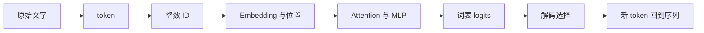

# 动画模型实验室：让一条数据走完整个模型

> **学习导航**：本页承接 D02、D05、D06 和 D07。
>
> 你将跟随同一段短文本走完运行过程，并说清每一步的对象、动作、形状和参数状态。

## 为什么要学这一页

若能背出 token、Embedding、Attention、logits，却串不起顺序，就先看本页。这里仅解释推理；参数更新见[梯度下降](梯度下降-旋钮下山.md)和[训练、验证与测试](训练与验证-两套题.md)。

## 本页目标

- 能把一条输入从离散文字追踪到下一个 token，而不把 ID、向量、概率混成同一个对象。
- 能区分模型参数、当前请求的中间状态和解码策略；知道推理时哪些东西会变、哪些不会变。
- 能用一张小表记录每一步的输入、动作、输出和责任边界，作为闭卷复述证据。

## 先预测

固定输入为“猫在垫子上”，只预测下一个词。先回答三件事，再继续往下读：

1. 哪一步把文字变成整数索引？
2. 哪一步才产生词表上的候选分数？
3. 调高 temperature 会更新模型参数吗？

把答案写在纸上或本地笔记中。看完路线后，用页面底部的新例子重答一次；两次答案的差异就是本页的学习记录。

## 一次生成的检查点

按顺序暂停，每一步都填四列：

| 检查点 | 当前对象 | 这一步做什么 | 结果是否改形状 |
|---|---|---|---|
| 文字 -> token | 离散片段 | 按 tokenizer 的词表切分文本 | 可能改变序列长度 |
| token -> ID | 整数索引 | 用词表把每个片段定位到编号 | 通常保持序列长度，内容改为整数 |
| ID -> 表示 | 浮点向量 | 查 Embedding 表并加入位置表示 | 每个位置得到固定宽度向量 |
| 表示 -> 隐藏状态 | 浮点张量 | 经过 Attention、MLP、残差和归一化 | 通常保持 `(B,T,D)`，数值持续变化 |
| 隐藏状态 -> logits | 词表分数 | 用 LM Head 为每个候选 token 计算分数 | 末轴变为词表大小 `V` |
| logits -> token | 概率分布与采样结果 | 按贪心、temperature、top-k 或 top-p 选一个候选 | 选出一个离散 token |
| 新 token 回到序列 | 更新后的上下文 | 把新 token 追加，再开始下一轮 | `T` 增加 1，参数仍不变 |

“改形状”要具体说明是哪条轴变了：token 数是序列轴，向量坐标数是特征轴，词表分数的最后一轴是候选数量。只说“数据变复杂了”不算完成。

## 责任边界：每轮到底谁在改变

| 对象 | 推理时会怎样 | 不要误解为 |
|---|---|---|
| 模型参数 | 从检查点读取，整次请求保持不变 | 模型会因为你问了一句就即时学习 |
| 隐藏状态与 KV Cache | 随当前输入和已生成 token 更新 | 这些状态是永久写回的知识 |
| 解码设置 | 改变本次候选分布或选择规则 | 改变模型已经训练好的能力 |
| 应用、检索与工具 | 可能增加上下文或外部结果 | 所有新信息都来自模型参数 |

## 可选观察材料：只带着一个问题去看

下列项目不属于本站运行依赖。不要漫无目的地点击；先读对应主线，再只观察一个变量，最后回到上面的四列表格。

| 项目 | 观察问题 | 先读 |
|---|---|---|
| [Transformer Explainer](https://poloclub.github.io/transformer-explainer/) | 同一批 token 怎样依次进入 Embedding、Attention、MLP、logits？ | D02、D05、D07 |
| [TensorFlow Playground](https://playground.tensorflow.org/) | 只增加一层时，分类边界、训练速度和过拟合怎样变化？ | [D04](../01-14天理论课/D04-神经网络如何学习.md) |
| [CNN Explainer](https://poloclub.github.io/cnn-explainer/) | 一个局部像素模式怎样逐层变成分类证据？ | [从模态到张量](../06-拓展知识库/多模态基础/01-从模态到张量.md) |
| [GAN Lab](https://poloclub.github.io/ganlab/) | 生成分布和判别边界为何会互相牵制？ | [模型全生命周期总纲](../01-14天理论课/模型训练总纲.md) |
| [Embedding Projector](https://projector.tensorflow.org/) | 换投影方法后，邻域和簇是否仍稳定？ | [D02](../01-14天理论课/D02-文字如何变成数字.md) |
| [BertViz](https://github.com/jessevig/bertviz) | 不同层、不同头的注意力连线如何变化？ | [D05](../01-14天理论课/D05-注意力机制.md) |

外部项目中的小模型、数据集和界面都有简化条件。观察到的现象只能回答表格中的局部问题，不能直接外推到所有现代模型，也不能把注意力图当成完整因果解释。

## 本页验收

遮住上面的表格，用下面的新输入“鸟停在树枝上”闭卷复述：

1. 说出从文字到下一个 token 的至少五个对象，并指出哪一步产生词表 logits。
2. 如果只把 temperature 从 `0.7` 调到 `1.2`，哪些数值会改变，哪些东西不会改变？
3. 如果追加了一个 token，为什么下一轮的序列长度会增加，而模型参数不会增加？

**完成证据**：你的答案应同时包含“对象名称、动作、形状或序列轴、是否更新参数”四项。若只会顺背流程，回到上面的“责任边界”表再做一次；若能解释三问，就可以继续主线或打开另一个按需分镜。

## 方法边界

- 本页串联的是 Decoder-only 文本模型的一条常见推理路线；具体模型可能使用不同 tokenizer、注意力结构或解码实现，应以模型说明为准。
- 外部项目只提供额外观察角度，不要求安装、运行 notebook、上传文本或离开本站完成任务。
- 追踪一次数据流能解释运行顺序，不能单独证明模型为何形成某项知识，也不能替代训练数据、评测和系统层证据。
