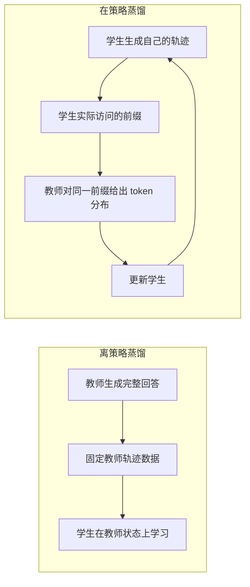

# 教师越强越好吗

> **学习导航**：承接基础蒸馏；本课比较离策略与在策略蒸馏，并用论文中的反常实验拆解“强教师必然更好”；完成后应能把教师分数、可学习性和新增能力分开判断。

## 本课核心判断

**排行榜最强的教师不一定最适合当前学生；还要看学生访问哪些状态，以及教师能否在这些状态提供可学习的新信息。**

路线以 arXiv v2 的数学推理实验为准，不能直接推广到代码、开放问答、多模态或真实 Agent 环境。“thinking pattern”在这里指局部输出分布现象，不是可直接读取的人类思维过程。

## 先分清离策略与在策略

离策略蒸馏容易获得稳定的教师示范，但训练时看到的是教师轨迹；推理时学生必须从自己的输出继续生成，二者可能出现暴露偏差。在策略蒸馏让学生先走到自己真实会到达的状态，再请教师评价下一步，因此监督位置更贴近学生推理时的分布。

“更贴近”不等于“一定成功”。如果学生走到的状态离教师熟悉的高概率区域太远，教师的逐 token 信号仍可能难以转成有效更新。

## 论文发现的两个必要条件

| 条件 | 初学者解释 | 不能误读成 |
|---|---|---|
| 思维模式兼容 | 在学生访问的前缀上，两者较可能选择的 token 有足够重叠，置信结构也不过度错位 | 教师和学生必须参数量相同，或内部推理完全一致 |
| 教师提供新能力 | 教师相对学生确实多学到了可迁移行为，而不只是同一训练管线下规模更大、分数稍高 | 只要教师分数高，就自动拥有学生没见过的新知识 |

论文的跨家族对照显示，额外经过 RL 后训练的教师比同一训练管线下单纯更大的教师带来更多提升。作者将其解释为：教师不仅要与学生“说得上话”，还要有值得传递的新东西。

## 反向蒸馏为什么有说服力

作者把经过 RL 的 JustRL-1.5B 当学生，再分别用其训练前的 1.5B 检查点和同家族 7B 模型做教师。两条训练轨迹都把学生推回接近训练前水平，虽然 7B 教师的 Benchmark 分数更高。

这组结果支持两个判断：

1. 在这些受控实验中，蒸馏方向会主动改变学生的行为模式，甚至覆盖已有的 RL 收益。
2. 教师的外部任务分数不能单独预测它在学生访问状态上的局部指导效果。

它不能证明“1.5B 与 7B 在所有方面等价”。更准确的表述是：从这个学生、这些数学提示和这套在策略目标看到的局部分布上，两位教师产生了非常相似的训练结果。

## 一张教师选择卡

| 要检查的证据 | 通过条件 | 失败时先做什么 |
|---|---|---|
| 教师独立任务分数 | 目标任务上确实强于原学生 | 先换教师或修复教师，不进入蒸馏 |
| 新能力来源 | 有不同后训练、数据、验证器或特权信息证据 | 不把“参数更多”当作新能力证明 |
| 初始局部分布关系 | top-k 重叠、熵差或小规模预生成记录没有明显失配 | 考虑冷启动或中间教师 |
| 学生可达性 | 教师在学生真实前缀上仍能给出稳定信号 | 缩短轨迹、调整数据或提示 |
| 独立验收 | 学生相对原始基线提升且没有关键能力回退 | 停止训练并做失败分类 |

## 本课验收

1. 为什么“教师更大”不能单独证明它更适合蒸馏？
2. 离策略和在策略蒸馏分别在哪一方生成的状态上学习？
3. 反向蒸馏中 7B 教师没有带来更好结果，能否推出 7B 没有更多知识？为什么？
4. 为一个领域小模型选择教师时，除 Benchmark 外至少还要记录哪三类证据？

## 方法边界

论文实验集中在数学推理、少数模型家族和特定 OPD 实现。“思维模式兼容”是对局部 token 分布现象的概括，不是已经建立的通用心理学解释。教师选择仍需在目标任务、词表、提示、训练预算和评测条件下重新验证。

来源：[论文 §2-§3、图 2-5](https://arxiv.org/abs/2604.13016v2)。下一课：[学生访问状态与重叠 token](02-学生访问状态与重叠token.md)
