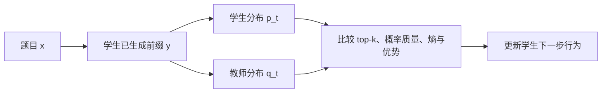

# 学生访问状态与重叠 token

> **学习导航**：承接教师可学习性；本课用一个五候选数字例子解释 top-k 重叠、概率质量和熵差，再对照论文的消融实验；完成后应能说明“重叠增加”为什么是机制线索而不是成功保证。

## 本课核心判断

**最终准确率和蒸馏 loss 都不能单独解释学习过程；必须同时检查学生访问状态、token 重叠和有效梯度。**

## 五个候选先算一次

在同一个学生前缀上，假设两个模型给出：

| token | 学生概率 | 教师概率 |
|---|---:|---:|
| A | 0.45 | 0.40 |
| B | 0.25 | 0.12 |
| C | 0.15 | 0.30 |
| D | 0.10 | 0.14 |
| E | 0.05 | 0.04 |

学生 top-3 是 `{A, B, C}`，教师 top-3 是 `{A, C, D}`，共同 token 是 `{A, C}`。

```formula-story
{
  "ariaLabel": "学生和教师各自的top3集合先取交集，再按三个保留候选归一；交集token的概率还需分别在学生和教师分布内求和",
  "title": "共同候选有几个，与共同区域有多重，是三本不同的账",
  "goal": "集合交集只数 A、C 两项；重叠比例除以本例共同 k=3；概率质量必须分别读取学生与教师的概率。",
  "coversNext": 3,
  "pattern": "branch",
  "source": { "label": "交集 {A,C}", "name": "双方 top-3 共同保留的 token", "detail": "集合大小为 2，但还未携带概率权重", "tone": "blue" },
  "items": [
    { "label": "2/3=66.7%", "name": "top-k 重叠比例", "detail": "共同候选数除以双方统一的 k=3", "tone": "slate", "arrow": "按集合计数" },
    { "label": "0.45+0.15=0.60", "name": "学生共同区域质量", "detail": "读取学生分布中 A 与 C 的概率", "tone": "orange", "arrow": "按学生概率加权" },
    { "label": "0.40+0.30=0.70", "name": "教师共同区域质量", "detail": "读取教师分布中 A 与 C 的概率", "tone": "green", "arrow": "按教师概率加权" }
  ],
  "result": { "label": "三个诊断量", "name": "共同个数、学生质量、教师质量", "detail": "它们回答不同问题，不能压成一个‘相似度’", "tone": "rose" },
  "example": { "label": "同样 2/3", "text": "若学生给 A、C 的概率各 0.05，重叠比例仍是 66.7%，但学生共同质量只有 0.10。" },
  "counterfactual": { "label": "集合大小不同", "text": "一方 top-3、一方 top-5 时直接除以 3 只表示一种覆盖口径；还可用并集作 Jaccard，必须声明。" },
  "boundary": "这些都是分布对齐诊断量，不是任务正确性的充分条件；两个模型可以在共同高概率区域一起犯错。"
}
```

$$
\text{重叠比例}=\frac{2}{3}\approx 66.7\%.
$$

这里双方都取 top-3，所以分母 `3` 表示“每个集合承诺保留的候选数”。若双方集合大小不同，`交集大小 / k` 就没有唯一含义：可以除以学生集合大小衡量“学生候选被教师覆盖多少”，也可以除以并集得到 Jaccard 相似度。论文、代码和图表必须先声明口径，不能只写一个百分比。

但集合大小还不够。共同 token 承载的学生概率质量是：

$$
0.45+0.15=0.60,
$$

教师概率质量是：

$$
0.40+0.30=0.70.
$$

这说明两个模型的大部分概率已经落在共同区域，但它们仍需要重新分配 A 与 C 的相对权重。重叠比例回答“共同候选有几个”；`0.60` 和 `0.70` 则分别回答“共同候选承载了学生或教师多少概率”。一个是集合计数，另一个是带权求和，二者不能互相替代，也不能把两边概率质量只报成一个数。

## 为什么必须看学生访问的状态



同一个教师在自己常见的前缀上可能非常稳定，换到学生生成的陌生前缀后却可能高熵或给出方向互相冲突的信号。OPD 的关键不是抽象地比较两个完整模型，而是在学生真正走到的每个前缀上比较两者下一 token 分布。

## 论文看到的成功动态

作者在成功配置中观察到：

- top-k 重叠比例随训练上升，代表学生逐渐进入教师支持的高概率区域。
- 重叠 token 内的优势趋近零，代表学生对共同候选的相对置信更接近教师。
- 学生与教师的熵差缩小，代表两者在同一状态上的不确定性结构更接近。
- 在论文的受控配置中，共同 top-k token 承载了两边约 97%-99% 的总概率质量。

最后一条是论文实验数字，不是“任何模型 top-k 都覆盖 97%-99%”的通用定律。它依赖模型、温度、k 值、数据和训练阶段。

## 消融为什么比相关曲线更强

作者把 top-k 支持集拆成三种训练方式：学生 top-k、双方重叠 top-k、非重叠部分。只优化重叠 token 的版本接近标准学生 top-k，而只优化非重叠 token 明显更弱。

这比“重叠曲线上升且分数上升”更有说服力，因为它主动改变了 loss 覆盖的 token 集合。论文据此认为，主要有效信号集中在双方共享的高概率区域。

论文比较了 sampled-token 与不同 k 的 top-k 版本。在这些实验中，按学生分布抽一个 token 已接近多 token 支持；只取 argmax 的 Top-1 更不稳定。关键不是 token 数，而是分布抽样能跨位置和训练步覆盖高概率区域，argmax 容易困在单一模式。

## 一个仍未证实的解释

失败教师给出的序列平均奖励仍能区分正确和错误轨迹，AUROC 与成功教师相近；但它产生的有效梯度更弱。作者提出一种可能：不同位置的 token 优势方向过于不一致，聚合后互相抵消，使全局有信息的奖励在局部难以利用。

论文明确说尚未直接验证这种各向异性梯度假设。课程应把它标为“作者提出的机制猜想”，不能写成已证实原因。

## 本课验收

1. top-k 重叠比例和重叠概率质量分别回答什么？
2. 为什么教师在自己生成的答案上很强，仍不能保证它在学生前缀上指导有效？
3. “只优化重叠 token”消融比两条相关曲线多提供了什么证据？
4. sampled-token 与 Top-1 都只用一个 token，为什么训练性质可能不同？

## 方法边界

重叠、熵差和梯度范数是诊断量，不是充分成功条件。高重叠也可能只是两个模型共同犯错；低熵也可能代表过早收缩。最终仍要回到独立任务评测、失败分类和能力回归。

来源：[论文 §4、§6.2-§6.3、图 6-7、14-16](https://arxiv.org/abs/2604.13016v2)。上一课：[教师越强越好吗](01-教师越强越好吗.md) · 下一课：[冷启动、提示对齐与长轨迹边界](03-冷启动提示对齐与长轨迹边界.md)
