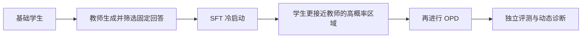
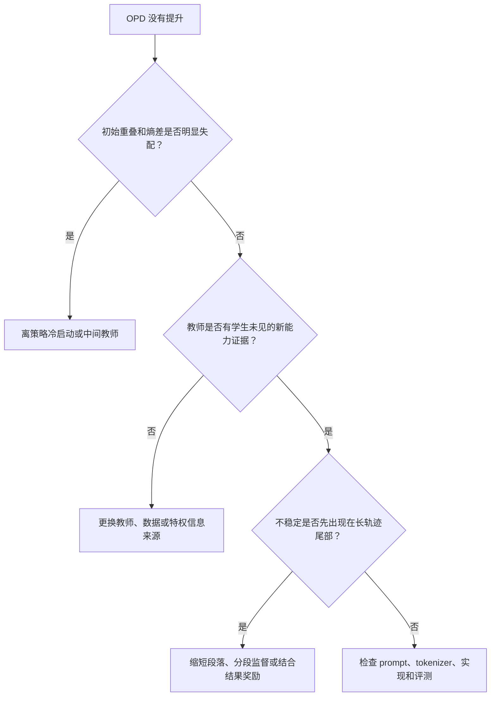

# 冷启动、提示对齐与长轨迹边界

> **学习导航**：承接 token 级机制；本课把论文的两种补救方法和长轨迹失效现象放进同一张决策图；完成后应能为失败 OPD 选择预设对照，并明确哪些结论不能迁移到 Agent。

## 本课核心判断

**蒸馏失败时，教师更大、步数更多或轨迹更长都不保证有效；先检查初始分布、提示覆盖和长轨迹后段的信号质量。**

## 补救一：先用离策略冷启动搭桥

论文在 Qwen3-1.7B-Base 学生和 Qwen3-4B Non-thinking 教师上，先用约 20 万条教师回答做全参数 SFT，再进入 OPD。相较直接从基础学生开始，冷启动版本初始重叠更高、熵差更小，最终评测也更好。

教学上应把它理解为“先铺一段学生走得到的路”，不是 SFT 与 OPD 谁绝对更优。离策略示范帮助学生靠近教师，随后在策略阶段再处理学生自己会访问的状态。

## 补救二：让提示与教师经历对应

论文分别控制了提示模板和提示内容：

| 调整 | 控制了什么 | 观察 | 风险 |
|---|---|---|---|
| 模板对齐 | 题目相同，只换成教师后训练使用的指令格式 | 初始重叠和最终准确率更高 | 模板收益可能依赖模型的聊天格式和后训练习惯 |
| 内容对齐 | 使用教师后训练中见过或更接近的数据来源 | 高概率共同区域更集中，任务表现更好 | 学生熵显著降低，可能损害探索和分布外覆盖 |

因此论文建议不要只喂教师最熟悉的数据，可混入教师后训练分布之外的提示。这里的目标不是刻意制造陌生样本，而是避免学生只会在一个过窄的提示区域复制教师。

## 长轨迹为什么会先从尾部坏掉

教师在第 $t$ 个位置评价的是：给定学生已经生成的前缀，下一 token 应该怎样分布。前缀越长，学生的小偏差越可能累积，后面的状态也越可能偏离教师自然会访问的区域。

论文在最大回答长度 0.5K、1K、3K、7K、10K 和 15K 的对照中发现，3K 和 7K 在该实验里较好，10K 和 15K 出现后期不稳定。15K 配置中，高熵先出现在输出尾部，再向前传播。让教师从学生前缀继续完成答案时，教师相对学生的准确率增益也随前缀从 1K 加深到 16K 而明显缩小。

这些数字只能说明论文中的数学长推理配置。它们支持的通用提醒是：监督更密、更长不保证更可靠；轨迹深度必须作为实验变量单独分桶。

## 把三种失败放进决策图

## 预生成审查包应包含什么

1. 原始学生、教师、SFT 冷启动学生和 OPD 学生四组独立基线。
2. prompt 来源、模板、去重规则和训练/测试隔离记录。
3. top-k 重叠、重叠概率质量、学生/教师熵、熵差和梯度范数曲线。
4. 按输出位置分桶的奖励、熵和正确率，而不只看全序列平均值。
5. 短、中、长轨迹及分布外任务的独立回归。
6. 失败停止条件：关键能力下降、熵塌缩、后缀不稳定或收益低于成本底线。

## 本课验收

1. 离策略冷启动为什么可能帮助后续在策略蒸馏？
2. 为什么教师对齐提示既可能提高效果，也可能降低学生分布覆盖？
3. 论文中的 3K/7K 结果为什么不能变成所有任务的固定长度配方？
4. 面对长 Agent 轨迹，你会增加哪两类结果级或分段级证据？

## 方法边界

论文未在代码、开放问答、多模态或真实工具环境验证这些配方；“长轨迹上限”也会随模型、任务、奖励和状态分布改变。对于 Agent，更合理的研究方向可能是短段密集蒸馏与长程结果奖励结合、课程式增加轨迹长度，或使用可验证环境反馈，但这些仍属于待验证方案。

来源：[论文 §5-§6、图 8-14、附录 C-D](https://arxiv.org/abs/2604.13016v2)。上一课：[学生访问状态与重叠 token](02-学生访问状态与重叠token.md) · 回到起点：[教师越强越好吗](01-教师越强越好吗.md)
