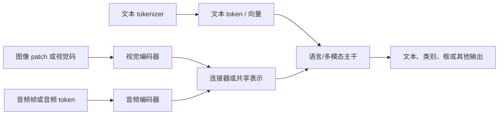

# 多模态基础

路线说明：承接 token、Embedding、Transformer 和文本生成；本路线解释图像、语音、视频怎样进入模型，比较外挂编码器与原生多模态路线，并审查一个预设图文案例的分层评测。

## 为什么很多课程先讲文本

文本模型的输入输出边界更容易观察：字符串经 tokenizer 变成 ID，再经模型得到 token 分布。图像、语音和视频还要处理分辨率、采样率、时间轴、模态编码器、连接器和更昂贵的数据配对。先学文本能把训练、注意力、生成和评测主干讲清楚，但这只是教学与工程上的低复杂度入口，不代表大模型只等于文本模型。

某个模型团队先发展文本能力，可能来自数据、算力、产品目标、研究节奏和组织积累；不能仅凭“先文本”推断它做不了多模态，也不能把某一公司的阶段选择写成所有模型的规律。

## 先分清模态、编码器和多模态模型

| 词 | 本课程中的含义 | 不要误解为 |
|---|---|---|
| 模态（modality） | 信息的表现与采集形式，如文本、图像、语音或视频 | 文件扩展名相同就一定是同一种任务表示 |
| 编码器 | 把某种输入转换成主干可处理的向量或 token 表示 | 已经完成全部语义理解和推理 |
| 连接器 | 对齐维度、数量或接口，使不同表示能够进入主干 | 形状能相接就已经语义对齐 |
| 多模态模型 | 能联合处理或生成两种及以上模态的模型系统 | 所有模态共用同一 tokenizer 和同一个输出头 |
| 解码器 | 把隐藏表示逐步还原或生成到目标输出空间 | 只指文本 Transformer 的 Decoder Block |

## “词表”到了多模态会怎样

文本 tokenizer 和词表是具体模型资产的一部分，不存在所有大模型共用的一张万能词表。一个词表可以包含多种语言的子词或字节片段，但“支持多少种语言”取决于训练数据、模型能力和评测，不等于数一数词表里有多少语言。

图像常被切成 patch 后通过视觉编码器得到连续向量，也可能使用离散视觉码本；语音可由声学特征、音频编码器或离散音频 token 表示；视频还增加时间顺序和帧间变化。这些表示可以通过连接器映射到语言模型的隐藏维度，也可以从预训练早期就在共享模型中联合学习。

## 路线目录

1. [从模态到张量](01-从模态到张量.md)：计算文本、图像、语音和视频怎样变成模型输入。
2. [连接器与跨模态对齐](02-连接器与跨模态对齐.md)：区分形状兼容、token 汇聚和语义对应。
3. [多模态训练路线](03-多模态训练路线.md)：比较冻结编码器和语言模型、只训练连接器，冻结大部分参数后局部微调，分阶段联合训练，以及原生多模态预训练。
4. [分层评测与失败定位](04-分层评测与失败定位.md)：拆开感知、定位、对齐、推理和生成错误。
5. [图文故障单项目](05-图文故障单项目.md)：用三类基线完成可验收的图文项目设计。

## 预设案例：图文故障单理解

课程正文分两组材料：第 4 课用 30 个预标注样本做感知、定位、对齐、推理和生成的失败分层；第 5 课另用 60 个开发评测样本比较三类基线。两组数据不共用题目，学习者据此判断应优先检查提示、OCR、领域检索还是小规模微调，不需要上传图片或调用多模态模型。

正文不附独立截图数据集或逐题输出，因此只能练习阅读汇总证据和设计诊断流程，不能独立复核 OCR、证据定位、分类或拒答指标。真实项目还应保存输入样本、标注、逐题结果、系统配置、延迟与失败样例。

## 适用范围

- 把图像转成向量不代表模型自动理解对象、空间关系和因果。
- 连接器维度对齐只是张量可以相接，不等于语义已经对齐。
- 原生多模态不天然优于分阶段方案，必须比较数据、预算、任务和评测。
- 文本能力强不保证 OCR、计数、空间定位、音频时间关系或视频一致性强。
- 二维可视化只能帮助观察，不能完整证明高维模态表示已经对齐。

基础连接：[文字如何变成数字](../../01-14天理论课/D02-文字如何变成数字.md)、[拼出完整 Transformer](../../01-14天理论课/D06-拼出完整Transformer.md)。多模态系统上线后的质量、任务、安全与服务监控，接回[D14：上线后如何发现并修正问题](../../01-14天理论课/D14-监控、反馈与持续迭代.md)。
